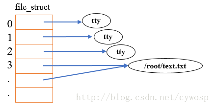
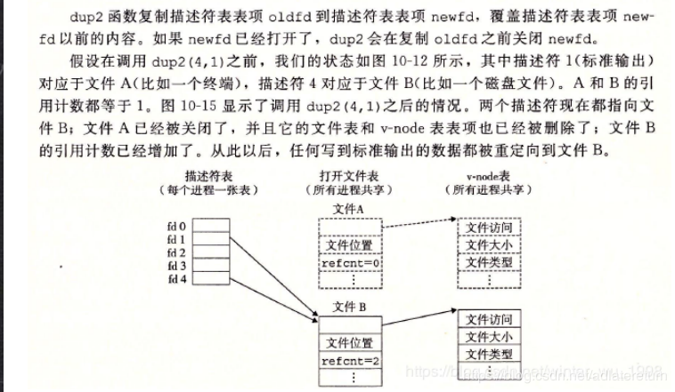

# 1 系统调用IO

**文件描述符（fd）**是在系统调用IO中贯穿始终的类型。


## 1.1 文件描述符的概念

在Linux系统中，使用文件描述符（fd）来标识一个文件

文件描述符的实质：是一个整型（==数组==的下标），==优先使用当前可用范围内最小的下标==

不打开任何文件时，默认 fd=0，1，2分别表示**文件流**stdin，stdout，stderr


每个进程都有这样一个数组

**只要执行一次open操作**，就会获得一个文件指针，这个指针就会存放在数组中

这个数组**存放**的是当前进程open的**文件指针**，数组的**长度**是一个进程能open的**最多次数（最多文件数）**

**只要执行一次close操作**，就会释放（清空）fd中存放的文件指针


## 1.2 fd数组、文件指针和文件属性三者的关系

文件（FILE）对象：描述了文件的当前状态，如读、写、偏移量、打开次数等

文件指针：FILE对象在内存的首地址

文件属性：inode，描述文件的类型、文件长度、文件所有者等，==对于文件而言，inode是唯一的==


有以下几种情况（以打开2个文件为例）：

（1）一个进程中，打开文件A、文件B，生成2个FILE对象，fd有2个，inode有2个，因为每个文件有对应的文件属性

（2）一个进程中，打开2次文件A，生成2个FILE对象，fd有2个，inode有1个，因为文件A的属性唯一

（3）一个进程中，打开1次文件A，生成1个FILE对象，fd有1个，并把fd中的文件指针复制一份，fd变成2个，FILE对象仍然是1个，相当于2个fd中的文件指针指向同一个FILE对象，inode有1个。此时如果执行一次close操作，那么有一个fd的文件指针就会被释放，FILE对象的打开次数-1，剩下的fd也就不会因此丢失FILE对象从而变成野指针


# 2 系统调用IO的函数

|   函数    |     描述     |
| :-------: | :----------: |
| `open()`  |   文件打开   |
| `close()` |   文件关闭   |
| `read()`  |   文件读取   |
| `write()` |   文件写入   |
| `lseek()` | 文件指针定位 |


## 2.1 open()，close()

### 2.1.1 open()

`int open(const char *pathname, int flags, [mode_t mode]);`

- pathname：文件路径
- flags：文件打开方式（只读、只写、读写、只执行、只搜索）

如果打开成功，返回文件描述符（fd）；否则返回-1和errno

### 2.1.2 close()

关闭文件

`int close(int fd);`

当一个进程终止时，内核会自动关闭它所有的打开文件


## 2.2 read()， write()

### 2.2.1 read()

`ssize_t read(int fd, void *buf, size_t count);`

- fd：文件描述符（表示一个文件）
- buf：从文件描述符读取数据到缓冲区
- count：读取的字节数

如果成功，返回成功读取的字节数；否则返回-1和errno

### 2.2.2 write()

`ssize_t write(int fd, void *buf, size_t count);`

- fd：文件描述符
- buf：获取缓冲区的字符写入到文件描述符中
- count：写入的字节数

如果成功，返回成功写入的字节数；否则返回-1和errno


## 案例1：实现复制命令 test1.c

```c
/* 函数描述：使用系统调用IO实现命令行复制文件*/
#include<unistd.h>
#include<stdio.h>
#include<stdlib.h>
#define BUFSIZE 1024
#include <sys/types.h>
#include<sys/stat.h>
#include<fcntl.h>
int main(int argc, char **argv) // 命令行传参, argc表示参数个数
{
	int fd1 = 0;
	int fd2 = 1;
	int n = 0; //成功读取到的字符个数
	int ret = 0; //成功写入的字符个数
	int pos = 0;
	char buf[BUFSIZE];	
	if(argc < 3)
	{
		fprintf(stderr, "Usage: %s <file1> <file2>\n", argv[0]);
		exit(1);
	}
	// 读文件
	fd1 = open(argv[1], O_RDONLY);
	if(fd1 < 0)
	{
		perror("open()");
		exit(1);
	}
	// 写文件,如果不存在，则创建，并赋予权限 0600
	fd2 = open(argv[2], O_WRONLY|O_CREAT,O_TRUNC, 0600);
	if(fd2 < 0)
	{
		close(fd1);
		perror("open()");
		exit(1);
	}
	while(1)
	{
		n = read(fd1, buf, BUFSIZE);
		if(n < 0)
		{
			perror("read()");
			break;
		}
		if(n == 0)
			break;
		pos = 0;
		while(n > 0)
		{
			ret = write(fd2, buf+pos, n);
			if(ret < 0)
			{
				perror("write()");
				exit(1);
			}
			n -= ret;
			pos += ret;
		}
	}
	close(fd2);
	close(fd1);
	exit(0);
}
```


## 2.3 lseek()

定位文件指针位置（光标）

`off_t lseek(int fd, off_t offset, int whence);`

- fd：文件描述符
- offset：偏移量
- whence：指定偏移位置（SEEK_SET文件开头，SEEK_CUR当前位置，SEEK_END文件末尾）

返回文件开头到当前文件指针的偏移量


# 3 IO的效率问题

缓冲区BUFSIZE值不是越大越好


# 4 文件共享 

**多个任务共同操作一个文件或者协同完成任务**

>  **示例：删除一个文件中的第2行**

思路：从第3行开始读取内容，覆盖第2行的内容

核心：打开两次文件，获得两个fd，一个fd用于只读第三行开始的内容，另一个fd定位到第二行，用于写入第三行开始的内容，减少系统调用，写入后，buf缓冲区的末尾还多出一块内容，需要利用truncate()函数截断文件到指定长度。

```c
/*代码有bug，待完善！！！*/
#include<unistd.h>
#include<stdio.h>
#include<stdlib.h>
#include<sys/types.h>
#include<sys/stat.h>
#include<fcntl.h>
#include<string.h>
#define BUFSIZE 1024
int cout(int line, char buf[])
{
	int n=0;
	int cout = 0;
	for(int i =0; i<strlen(buf); i++)	
	{	
		cout ++;
		if(n == line) break;
		if(buf[i] == '\n')
			n ++;
	}
	return cout;
}

int main(int argc, char** argv)
{
	char buf[BUFSIZE];
	int fd1 = 0;
	int fd2 = 0;
	int n = 0;
	int cout1 = 0;
	int cout2 = 0;
	int offset1 = 0;
	int offset2 = 0;
	fd1 = open(argv[1], O_RDONLY);
	fd2 = open(argv[1], O_RDWR);
	// 获取整个文件
	while(1)
	{
		n = read(fd1, buf, BUFSIZE);
		if(n <= 0) break;
	}
	cout1 = cout(3, buf);
	cout2 = cout(2, buf);
	// 定位到fd1的第3行
	offset1 = lseek(fd1, cout1, SEEK_SET);
    // 定位到fd2的第2行	
	offset2 = lseek(fd2, cout2, SEEK_SET);
	char buf1[BUFSIZE];
	int pos,ret;
	// 读取fd1写入到fd2
	while(1)
	{
		n = read(fd1, buf1, BUFSIZE);
		if(n<=0) break;
		pos = 0;
		while(n > 0)
		{
			ret = write(fd2, buf1+pos, n);
			if(ret < 0)
			{
				perror("write()");
				exit(1);
			}
			n-=ret;
			pos+=ret;
		}
	}
	close(fd2);
	close(fd1);
	exit(0);
}
```


# 5 原子操作

原子：不可分割的最小单位

原子操作：==**由多个步骤组成的一个操作，这个操作要么执行完所有步骤，要么一步也不执行**==

作用：解决竞争和冲突


# 6 ==程序中的重定向：dup()，dup2()==

复制一个现有的文件描述符

`int dup(int fd);`

将fd复制一份到当前可用范围内最小的文件描述符，返回一个新的fd（创建一个新的fd，这个fd与参数fd指向同一个文件）

`int dup2(int oldfd, int newfd2);`

先将fd2关闭，然后将fd复制一份到指定的文件描述符fd2（fd2指向fd的文件）


调用失败返回-1，并设置errno；两个函数创建的文件描述符并不继承源文件描述符的**属性**


应用：

- 将标准输入重定向到一个文件，或者把标准输出重定向到一个网络连接


## 6.1 fd=0,1,2

执行一个shell命令行时通常会自动打开三个标准文件：

- 标准输入文件（stdin/STDIN_FILENO），通常对应终端的键盘，fd=0

- 标准输出文件（stdout/STDOUT_FILENO），通常对应终端的屏幕，fd=1
- 标准错误输出文件（stderr/STDERR_FILENO），通常对应终端的屏幕，fd=2

进程从标准输入文件中得到输入数据，将正常输出数据输出到标准输出文件，而将错误信息送到标准错误文件中。


文件描述符与打开的文件对应模型如图：




有时候，我们执行一个进程时，不想在终端显示输出，就可以通过重定向符号`>`来将标准输出重定向到某个文件

还有一个办法就是可以通过dup2，来将标准输出的文件描述符指向某个文件，达到重定向的功能


## 6.2 dup2(fd, 0/1/2)




> 将标准输入、输出和错误的数据全部重定向到/dev/null这个黑洞文件中
>
> 也就是说，不将终端的输入作为标准输入、不显示终端屏幕的标准输出和标准错误输出

```c
int fd = open("/dev/null", O_RDRW);
dup2(fd, 0); 
//先关闭标准输入，复制一份fd的地址，标准输入重定向到fd，即fd中的内容被读取，当作标准输入的内容
dup2(fd, 1); 
//先关闭标准输出，标准输出指向了fd，即本该输出到终端屏幕中内容被写入到了fd中
dup2(fd, 2); 
//先关闭标准出错，标准出错指向了fd，即本该输出到终端屏幕的错误内容被写入到了fd中

// 只要是fd2为0，1，2，从终端的输入和输出就会重定向到fd中
```


# 7 同步：sync，fsync，fdatasync

同步buffer和cache：`sync`

同步一个文件的buffer和cache：`sync`

只刷数据，不刷亚数据（文件属性）：`fdatasync`


# 8 ==fcntl()==，ioctl()

`fcntl()`：文件描述符各种控制操作都来源于这个函数

```c++
#include<fcntl.h>
int fcntl(int fd, int cmd,...);
- fd：要操作的文件描述符
- cmd：要执行的操作
失败返回-1并设置errno
```

常用操作及其参数：

|            操作分类            |     操作符      |                             含义                             | 第三个参数类型 | 成功时的返回值 |
| :----------------------------: | :-------------: | :----------------------------------------------------------: | :------------: | :------------: |
|         复制文件描述符         |     F_DUPFD     |                    创建一个新的文件描述符                    |      long      |   新创建的fd   |
|                                | F_DUPFD_CLOEXEC |       创建一个新的文件描述符，设置其close-on-exec标志        |      long      |   新创建的fd   |
|   获取和设置文件描述符的标志   |     F_GETFD     |              获取fd的标志，如close-on-exec标志               |       -        |    fd的标志    |
|                                |     F_SEDFD     |                         设置fd的标志                         |      long      |       0        |
| 获取和设置文件描述符的状态标志 |     F_GETFL     | 获取fd的状态标志，包括open系统调用设置的标志O_APPEND、O_CREAT；访问模式O_RDONLY、O_WRONLY、O_RDWR |      void      |  fd的状态标志  |
|                                |     F_SETFL     |           设置fd的状态标志，访问模式的标志不可修改           |      long      |       0        |


在网络编程中，一般会使用`fcntl()`将一个文件描述符设置为非阻塞的：

```c++
int setnonblocking(int fd)
{
    int old_option = fcntl(fd, F_GETFL);	//获取fd旧的状态标志
    int new_option = flag | O_NONBLOCK;		//设置为非阻塞标志
    fcntl(fd, F_SETFL, new_option);		//将fd设置为非阻塞
    return old_option; 	//返回fd旧的状态标志，以便日后恢复该状态标志
}
```


`ioctl()`：比fcntl能够执行更多的控制，设备相关的内容由这个函数来管理


# 9 /dev/fd/目录

这是一个虚目录，显示的是当前进程的文件描述符信息

