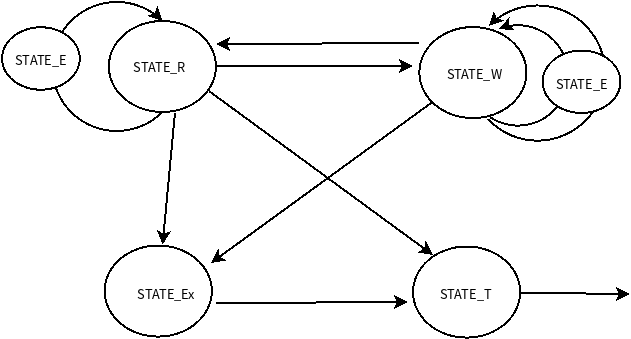
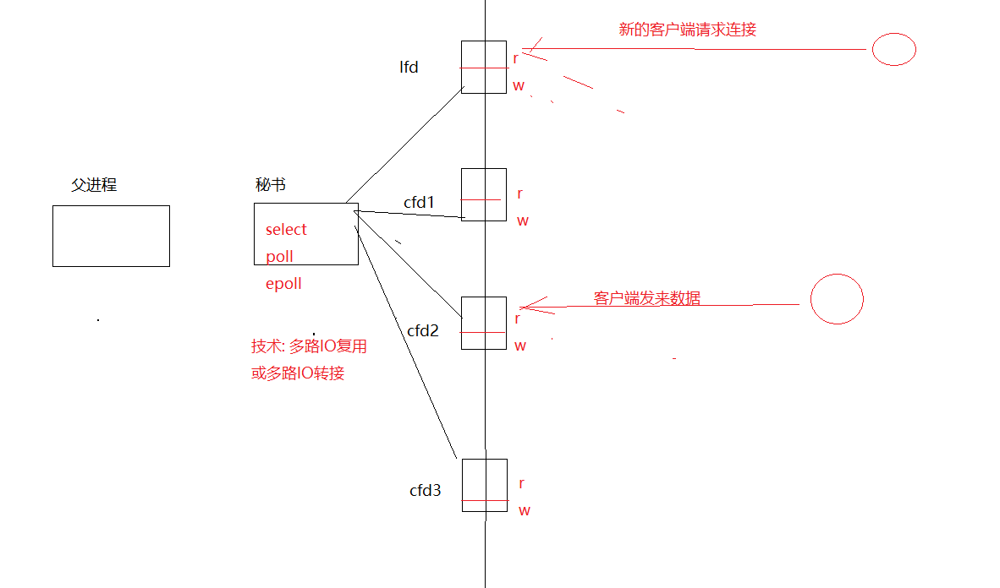

# 1 非阻塞IO

两个设备之间的数据交换称为数据中继


假设有这样一个数据交换的任务：

读设备A->将读取到的内容写入到设备B->读设备B->将读取到的内容写入到设备A


对于单线程（单进程）来说

阻塞IO：如果设备A没有内容，就会一直阻塞在读设备A的位置，由于设备A被阻塞且只有一个线程在工作，那么后续任务无法执行下去

非阻塞IO：**如果设备A没有内容，那么就会放弃这一步，去执行下面的操作，不会卡死在某一个环节**


对于多线程（多进程）来说：将任务进行划分，一个线程执行读设备A，写到设备B的任务；一个线程执行读设备B，写到设备A的任务

阻塞IO：即便有一个任务阻塞了，也不会影响到整体的任务循环

## 1.1 阻塞IO，非阻塞IO（NIO），异步IO（AIO）

阻塞IO：会一直等到有数据才执行下一步

非阻塞IO：使用非阻塞IO时，如果有数据则立即返回结果，否则返回错误码；不会像阻塞IO一直停留在这一步，使用while循环不断调用非阻塞IO来接收返回结果

异步IO：调用异步IO后，会执行下一步，当有数据时，内核会自动发起通知


==**阻塞是谁的属性？**==

==阻塞、非阻塞是设备文件、网络文件本身的特性==，不是系统调用read/write本身可以控制的。

也就是说，非阻塞IO读写的是非阻塞属性的文件，阻塞IO读写的是阻塞属性文件


==**如何将文件设置为非阻塞？**==

所以如果是文件属性的话，是可以改变的(属性名：0_NONBLOCK)，可以在文件打开的时候(open)再加上(改变)文件属性；

对于网络文件，也可以使用fcntl函数改变文件属性


==**非阻塞的操作？**==

如果将文件设置成非阻塞，即便发现内容为空，也不会阻塞等待而是会直接返回，但是由于没有内容因此只能返回一个特殊数字-1，（数字0代表读到文件末尾），大于0就表示读到内容了


# 2 有限状态机编程思路

自然流程：解决问题的流程图

简单流程：一个程序的自然流程是结构化的（顺序流程图可以描述这个任务）

复杂流程：一个程序的自然流程不是结构化的（不能用简单的顺序流程图描述整个任务）


有限状态机用于解决复杂流程，一般分为以下步骤：

- 程序开始
- 如果出现真错，EX态，程序终止
- 如果出现假错，E态，程序重新开始

- 任务完成，程序终止


> ./src/nonblock/relay.c 有限状态机流程图




# 3 ==IO多路转接==

服务端的`accept`和`read`默认都是阻塞的

来一个客户端发起`connect`请求时，就创建一个进程或线程去处理，这种方式实现并发；然而大多数时间，当客户端没有发送数据时，服务端开启的进程或线程就没有任务，此时都处于休眠状态（盲等状态），这样非常浪费内存资源


有一种解决办法是：非阻塞忙轮询

就是让一个进程不停的访问每一个套接字（监听套接字和已连接套接字），查看是否有连接或数据到达，但是这种方法非常浪费CPU


最优的办法是IO多路复用：



==设置一个进程用来监听多个文件描述符的读写缓冲区的变化，只有当文件描述符读写状态发生改变时，才去推动状态机，执行任务，而不是盲目等待==

监听到的文件描述符分两类,一个是lfd（监听套接字），一类是cfd（已连接套接字）

```c
int select(int nfds, fd_set *readfds, fd_set *writefds, fd_set *exceptfds, struct timeval *timeout);


int poll(struct pollfd *fds, nfds_t nfds, int timeout);


epoll; // 是poll在Linux封装的方言
```


==大致步骤：==

- 1、布置监视任务
- 2、选择监视函数（`select`，`poll`，`epoll`）进行监视
- 3、根据监视的情况来执行相应的操作


## 3.1 select

`int select(int nfds, fd_set *readfds, fd_set *writefds, fd_set *exceptfds, struct timeval *timeout);`

成功，返回监听集合中状态发生变化的文件描述符个数，内核将自动修改文件描述符集合来通知应用程序哪些文件描述符已经就绪；如果失败，返回-1和errno

- nfds：监视的最大文件描述符+1
- readfds：文件描述符是否可读的集合（监听集合中的文件描述符的读事件）
- writefds：文件描述符是否可写的集合
- exceptfds：异常文件描述符的集合
- timeout：超时设置。NULL（select阻塞，永久监听），0（不等待，立即返回）
- ==fd_set==结构体包含一个整型数组，数组长度由FD_SETSIZE指定，该数组中的每个元素的每一位（bit）标记一个文件描述符，表示==位图==

使用下面的一系列宏来控制fd_set结构体中的位：

```c
void FD_ZERO(fd_set *set);			//将集合清空

void FD_CLR(int fd, fd_set *set);	//将一个fd从set中清除

void FD_SET(int fd, fd_set *set);	//将一个fd添加到set中

int  FD_ISSET(int fd, fd_set *set);	//判断fd是否在集合中
```


==当有文件描述符可读/可写的时候，监听集合就发生变化==


**问题1：当有新的客户端要请求连接服务端时，需要监听哪个`socket`，加入哪个集合？**

对于服务端而言，新的客户端加入时，监听的是服务端的`socket`，加入readfds可读集合

**问题2：客户端向服务端发送数据，这对于服务端中使用`select`监听的socket而言，是加入哪个集合？**

客户端使用`send`或`write`对socket写入数据后（相当于发送了数据）；于服务端而言，连接到的socket中就有内容了，于是服务端监听的socket==可读==，即加入readfds可读集合

**问题:3：如何将需要监听的文件描述符添加到各个集合中？**

先调用`FD_ZERO`，再`FD_SET`，此时集合中的文件描述符对应的==位图置1==

**问题4：对于成功返回的文件描述符个数，如何区分哪个fd来自与哪个集合？**

当内核监听到有文件描述符的状态发生变化时（如readfds初始监听3个文件描述符，对应位图为111；有一个读事件发生，readfds位图变为001），内核自动将变化后的集合返回给用户

用户可以使用for循环，调用`FD_ISSET`来判断集合中是否存在fd，从而判断这个fd的状态是否发生变化

**问题5：文件描述符可读情况？**

- socket内核接收缓存区中的字节数大于或等于其低水位标记SO_RCVLOWAT。此时我们可以无阻塞
  地读该socket，并且读操作返回的字节数大于0。
- socket通信的对方关闭连接。此时对该socket的读操作将返回0。
- 监听socket上==有新的连接请求==。
- ==连接socket接收到数据==
- socket上有未处理的错误。此时我们可以使用getsockopt来读取和清除该错误

**问题6：文件描述符可写情况？**

- socket内核发送缓存区中的可用字节数大于或等于其低水位标记SO_SNDLOWAT。此时我们可以无阻塞地写该socket，并且写操作返回的字节数大于0。
- socket的写操作被关闭。对写操作被关闭的socket执行写操作将触发一个SIGPIPE信号。
- ==客户端socket使用非阻塞connect连接成功或者失败（超时）之后。==
- socket上有未处理的错误。此时我们可以使用getsockopt来读取和清除该错误。

**问题7：文件描述符异常情况？**

socket上接收到==带外数据==


**补充：当有监听事件发生时，集合都会发生变化，内核会将变化后的集合复制到用户空间，而下一次开始新的监听时，仍然是要监听原来的事件，此时可以做一个备份集合，这个备份集合保存的是一直要监听的文件描述符**


> 例子：src/nonblock/select.c

算法流程：

```c
1、创建套接字
2、绑定
3、监听
while(1){  
    （1）设置要监听的集合
    （2）select()//监听
    （3）判断集合变化：
    	如果是lfd变化,提取新的连接,并且将新的套接字加入监听的集合
    	如果是cfd变化,直接读取,处理客户端请求
}
```


### select优化

在判断cfd的状态是否在监听集合中，方法是遍历所有已连接套接字【lfd+1， maxfd】，一个一个遍历是否在可读集合中

==在Linux中，默认监听的最大描述符个数为1024==


**一种情况是**，监听【3，1023】的文件描述符，在运行过程中，一些客户端关闭了端口，此时仍然需要循环多次来判断处理，效率很低，需要优化；

【优化方法】

- C

==自定义一个监听数组，该数组初始化为-1，当有新的客户端加入时，保存socket到监听数组，值变为cfd==

在判断所有已连接socket时，从监听数组开始遍历，值为-1的直接跳过

- C++

使用vector代替数组


**另一种情况是**，监听【3，1023】的文件描述符，其中只有少部分的socket经常发来消息，而其他的socket偶尔发送消息且并没有关闭，出现了资源浪费，==无法优化（select缺陷：大量并发，少量活跃）==


**优点:**跨平台、并发量高、效率高、消耗资源少、消耗cpu也少

**缺点: **

- 有最大文件描述符的个数限制 FD_SETSIZE = 1024 

- 每一次重新监听都需要再次设置需要监听集合,集合从用户态拷贝至内核态消耗资源
- 监听到文件描述符变化之后,需要用户自己遍历集合才知道具体哪个文件描述符变化了  
- 大量并发，少数活跃，select的效率低


## 3.2 poll

poll系统调用和select类似，也是在指定时间内轮询一定数量的文件描述符

`int poll(struct pollfd *fds, nfds_t nfds, int timeout);`

- fds：存放了文件描述符及其事件的结构体数组的起始地址
- nfds：数组中文件描述符个数
- timeout：超时设置

成功，返回监听集合中状态发生变化的文件描述符个数，内核将自动修改revents来通知应用程序哪些文件描述符已经就绪；如果失败，返回-1和errno

```c
struct pollfd {
    int   fd;      /* file descriptor */
    short events;  /* 要监听的事件按位或：POLLIN/POLLOUT/POLLERR */
    short revents; /* 当监听到某事件后，内核会自动修改，通知应用程序fd上实际发生了哪些事件,初始化为0 */
};
触发情况：
- POLLIN：可读（普通数据和优先数据）
    - POLLRDNORM：普通数据可读
    - POLLPRI：优先级数据可读，如TCP带外数据
- POLLOUT：可写（普通数据和优先数据）
    - POLLWRNORM：普通数据可写
    - POLLWRBAND：优先级数据可写
- POLLRDHUP：客户端关闭连接/客户端关闭写操作
- POLLHUP：挂起，如管道写端被关闭后，读端fd上将收到POLLHUP事件
- POLLERR：错误
```

> 例子：poll.c


优点：没有监听上限；监听、返回集合分离；


## 3.3 ==epoll==

epoll是Liunx的方言，是select/poll的增强版本，使用一组函数来完成任务。**epoll把用户关心的文件描述符上的事件放在内核里的一个事件表中，而无须像select和poll那样每次调用都要重复传入文件描述符集或事件集**

epoll的存储结构是一棵**红黑树**

优点：

- 没有文件描述符个数限制
- 已经添加到红黑树上的cfd，如果状态变化，会自动存储到监听事件数组events中；当开始新一轮监听时，不需要重新将cfd添加到红黑树中
- 监听到文件描述符变化后，返回的是已经变化的文件描述符，不需要像select对文件描述符进行判断其是否在可读集合中

```c
// 1、创建epoll句柄（红黑树）
int epoll_create(int size); 
- size：监听的文件描述符个数
成功，返回一个epfd（epfd是一棵红黑树的根节点，有size个文件描述符作为结点）

// 2、设置epoll：在红黑树上添加需要监听的文件描述符
int  epoll_ctl(int epfd, int op, int fd, struct epoll_event *event);
- op：对红黑树中的结点进行的操作（增加/删除/修改文件描述符结点）
    -  EPOLL_CTL_ADD:添加结点
    -  EPOLL_CTL_MOD:修改结点
    -  EPOLL_CTL_DEL:删除结点
- event：监听事件结构体的地址（事件+数据）
    -  EPOLLIN：读事件
    -  EPOLLOUT：写事件
    -  EPOLLERR：错误事件
成功返回0，失败返回-1并设置errno

// 3、监听等待，相当于select()
int epoll_wait(int epfd, struct epoll_event *events, int maxevents, int timeout);
- epfd：文件描述符，红黑树根节点
- events：监听事件结构体数组的首地址（数组需要提前定义）
- maxevents：数组元素个数，最多监听多少个事件
- timeout：超时等待
成功，返回监听到的文件描述符个数，内核空间会将监听到的就绪事件复制一份存放到用户空间定义的第二个参数events结构体数组中，用户只需要对这个结构体数组进行操作即可；失败返回-1并设置errno

// 联合体
typedef union epoll_data {
    void        *ptr;	// 应用于epoll反应堆模型
    int          fd;	// 监听的文件描述符
    uint32_t     u32;
    uint64_t     u64;
} epoll_data_t;

struct epoll_event {
    uint32_t     events;      /* 位图，监听事件：EPOLLIN/OUT/ERR */
    epoll_data_t data;        /* User data variable */
};
```


算法流程：

```c
1、创建套接字
2、绑定
3、监听
4、创建红黑树根节点
5、将lfd添加到红黑树，设置为可读事件
while(1){  
    （1）epoll_wait()//监听红黑树
    （3）判断集合变化：
    	如果是lfd变化,提取新的连接,并且将新的套接字加入到红黑树
    	如果是cfd变化,直接读取,处理客户端请求
}
```

==注意：==

epoll_events中的events成员是一个位图，当监听到事件后，文件描述符的事件位图发生了变化，需要进行位与（`&`）来判断事件是否发生变化


### epoll和poll的区别

```c++
/*如何索引poll返回的就绪文件描述符*/
int ret=poll(fds,MAX_EVENT_NUMBER,-1);
/*必须遍历所有已注册文件描述符并找到其中的就绪者（当然，可以利用ret来稍做优化）*/
for(int i=0;i＜MAX_EVENT_NUMBER;++i)
{
	if(fds[i].revents＆POLLIN)/*判断第i个文件描述符是否就绪*/
    {
    	int sockfd=fds[i].fd;
    	/*处理sockfd*/
    }
}

/*如何索引epoll返回的就绪文件描述符*/
struct epoll_event events[MAX_EVENT_NUMBER];
int ret=epoll_wait(epollfd,events,MAX_EVENT_NUMBER,-1);
/*仅遍历就绪的ret个文件描述符*/
for(int i=0;i＜ret;i++)
{
    int sockfd=events[i].data.fd;
    /*sockfd肯定就绪，直接处理*/
}
```

- poll模型：所有文件描述符及其事件存放在一个结构体数组fds中，当poll函数返回成功时，需要遍历fds先判断每个fd的可读可写情况，再进行读/写操作
- epoll模型：文件描述符及其事件是一个红黑树节点，用户定义了一个events数组，当epoll_wait函数返回成功时，红黑树上监听的节点事件会自动发生变化，同时内核空间会将监听到的就绪事件复制一份存放到events结构体数组中，遍历events数组进行读/写操作


### epoll触发模式

不同的触发模式会影响epoll_wait函数的执行次数

- 水平触发（电平一直为0或1就触发）：EPOLLLT（默认）
  - **读缓冲区只要有数据就会被触发；写缓冲区只要可写就会被触发**
  - 比如远端发送10个字节的数据，服务端一次处理5个字节，缓冲区还剩5个字节，数据需要读取两次才能将缓冲区读完，那么`epoll_wait()`就会一直触发两次
  - 优点：易于编码，未读完的数据下次还能继续读，不易遗漏
  - 缺点：在并发量高的时候，epoll_wait返回的就绪队列比较大，遍历比较耗时。因此LT适用于==并发量小==的情况
- ==边沿触发（电平由0变1或由1变0就触发）==：EPOLLET
  - **读缓冲区只要有数据到达就会被触发；写缓冲区只要数据被发送了就会被触发**
  
  - 比如远端发送10个字节的数据，服务端一次处理5个字节，缓冲区还剩5个字节，但是`epoll_wait()`只会触发一次，如果不使用循环读完，那么剩下的字节就无法读取；只有当**新的数据**发送过来时，才会再次触发，继续读剩下的字节
  
  - ==写法：==事件监听时，使用`EPOLLIN|EPOLLET`
  
  - 优点：==并发量大的时候==，就绪队列要比LT小得多，效率更高
  
  - 缺点：难以编码，需要一次读完，有时会遗漏
  
    

**注意：**

- 服务端处理字节的意思是使用read/recv函数接收数据

  - ```c++
    char *buf[BUFFER_SIZE];	//BUFFER_SIZE是服务端每一次处理的字符个数
    memset(buf, '\0', BUFFER_SIZE);
    n = read(fd, buf, BUFFER_SIZE-1);	//n读取到的键盘输入数据包含 '\n' 字符
    ```

- 使用边沿（ET）触发时，缓冲区需要使用while循环读取多次才能将缓冲区读完，当读完缓冲区，`read()`陷入阻塞状态，因此需要提前==将cfd设置为非阻塞==，并跳出循环

- **当read的返回值为-1,并且errno的值被设置为EAGAIN时,代表缓冲区被读取干净**


==文件描述符非阻塞==：使用`fcntl() `

```c++
// 将新客户端cfd设置为非阻塞，read为非阻塞
int setnonblocking(int fd)
{
    int old_option = fcntl(fd, F_GETFL);
	int new_option = old_option | O_NONBLOCK;
	fcntl(fd, F_SETFL, new_option);
    return old_option;	//保存原始选项，以备后续还原操作
}
```


==ET模式在很大程度上降低了同一个epoll事件被重复触发的次数，因此效率要比LT模式高，在实际工作中，通常采用边沿触发+epoll非阻塞==


### epoll 难点

==**EPOLLIN与EPOLLOUT的理解？**==

EPOLLIN：当一个连接过来，或者一个数据发送过来了，那么EPOLLIN事件就触发

EPOLLOUT：当写缓冲区可写，就可以触发


==**水平触发（LT）时的EPOLLIN和EPOLLOUT**==

EPOLLIN：读缓冲区**只要有数据就会一直触发**

EPOLLOUT：写缓冲区**只要有空间就会一直触发**


==**边沿触发（ET）时的EPOLLIN和EPOLLOUT**==

ET模式称为边缘触发模式，顾名思义，**不到边缘情况，是死都不会触发的。**

**EPOLLIN事件：**

EPOLLIN事件则只有当对端有数据写入时才会触发，所以触发一次后需要不断读取所有数据直到读完**EAGAIN**为止。否则剩下的数据只有在下次对端有写入时才能一起取出来了。
现在明白为什么说epoll必须要设置为非阻塞socket了吧？如果是阻塞的socket，而且要求读完所有数据，那么最终就会在堵死在阻塞里。

**EPOLLOUT事件：**

EPOLLOUT事件==只有在连接（accept）时触发一次==，表示可写，其他时候想要触发，那你要先准备好下面条件：

- 1.某次write，写满了发送缓冲区，返回错误码为EAGAIN
- 2.对端读取了一些数据，又重新可写了（发送缓冲区有空间），此时会触发EPOLLOUT
- 3.同时监听EPOLLOUT和EPOLLIN事件 时，当有IN 事件发生，都会顺带一个OUT事件

简单地说：EPOLLOUT事件只有在不可写到可写的转变时刻，才会触发一次，所以叫边缘触发，这叫法没错的！

其实，如果想==强制触发==一次，也是有办法的，==直接调用`epoll_ctl`重新设置一下event就可以了==，event跟原来的设置一模一样都行（但必须包含EPOLLOUT），==关键是重新设置，就会马上触发一次EPOLLOUT事件==


==**ET和LT的区别?**==

简单来讲，LT是epoll的默认操作模式，当epoll_wait函数检测到有事件发生并将通知应用程序，而应用程序==不一定必须立即进行处理==，这样epoll_wait函数==再次检测到此事件的时候还会通知应用程序==，直到事件被处理。

而ET模式，只要epoll_wait函数检测到事件发生，通知应用程序==立即进行处理==，后续的epoll_wait函数将==不再检测此事件==。因此ET模式在很大程度上降低了同一个事件被epoll触发的次数，因此效率比LT模式高。

总的来说，LT对于存在未读完的数据，下一次仍然会调用epoll_wait触发；ET无论是否读完，只触发一次，直到下一次EPOLLIN事件到来。


==**为什么epoll默认是LT的原因?**==

LT是缺省的工作方式，并且同时支持block和no-block socket。在这种做法中，内核告诉你一个文件描述符是否就绪了，然后你可以对这个就绪的fd进行IO操作。如果你不作任何操作，内核还是会继续通知你的，所以，这种模式编程出错误可能性要小一点。传统的select/poll都是这种模型的代表


**为什么ET模式下一定要用非阻塞的模式？**

ET 模式是一种边沿触发模型，在它检测到有 I/O 事件时，通过 epoll_wait 调用会得到有事件通知的文件描述符，每于每一个被通知的文件描述符，如可读，则必须将该文件描述符一直读到空，让 errno 返回 EAGAIN 为止，否则下次的 epoll_wait 不会返回余下的数据，会丢掉事件。而==如果你的文件描述符如果不是非阻塞的，那这个一直读或一直写势必会在最后一次阻塞==。


### EPOLLONESHOT事件

使用ET模式，一个socket上的某个事件还是可能被触发多次。这在并发程序中就会引起一个问题。比如一个线程（或进程）在读取完某个socket上的数据后开始处理这些数据，而在数据的处理过程中该socket上又有新数据可读（EPOLLIN再次被触发），此时另外一个线程被唤醒来读取这些新的数据。于是就出现了==两个线程同时操作一个socket的局面==，这显然不符合预期。

==EPOLLONESHOT事件确保一个socket连接在任何时刻都只被一个线程/进程处理，保证了连接的完整性，从而避免了很多可能的竞态条件==

对于注册了EPOLLONESHOT事件的文件描述符，操作系统最多触发其上注册的一个可读、可写或者异常事件，且==只触发一次==，除非我们使用epoll_ctl函数重置该文件描述符上注册的EPOLLONESHOT事件。这样，当一个线程在处理某个socket时，其他线程是不可能有机会操作该socket的。

但反过来思考，注册了EPOLLONESHOT事件的socket==一旦被某个线程处理完毕==，该线程就应该==立即重置==这个socket上的EPOLLONESHOT事件，以确保这个socket下一次可读时，其EPOLLIN事件能被触发，进而让其他工作线程有机会继续处理这个socket。

设置方法：在初始化事件时，设置ET触发模式，同时设置EPOLLONESHOT

```c++
void addfd(int epollfd, int fd, bool oneshot)
{
    epoll_event ev;
    ev.data.fd = fd;
    ev.events = EPOLLIN|EPOLLET;
    if(oneshot)
    {
        ev.events |= EPOLLONESHOT;
    }
    epoll_ctl(epollfd, EPOLL_CTL_ADD, fd, &ev);
}


/*重置fd上的事件。这样操作之后，尽管fd上的EPOLLONESHOT事件被注册，但是操作系统仍然会触发fd上的EPOLLIN事件，且只触发一次*/
void reset_oneshot(int epollfd,int fd)
{
    epoll_event event;
    event.data.fd = fd;
    event.events = EPOLLIN|EPOLLET|EPOLLONESHOT;
    epoll_ctl(epollfd, EPOLL_CTL_MOD, fd, ＆event);
}
```


### ==reactor反应堆模型（libevent核心思想）==

libevent库：跨平台，使用了大量的回调函数，实现了高并发

反应堆是指反应快。。。


反应堆模型与普通epoll模型的区别：

- （1）反应堆模型增加了对客户读cfd的**可写事件**的监听
- （2）使用了**回调函数**

```c
// ptr指向这个事件驱动结构体
struct xxevent
{
    int fd;		// 要监听的文件描述符
    int events;	// 对应的监听事件
    void *arg;	// 泛型参数
    void (*call_back)(int fd, int events, void *arg);	// 回调函数
    int status;	// 是否在监听：1表示在红黑树上，0表示不在红黑树上
    char buf[BUFSIZE];
    int len;
    long last_active;	// 记录每次fd加入红黑树 efd 的时间，类似超时设置
}
```


算法步骤：

```shell
1、定义事件驱动结构体（epoll_event.data.ptr指向这个结构体）
2、定义全局红黑树根，方便使用
3、定义事件函数：
	eventadd()：初始化事件驱动结构体，添加结点到红黑树
	eventset()：修改事件驱动结构体，修改结点
	eventdel()：重置事件驱动结构体，删除结点
4、定义回调函数：
	initAccept()：接收新客户端cfd，调用eventadd()将cfd添加到红黑树，设置监听事件为EPOLLIN，回调函数为recvData()
	recvData()：接收已连接cfd发来的消息，将读取到的字符及字符数存放在事件驱动结构体中；当字符数>0时，调用eventset()修改cfd，监听事件改为EPOLLOUT，回调函数为sendData()；当字符数==0时，关闭cfd，调用eventdel()删除cfd
	sendData()：发送字符给cfd；调用eventset()修改cfd，监听事件改为EPOLLIN，回调函数为recvData()，表示继续监听cfd的读事件
	
5、main函数：
	创建lfd，配置、绑定、监听lfd
	定义事件数组
	调用eventadd()将lfd添加到红黑树，回调函数为initAccept()
	while(1)
	{
		n = epoll_wait();
		for循环处理事件数组中的事件，调用回调函数
	}
```


### ==epoll+线程池==

线程的工作是处理每个客户端的请求

main线程来监听lfd，设计一个线程池来处理任务


> 示例：./epoll_reactor/reactor.c


# 4 IO复用函数比较

select、poll、epoll

==异同点：==

- 都能同时监听多个文件描述符，并返回就绪的文件描述符数量

- 都通过某种结构体变量来告诉内核监听哪些文件描述符上的哪些事件，并使用该结构体类型的参数来获取内核处理的结果

  - select：`fd_set *readfds, writefds, exceptfds`。当事件就绪时，内核自动修改fd_set，并将其复制到用户空间；当下次调用select前不得不重置fd_set
  - poll：`struct pollfd *fds`。该结构体包含fd、events、revents；其中events记录监听的所有事件，当事件就绪时，内核自动修改revents来通知应用程序哪些文件描述符已经就绪；当下次调用poll时无需重置pollfd
  - epoll：`struct epoll_event *event`。该结构体是红黑树的节点结构体，包含events、data；内核提供了一个独立的系统调用epoll_ctl来控制这些节点，往红黑树上添加、删除、修改事件；当事件就绪时，红黑树上监听的节点事件会自动发生变化，同时内核空间会将监听到的就绪事件复制一份存放到用户定义的epoll_event结构体数组中

- poll、epoll分别用nfds和maxevents参数指定最多监听多少个文件描述符和事件

- select、poll使用相对低效的LT模式，epoll可以工作在ET高效模式

- epoll支持EPOLLONESHOT事件，该事件能进一步减少可读、可写和异常等事件被触发的次数

- select、pool采用轮询的方式，即每次调用都要扫描整个注册文件描述符集合，并将其中就绪的文件描述符返回给用户程序，因此它们检测就绪事件的算法的时间复杂度是$O(n)$

- epoll采用回调的方式，内核检测到就绪的文件描述符时，将触发回调函数，回调函数就将该文件描述符上对应的事件插入内核就绪事件队列。内核最后在适当的时机将该就绪事件队列中的内容拷贝到用户空间。因此epoll_wait无须轮询整个文件描述符集合来检测哪些事件已经就绪，其算法时间复杂度是$O(1)$

- 当**活动连接比较多的时候，epoll_wait的效率未必比select和poll高**，因为此时回调函数被触发得过于频繁。所以==epoll_wait适用于连接数量多，但活动连接较少的情况==

  

|           IO复用函数           |               select                |                poll                 |               epoll                |
| :----------------------------: | :---------------------------------: | :---------------------------------: | :--------------------------------: |
|            事件集合            |               fd_set                |               pollfd                |            epoll_event             |
| 应用程序索引就绪fd的时间复杂度 |               $O(n)$                |               $O(n)$                |               $O(1)$               |
|         最大支持fd数量         |           一般有最大限制            |                65535                |               65535                |
|            工作模式            |                 LT                  |                 LT                  |               LT/ET                |
|    内核实现和算法时间复杂度    | 采用轮训方式来检测就绪事件， $O(n)$ | 采用轮训方式来检测就绪事件， $O(n)$ | 采用回调方式来检测就绪事件，$O(1)$ |


# ==5 应用==

## 5.1 select实现非阻塞connect

`connect()`默认是阻塞IO

阻塞的意思是，在得到调用结果前，程序都不会往下执行；非阻塞的意思是，在无法得到调用结果之前，程序可以往下执行，之后会隔一段时间来等待调用结果

非阻塞connect有三种用途，目的都是为了节约时间，执行更多的任务：

- （1）我们可以在三路握手的同时做一些其它的处理.connect操作要花一个往返时间完成,而且可以是在任何地方,从几个毫秒的局域网到几百毫秒或几秒的广域网.在这段时间内我们可能有一些其他的处理想要执行;

- （2）可以用这种技术同时建立多个连接.在Web浏览器中很普遍;

- （3）由于我们使用select来等待连接的完成,因此我们可以给select设置一个时间限制,从而缩短connect的超时时间.在大多数实现中,connect的超时时间在75秒到几分钟之间.有时候应用程序想要一个更短的超时时间,使用非阻塞connect就是一种方法;

==实现原理：==

**EINPROGRESS**是connect的一种errno值：这种错误发生在对**非阻塞的socket调用connect，而连接又没有立即建立时**。根据man文档的解释，在这种情况下，我们可以调用select、poll等函数来监听这个连接失败的socket上的**可写事件**。当select、poll等函数返回后，再利用**getsockopt来读取错误码并清除该socket上的错误**。如果错误码是0，表示连接成功建立，否则连接失败。

```c++
/**
  * @file    :9-5nonblock_connect.cc
  * @author  :zhl
  * @date    :2021-03-24
  * @desc    :使用select实现客户端的非阻塞connect
  */
#include <sys/socket.h>
#include <netinet/in.h>
#include <arpa/inet.h>
#include <stdio.h>
#include <unistd.h>
#include <stdlib.h>
#include <string.h>
#include <fcntl.h>
#include <sys/types.h>
#include <errno.h>
#include <time.h>
#include <sys/ioctl.h>

#define SERVERPORT "12345"

//文件设置为非阻塞
int set_nonblcok(int fd)
{
    int old_option = fcntl(fd, F_GETFL);
    int new_option = old_option | O_NONBLOCK;
    fcntl(fd, F_SETFL, new_option);
    return old_option;
}

//非阻塞connect
int nonblock_connect(int time)
{
    int fd;
    struct sockaddr_in raddr;

    fd = socket(AF_INET, SOCK_STREAM, 0);

    //设置服务端socket地址
    raddr.sin_family = AF_INET;
    raddr.sin_port = htons(atoi(SERVERPORT));
    inet_pton(AF_INET, "127.0.0.1", &raddr.sin_addr);

    //将fd设置为非阻塞
    int oldopt = set_nonblcok(fd);

    //请求连接服务端
    int ret = connect(fd, (struct sockaddr *)&raddr, sizeof(raddr));
    if (ret == 0) //立即连接，则恢复fd属性，并返回用于通信的fd
    {
        printf("connect with server immediately\n");
        fcntl(fd, F_SETFL, oldopt);
        return fd;
    }
    else if (errno != EINPROGRESS) //如果连接没有立即建立，且不是报EINPROGRESS错误
    {
        printf("nonblock connect not support\n");
        return -1;
    }
    else //EINPROGRESS错误，用select来监听写事件后，在进行判断
    {
        fd_set write_sets;
        struct timeval timeout;
        //清空写事件集合
        FD_ZERO(&write_sets);
        //监听fd的写事件
        FD_SET(fd, &write_sets);
        timeout.tv_sec = time;
        timeout.tv_usec = 0;
        ret = select(fd + 1, NULL, &write_sets, NULL, &timeout);
        if (ret <= 0)
        {
            perror("select()");
            close(fd);
            return -1;
        }
        if (!FD_ISSET(fd, &write_sets)) //fd没有写事件发生
        {
            printf("no event on sockfd found\n");
            close(fd);
            return -1;
        }

        int error = 0;
        socklen_t len = sizeof(errno);
        //通过getsockopt来获取fd上的错误码，并清除
        if (getsockopt(fd, SOL_SOCKET, SO_ERROR, &error, &len) < 0)
        {
            perror("getsockopt()");
            close(fd);
            return -1;
        }
        if (error != 0) //如果错误码不为0，表示连接出错
        {
            printf("connection failed after select with the error:%d\n", error);
            close(fd);
            return -1;
        }
        //错误码为0，表示连接成功
        printf("connection ready after select with the socket:%d\n", fd);
        //恢复fd属性
        fcntl(fd, oldopt);
        return fd;
    }
}

int main(int argc, char const *argv[])
{
    int cfd = nonblock_connect(10);
    if (cfd < 0)
    {
        printf("failed\n");
        return 1;
    }
    close(cfd);
    return 0;
}
```


## 5.2 poll实现聊天室

### 5.2.1 客户端

负责收发数据，可使用`send`，`write`，`pipe`，`splice`等系统调用IO实现

- （1）从标准输入终端读取用户数据，并将其发送至服务端
- （2）接收服务端发送的消息，并将其打印至标准输出终端

```c++
/**
  * @file    :9-6client.cc
  * @author  :zhl
  * @date    :2021-03-25
  * @desc    :实现聊天室程序的客户端：
  *             1、从标准输入终端读取用户数据，并将其发送至服务端
  *             2、接收服务端发送的消息，并将其打印至标准输出终端
  */
#include <sys/socket.h>
#include <netinet/in.h>
#include <sys/types.h>
#include <arpa/inet.h>
#include <stdio.h>
#include <unistd.h>
#include <stdlib.h>
#include <string.h>
#include <fcntl.h>
#include <poll.h>

#define BUFSER_SIZE     64
#define SERVERPORT      "12345"

int main(int argc, char const *argv[])
{
    int cfd;
    struct sockaddr_in raddr;

    cfd = socket(AF_INET, SOCK_STREAM, 0);

    raddr.sin_family = AF_INET;
    raddr.sin_port = htons(atoi(SERVERPORT));
    inet_pton(AF_INET, "0.0.0.0", &raddr.sin_addr);

    //请求连接远端socket
    connect(cfd, (struct sockaddr *)&raddr, sizeof(raddr));

    //使用poll模型监听fd
    pollfd fds[2];
    //监听标准输入的可读事件
    fds[0].fd = 0;
    fds[0].events = POLLIN;
    fds[0].revents = 0;
    //连接cfd的可读事件
    fds[1].fd = cfd;
    fds[1].events = POLLIN | POLLRDHUP;
    fds[1].revents = 0;

    char recv_buf[BUFSER_SIZE];
    int pipefd[2];
    //创建管道用于读写数据
    pipe(pipefd);

    while (1)
    {
        int n = poll(fds, 2, -1);
        if(fds[0].revents & POLLIN) //输入终端有数据，则将数据输入到cfd
        {
            //使用splice实现零拷贝
            //从输入终端（0）读取数据，写入到管道写端（pipefd[1]）
            int ret = splice(0, nullptr, pipefd[1], nullptr, BUFSIZ, SPLICE_F_MORE|SPLICE_F_MOVE);
            //从管道读端（pipefd[0]）读取数据，写入到连接socket中
            ret = splice(pipefd[0], nullptr, cfd, nullptr, BUFSIZ, SPLICE_F_MORE|SPLICE_F_MOVE);
        }
        if (fds[1].revents & POLLRDHUP) 
        {
            printf("server close the connection\n");
            exit(1);
        }
        else if (fds[1].revents & POLLIN)   //cfd有数据可读，则打印到输出终端
        {
            memset(recv_buf, '\0', BUFSER_SIZE);
            int len = read(fds[1].fd, recv_buf, BUFSER_SIZE-1);
            write(1, recv_buf, len);
        }
    }
    
    close(cfd);
    return 0;
}
```


### 5.2.2 服务端

负责连接客户，接收并==转发==用户数据，使用`poll`实现

- （1）接收新客户
  - lfd监测到POLLIN事件，说明有新客户请求连接，`accept`接收连接，获得cfd
  - 判断是否超过最大连接数
    - 超过，发送错误给那个客户
    - 不超过，将cfd添加到fds中，并初始化

  *            （2）接收客户数据
                 *            某个cfd监测到POLLIN事件，说明有数据可读，使用系统调用IO读取
                 *            为其他客户连接==注册可写事件==，并把数据保存到客户数据结构中，以便转发数据
  *            （3）把客户数据转发给每一个连接到该服务器上的客户端
                 *            某个cfd监测到POLLOUT事件，说明有数据可写，该数据保存到这个cfd对应的客户数据结构的write_buf中，使用系统调用IO发送给这个cfd即可
                 *            注销可写事件，重新注册可读事件

==要点：==

- 1 最大客户连接，限制服务资源
  * 2 客户数据结构体方便转发消息：客户socket地址、客户发送数据缓冲区、客户接收数据缓冲区
  - 3 选择一个IO复用模型，本程序采用epoll模型
      *     3.1 监听lfd，如果有新客户连接，判断是否超过最大客户连接，将cfd为ET+非阻塞模式，添加到模型中
      - 3.2 监听cfd，如果有可读事件，说明有数据可读
          - ret<0：
              *                 errno!=EAGAIN：接收数据时发生错误，报错，客户-1
              *                 errno==EAGAIN：读缓冲区读取完毕
          - ret==0：客户关闭连接，客户-1
          - ret>0：接收用户数据并保存到其他客户的数据结构中，同时为其他客户注册可写事件
      - 3.3 监听cfd，如果有可写事件，说明有数据可发送
          *         将客户数据结构中的发送缓冲区数据写到cfd中，同时注册可读事件
      - 3.4 POLLERR事件
          *         通过getsockopt来获取fd上的错误码
      - 3.5 POLLRDHUP事件
          *         客户关闭连接，客户-1
- 4 ==客户断开连接后，需要移除此客户信息==，更改**用户数据结构**、poll模型的**fds数组**、**当前用户数量**、**当前游标位置**

```c++
/**
  * @file    :9-6server.cc
  * @author  :zhl
  * @date    :2021-03-25
  * @desc    :实现聊天室程序的服务端：
  *            1、接收新连接
  *            2、接收客户数据
  *            3、把客户数据发送给每一个连接到该服务器上的客户端
  */
#include <sys/socket.h>
#include <sys/types.h>
#include <netinet/in.h>
#include <arpa/inet.h>
#include <stdio.h>
#include <unistd.h>
#include <stdlib.h>
#include <string.h>
#include <fcntl.h>
#include <poll.h>
#include <errno.h>

#define SERVERPORT "12345"
#define BUFFER_SIZE 64
#define USER_LIMIT 5
#define FD_LIMIT 65535

//保存用户数据
struct client_data
{
    sockaddr_in addr;
    char *write_buf;
    char buf[BUFFER_SIZE];
};

//fd设置为非阻塞
int setnonblocking(int fd)
{
    int old_opt = fcntl(fd, F_GETFL);
    int new_opt = old_opt | O_NONBLOCK;
    fcntl(fd, F_SETFL, new_opt);
    return old_opt;
}

int main(int argc, char const *argv[])
{

    int lfd, cfd;
    struct sockaddr_in laddr, raddr;
    //创建clients数组，分配FD_LIMIT个对象，记录每个客户的数据，方便索引
    client_data *clients = new client_data[FD_LIMIT]; //有点类似哈希表，索引为cfd

    lfd = socket(AF_INET, SOCK_STREAM, 0);
    laddr.sin_family = AF_INET;
    laddr.sin_port = htons(atoi(SERVERPORT));
    inet_pton(AF_INET, "127.0.0.1", &laddr.sin_addr);

    int val = 1;
    socklen_t val_len = sizeof(val);
    setsockopt(lfd, SOL_SOCKET, SO_REUSEADDR, &val, val_len);

    bind(lfd, (struct sockaddr *)&laddr, sizeof(laddr));

    listen(lfd, USER_LIMIT);

    //初始化poll
    pollfd fds[USER_LIMIT + 1];
    //监听lfd
    fds[0].fd = lfd;
    fds[0].events = POLLIN | POLLERR;
    fds[0].revents = 0;
    //初始化其他cfd
    for (size_t i = 1; i <= USER_LIMIT; i++)
    {
        fds[i].fd = -1;
        fds[i].events = 0;
    }
    int users = 0; //记录请求的客户数量
    while (1)
    {
        int n = poll(fds, users + 1, -1); //nfds初始时只有一个lfd
        if(n < 0)
        {
            perror("poll()");
            break;
        }
        for (size_t i = 0; i < users + 1; i++)
        {
            int sockfd = fds[i].fd;
            if ((sockfd == lfd) && (fds[i].revents & POLLIN)) //有新客户连接
            {
                socklen_t raddr_len = sizeof(raddr);
                cfd = accept(sockfd, (struct sockaddr *)&raddr, &raddr_len);
                //优先判断users数量是否超过最大限制客户数量
                if (users >= USER_LIMIT)
                {
                    const char *err_msg = "too many users in the rooms, wait...\n";
                    printf("%s", err_msg);
                    send(cfd, err_msg, strlen(err_msg), 0);
                    close(cfd);
                    continue;
                }
                //客户+1
                users++;
                //添加到clients数组
                clients[cfd].addr = raddr;
                //将sockfd设置为非阻塞
                int opt = setnonblocking(cfd);
                //添加到poll中
                fds[users].fd = cfd;
                fds[users].events = POLLIN | POLLRDHUP | POLLERR;
                //打印客户信息
                char ip[INET_ADDRSTRLEN];
                inet_ntop(AF_INET, &raddr.sin_addr, ip, INET_ADDRSTRLEN);
                printf("welcome client %s:%d, now have %d users\n", ip, ntohs(raddr.sin_port), users);
            }
            else if (fds[i].revents & POLLIN) //如果连接cfd有数据可读，则其他客户注册可写事件
            {
                //将客户数据保存到对应的client_data结构体中
                memset(clients[sockfd].buf, '\0', BUFFER_SIZE);
                int ret = read(sockfd, clients[sockfd].buf, BUFFER_SIZE - 1);
                if (ret < 0)
                {
                    if (errno != EAGAIN) //出错，clients数组、fds数组用户-1
                    {
                        close(sockfd);
                        //使用clients最后一个客户进行覆盖
                        clients[sockfd] = clients[fds[users].fd];
                        //fds也被最后一个fd覆盖
                        fds[i] = fds[users];
                        i--;     //游标上移一个位置
                        users--; //客户-1
                    }
                    else //==EAGAIN，说明读缓冲区读取完毕
                    {
                        continue;
                    }
                }
                else if (ret == 0) //客户主动关闭连接
                {
                    printf("No.%d client exit...\n", sockfd);
                    close(sockfd);
                    //使用clients最后一个客户进行覆盖
                    clients[sockfd] = clients[fds[users].fd];
                    //fds也被最后一个fd覆盖
                    fds[i] = fds[users];
                    i--;     //游标上移一个位置
                    users--; //客户-1
                }
                else //处理数据，设置其他cfd的可写事件
                {
                    printf("client No.%d: %s\n", sockfd, clients[sockfd].buf);
                    for (size_t j = 1; j <= users; j++)
                    {
                        if (fds[j].fd == sockfd) //跳过当前cfd
                        {
                            continue;
                        }
                        //注销可读事件
                        fds[j].events |= ~POLLIN;
                        //注册可写事件
                        fds[j].events |= POLLOUT;
                        //写缓冲区为当前客户数据
                        clients[fds[j].fd].write_buf = clients[sockfd].buf;
                    }
                }
            }
            else if (fds[i].revents & POLLOUT) //如果cfd有数据可写，则发送数据到对端，并重新注册可读事件
            {
                if(!clients[sockfd].write_buf) continue;
                int ret = write(sockfd, clients[sockfd].write_buf, strlen(clients[sockfd].write_buf));
                clients[sockfd].write_buf = NULL;
                //注销可写事件
                fds[i].events |= ~POLLOUT;
                //重新注册可读事件
                fds[i].events |= POLLIN;
            }
            else if (fds[i].revents & POLLERR)
            {
                printf("get an error from %d\n", sockfd);
                int error = 0;
                socklen_t len = sizeof(errno);
                //通过getsockopt来获取fd上的错误码，并清除
                if (getsockopt(sockfd, SOL_SOCKET, SO_ERROR, &error, &len) < 0)
                {
                    perror("getsockopt()");
                }
                continue;
            }
            else if (fds[i].revents & POLLRDHUP)
            {
                /*如果客户端关闭连接，则服务器也关闭对应的连接，并将用户总数减1*/
                close(sockfd);
                //使用clients最后一个客户进行覆盖
                clients[sockfd] = clients[fds[users].fd];
                //fds也被最后一个fd覆盖
                fds[i] = fds[users];
                i--;     //游标上移一个位置
                users--; //客户-1
                printf("a client left\n");
            }
        }
    }
    delete[] clients;
    close(lfd);
    return 0;
}
```


## 5.3 epoll实现回射服务器

epoll回射服务器同时处理TCP和UDP请求

实现原理：

- 创建tcp的监听套接字tcpfd
- 创建udp的套接字udpfd，并和tcp绑定在一个端口上
- epoll处理三种情况且设置为ET模式和非阻塞
  - tcpfd建立新连接
  - udp返回echo服务
  - 其他cfd返回echo服务

```c++
/**
  * @file    :9-8echoServer.cc
  * @author  :zhl
  * @date    :2021-03-27
  * @desc    :使用epoll实现echo服务器，能够同时处理一个端口上的TCP和UDP请求
  */
#include <sys/socket.h>
#include <netinet/in.h>
#include <arpa/inet.h>
#include <stdio.h>
#include <unistd.h>
#include <stdlib.h>
#include <string.h>
#include <fcntl.h>
#include <sys/types.h>
#include <sys/epoll.h>
#include <errno.h>

#define MAX_EVENT_NUMBER 1024
#define TCP_BUFFER_SIZE 512
#define UDP_BUFFER_SIZE 1024
#define SERVERPORT "12345"

//epoll句柄
const int epfd = epoll_create(1);

int setnonblocking(int fd)
{
    int old_option = fcntl(fd, F_GETFL);
    int new_option = old_option | O_NONBLOCK;
    fcntl(fd, F_SETFL, new_option);
    return old_option;
}

void addfd(int fd)
{
    epoll_event ev;
    ev.data.fd = fd;
    ev.events = EPOLLIN | EPOLLET; //ET触发模式
    epoll_ctl(epfd, EPOLL_CTL_ADD, fd, &ev);
    setnonblocking(fd); //fd设置为非阻塞
}

int main(int argc, char const *argv[])
{
    int tcpfd, udpfd;
    struct sockaddr_in laddr;

    //创建tcpsocket
    tcpfd = socket(AF_INET, SOCK_STREAM, 0);
    laddr.sin_family = AF_INET;
    laddr.sin_port = htons(atoi(SERVERPORT));
    inet_pton(AF_INET, "127.0.0.1", &laddr.sin_addr);

    bind(tcpfd, (struct sockaddr *)&laddr, sizeof(laddr));

    listen(tcpfd, 5);

    //创建udpsocket，并绑定在laddr
    udpfd = socket(AF_INET, SOCK_DGRAM, 0);
    laddr.sin_family = AF_INET;
    laddr.sin_port = htons(atoi(SERVERPORT));
    inet_pton(AF_INET, "127.0.0.1", &laddr.sin_addr);

    bind(udpfd, (struct sockaddr *)&laddr, sizeof(laddr));

    //初始化epfd
    struct epoll_event events[MAX_EVENT_NUMBER];
    //将tcpfd、udpfd添加到epfd
    addfd(tcpfd);
    addfd(udpfd);

    while (1)
    {
        int n = epoll_wait(epfd, events, MAX_EVENT_NUMBER, -1);
        if (n < 0)
        {
            perror("epoll_wait()");
            break;
        }
        for (size_t i = 0; i < n; i++)
        {
            int sockfd = events[i].data.fd;
            if (sockfd == tcpfd)
            {
                struct sockaddr_in raddr;
                socklen_t raddr_len = sizeof(raddr);
                int connfd = accept(sockfd, (struct sockaddr *)&raddr, &raddr_len);
                addfd(connfd);
            }
            else if (sockfd == udpfd) //udp连接，echo
            {
                char buf[UDP_BUFFER_SIZE];
                struct sockaddr_in raddr;
                socklen_t raddr_len = sizeof(raddr);
                memset(buf, '\0', UDP_BUFFER_SIZE);
                int ret = recvfrom(sockfd, buf, UDP_BUFFER_SIZE - 1, 0, (struct sockaddr *)&raddr, &raddr_len);
                if (ret > 0)
                {
                    sendto(sockfd, buf, strlen(buf), 0, (struct sockaddr *)&raddr, raddr_len);
                }
            }
            else if (events[i].events & EPOLLIN) //tcp可读事件
            {
                char buf[TCP_BUFFER_SIZE];
                while (1)
                {
                    memset(buf, '\0', TCP_BUFFER_SIZE);
                    int ret = read(sockfd, buf, TCP_BUFFER_SIZE - 1);
                    if (ret < 0)
                    {
                        if ((errno == EAGAIN) || (errno == EWOULDBLOCK))
                        {
                            break;
                        }
                        close(sockfd);
                        break;
                    }
                    else if (ret == 0)
                    {
                        printf("client close\n");
                        close(sockfd);
                    }
                    else
                    {
                        send(sockfd, buf, strlen(buf), 0);
                    }
                }
            }
            else
            {
                printf("something else happened\n");
            }
        }
    }
    close(tcpfd);
    return 0;
}
```

