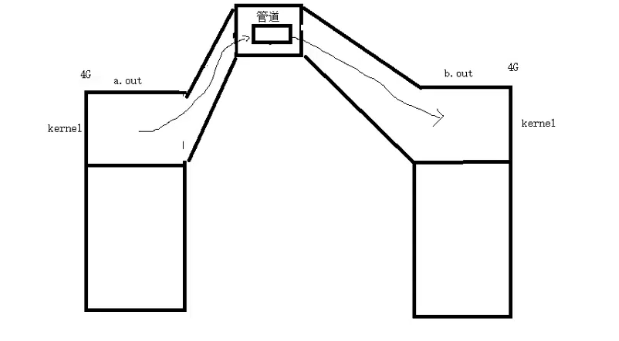

进程间通信的方式：

- 管道
- 内存映射IO
- 信号量
- 共享内存
- 消息队列


# 1 管道 pipe

管道是一个最基本的IPC机制，有如下特质：

- 其本质是一个伪文件（内核缓冲区）,不占用磁盘空间
- 由两个文件描述符引用，一个表示读端，一个表示写端
- 数据从管道的写端流入，从读端流出（==半双工==）

管道的原理：管道实为内核使用**环形队列**机制，借助内核缓冲区（4K）实现

管道的局限性：

- 数据自己读，不能自己写
- 数据一旦被读走，便不在管道中存在，不可反复读取
- 采用的是半双工通信方式，即，数据只能在一个方向上流动

.

## 1.1 匿名管道

不存储在磁盘中，**只能用于有血缘关系的进程间通信**

==注意：==

- 管道是在fork之前创建的
- fork之后，父子进程共享同一个管道，且具有管道读、写端的权限
- 根据管道的机制，通信时，每个进程应该只能有一端的操作权限，因此需要关闭另一端

```c
int pipe(int pipefd[2]);
- pipefd[0]：读端的文件描述符
- pipefd[1]：写端的文件描述符
```


> 【示例】父子进程使用匿名管道通信：pipe_fork.c


## 1.2 命名管道

磁盘中文件类型为p的文件，就是命名管道，可以让**非血缘关系的进程进行通信**

```c
int mkfifo(const char *pathname, mode_t mode);
```


## 1.3 socketpair

socketpair()函数用于创建一对匿名的、相互连接的套接字。 

```c++
int socketpair(int domain, int type, int protocol, int sv[2]);
- domain：协议族，一般为AF_UNIX
- type：SOCK类型
- protocol：协议号
- sv[2]：创建的2个连接套接字，sv[0]读/写，sv[1]写/读
成功，则返回0，创建好的套接字分别是sv[0]和sv[1]；否则返回-1，错误码保存于errno中。
```

- 读写操作位于同一个进程时，sv[0]用于读，sv[1]用于写
- 读写操作位于不同进程时，读进程需要关闭写端，写进程需要关闭读端


**socketpair与pipe的区别：**

管道pipe是半双工的，pipe两次才能实现全双工，使得代码复杂。socketpair直接就可以实现全双工；

socketpair对两个文件描述符中的任何一个都可读和可写，而pipe是一个读，一个写


# 2 内存映射 mmap

详情见【01.IO操作-高级IO.md】

- 1、创建映射空间

```c++
void *mmap(void *addr, size_t length, int prot, int flags, int fd, off_t offset);
- addr：指定映射到的进程空间的起始位置，如果为NULL，让系统自己分配
- length：映射区长度
- prot：映射区的操作权限（读/写）
- flags：权限（共享、私有）
- fd：文件描述符，打开要映射的文件
- offset：指定要映射文件的偏移量
如果成功，返回创建的映射区首地址；失败，返回MAP_FAILED宏
```

- 2、接触映射

```c++
int munmap(void *addr, size_t length);
```

==注意事项：==

- 映射区大小不能为0（不能在open的时候使用O_CREATE创建一个**空文件**映射到进程空间）
- 映射区的权限 **<=** 文件打开权限
- 创建映射区时，文件至少需要有**读的权限**
- 文件偏移量参数，必须是4K的整数倍（CPU的MMU单元负责内存映射，映射单位是4K）


## 2.1 匿名映射

在之前的映射时，每次创建映射区一定要依赖一个打开的文件才能实现

通常为了建立一个映射区，要open一个文件，创建好映射区后，再close文件，比较麻烦

Linux系统提供了创建匿名映射区的办法，无需依赖一个文件即可创建映射区，需要指定flags参数

flags=`MAP_SHARED|MAP_ANONYMOUS`

```c
int *p = mmap(NULL, 4, PROT_READ, MAP_SHARED|MAP_ANONYMOUS, -1, 0);
// 映射区长度任意；文件描述符为-1，不使用文件
```


由于这个匿名映射的宏是Linux提供的，因此不适用于其他操作系统

这时，可以使用`/dev/zero`文件来创建映射区，这个文件的大小是无限大的，给一指定任意长度，和`/dev/null`文件相对应

```c
fd = open("/dev/zero", O_RDWR);
p = mmap(NULL, size, PROT_READ, MMAP_SHARED, fd, 0);
```


# 3 信号量

多个进程同时访问某个资源时，需要考虑进程同步问题

信号量（Semaphore）是一种特殊的变量，S=n，表示允许n个进程来读取这个资源

信号量支持两种操作：等待（wait）和信号（signal）；在Linux中通常称为P、V操作

P：当某个进程来读取资源时，S-1；当S=0时，表示当前读取资源的进程上限已经达到，需要等待资源，处于挂起状态，直到V唤醒它

V：当某个进程使用完资源时，S+1；并通知其他挂起等待的进程来争夺资源


- 创建一个新的信号集或获取一个已经存在的信号集

```c++
int semget(key_t key, int num_sems, int sem_flags);
- key：标识信号集
- num_sems：创建/获取的信号量数目；如果是获取已存在的信号量，设置为0
- sem_flags:标志位
```

- 执行P、V操作

```c++
int semop(int sem_id, struct sembuf *sem_ops, size_t num_sem_ops);
```

- 对信号量直接控制

```c++
int semctl(int sem_id, int sem_num, int command, ...);
```


# 4 共享内存

**共享内存是最高效的IPC机制**，因为它不涉及进程之间的任何数据传输，让进程共享同一块内存，使得资源可以重复使用

这种高效率带来的问题是：必须使用其他辅助手段来同步进程对共享内存的访问，否则会产生竞态条件


- 1、创建一段新的共享内存，或者获取一段已经存在的共享内存：

```c++
#include <sys/ipc.h>
#include <sys/shm.h>

int shmget(key_t key, size_t size, int shmflg);
- key：用来标识全局唯一的共享内存
- size：内存的大小，单位是字节；如果=0，则获取已经存在的共享内存
- shmflg：标志位
成功，返回正整数值，它是共享内存的标识符shm_id；失败返回-1，并设置errno
```

- 2、共享内存被创建/获取后，需要先将它关联到进程的地址空间

```c++
void *shmat(int shm_id, const void* shm_addr, int shmflg);
- shm_id：shmget的返回值，共享内存的标识符
- shm_addr：进程的地址空间
- shmflg：为NULL，则被关联的地址由操作系统自动分配
```

- 3、使用完共享内存后，需要将它从进程空间中分离

```c++
int shmdt(const void* shm_addr);
```

- 可以使用系统调用，控制共享内存的某些属性

```c++
int shmctl(int shm_id, int command, struct shmid_ds *buf);
```


## 4.1 创建共享内存的POSIX方法

使用POSIX方法时，编译时需要制定链接选项`-lrt`

- 创建

```c++
int shm_open(const char *name, int oflag, mode_t mode); // 类似open()
- name:创建/打开的共享内存对象
- oflag：标志位，指定创建/打开共享内存的方式
    - O_RDONLY:只读方式
    - O_RDWR：可读可写方式
    - O_CREATE：如果不存在共享内存，则创建
    - O_EXCL：与O_CREATE一起使用，如果name指定的共享内存已存在，则函数返回错误，否则创建新的内存空间
    - O_TRUNC：如果共享内存已存在，则覆盖为新的共享内存
成功，返回文件描述符，该文件描述符可用于mmap()调用；失败返回-1，并设置errno
```

- 分离（删除）

```c++
  int shm_unlink(const char *name);
```


# 5 消息队列

在两个进程块之间传递二进制数据的简单有效方式

每个数据块有一个特定的类型，接收方可以根据类型来有选择地接收数据，而不一定像管道那样必须以先进先出的方式接收数据

- 创建一个消息队列/获取一个已有的消息队列

```c
int msgget(key_t key, int msgflg);
成功返回消息队列标识符；失败返回0并设置errno
```

如果创建成功，则内核的数据结构msqid_ds将被创建并初始化：

```c
struct msqid_ds
{ 
    struct ipc_perm msg_perm;/*消息队列的操作权限*/
    time_t msg_stime;/*最后一次调用msgsnd的时间*/
    time_t msg_rtime;/*最后一次调用msgrcv的时间*/
    time_t msg_ctime;/*最后一次被修改的时间*/
    unsigned long__msg_cbytes;/*消息队列中已有的字节数*/
    msgqnum_t msg_qnum;/*消息队列中已有的消息数*/
    msglen_t msg_qbytes;/*消息队列允许的最大字节数*/
    pid_t msg_lspid;/*最后执行msgsnd的进程的PID*/
    pid_t msg_lrpid;/*最后执行msgrcv的进程的PID*/
};
```

- 把一条消息添加到消息队列中：

```c
int msgsnd(int msqid, const void *msg_ptr, size_t msg_sz, int msgflg);
- msqid：消息队列标识符
- msg_ptr：准备发送的消息
- msg_sz：数据大小
- msgflg:控制msgsnd的行为；它通常仅支持IPC_NOWAIT标志，即以非阻塞的方式发送消
    
msg_ptr参数指向一个准备发送的消息，消息必须定义为如下类型：
struct msgbuf
{ 
    long mtype;/*消息类型*/
	char mtext[512];/*消息数据*/
}; 
```

- 从消息队列中获取消息：

```c
int msgrcv(int msqid, void *msg_ptr,size_t msg_sz,long int msgtype, int msgflg);
- msgtype：指定接收何种类型的消息。我们可以使用如下几种方式来指定消息类型：
	- 等于0。读取消息队列中的第一个消息
	- 大于0。读取消息队列中第一个类型为msgtype的消息（除非指定了标志MSG_EXCEPT）
	- 小于0。读取消息队列中第一个类型值比msgtype的绝对值小的消息
```

- 设置消息队列属性：

```c
int msgctl(int msqid, int command, struct msqid_ds *buf);
- msqid:是由msgget调用返回的共享内存标识符
- command:指定要执行的命令
```

