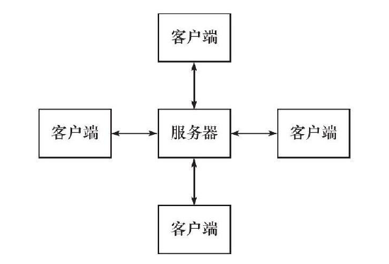
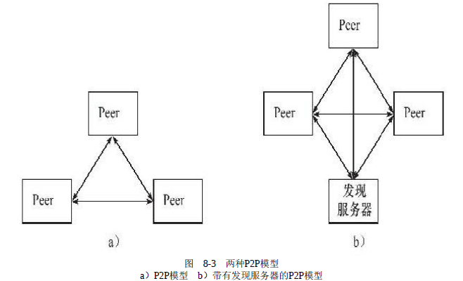
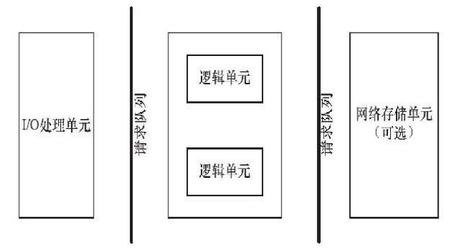
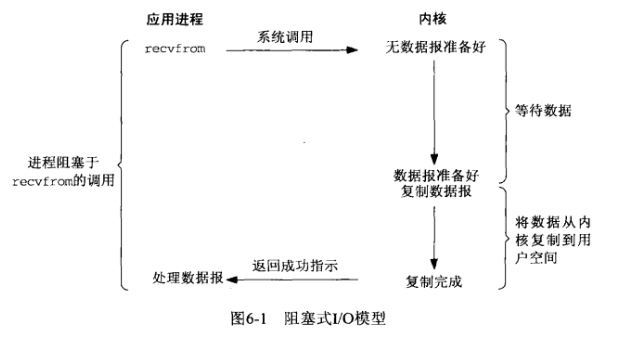
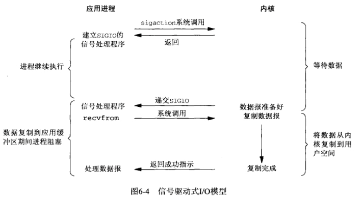
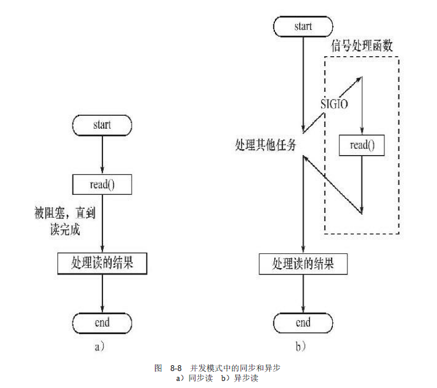
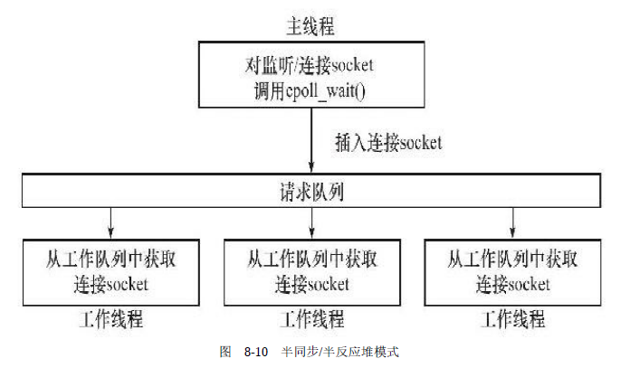
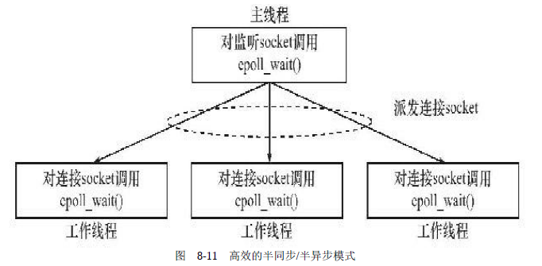
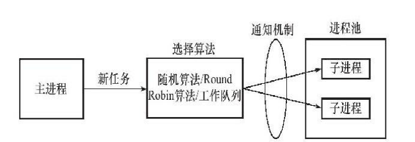

# 服务器模型

## C/S模型

所有客户端都通过访问服务器来获取所有资源



服务器启动：

- 创建一个或多个监听socket，调用`bind()`将其绑定到服务端口，然后调用`listen()`等待客户连接

服务器运行后：客户端向服务器发送`connect()`请求

- 客户连接请求时随机到达的异步事件，服务器需要使用某种==I/O模型==来监听fd
  - 常用的I/O模型：`select`，`poll`，`epoll`
- 服务器监听到连接请求后，`accept()`新的客户请求，并分配一个==逻辑单元==为该客户服务
  - 逻辑单元：新创建的子进程、线程等


**缺点：**

服务器是通信中心，当访问量过大时，服务器负载大，所有客户都将得到很慢的相应

## P2P模型

每台机器在消耗服务的同时也为他人提供服务，这样资源能够充分、自由共享，如：云计算机群

从编程者角度来看，P2P模型可以看做是C/S模型的扩展：**每台主机既是客户端又是服务器**，因此仍然采用C/S模型编程思想进行




**缺点：**

当用户之间传输的请求过多时，网络的负载加重


# 高性能服务器框架



上图既能用来描述一台服务器，又能用来描述一个服务器机群，各个部件的含义功能如下表：

|     模块     |       单个服务器程序       |          服务器机群          |
| :----------: | :------------------------: | :--------------------------: |
| I/O处理单元  | 处理客户连接、读写网络数据 | 作为接入服务器、实现负载均衡 |
|   逻辑单元   |    处理业务的进程或线程    |          逻辑服务器          |
| 网络存储单元 |   本地数据库、文件或缓存   |         数据库服务器         |
|   请求队列   |    各单元之间通信的方式    |  各服务器之间的永久TCP连接   |

- **I/O处理单元：服务器管理客户连接的模块**
  - 等待并接受新的客户连接，接收客户数据，将服务器响应数据返回给客户端；数据的收发不一定在I/O处理单元中执行，也可能在逻辑单元执行，具体情况取决于==事件处理模式==
  - 对于服务器机群而言，I/O处理单元是一个专门的接入服务器，用于实现负载均衡
- **逻辑单元：通常是一个进程或线程**
  - 分析并处理客户数据，将结果传递给I/O处理单元或直接发送给客户端（取决于事件处理模式）
  - 对于服务器机群而言，一个逻辑单元就是一台逻辑服务器
  - 服务器通常拥有多个逻辑单元，以实现对多个客户任务的并行处理
- **网络存储单元：可以是数据库、缓存和文件；非必须**
- **请求队列：是各个单元之间通信的方式，通常是用于进程池或线程池**
  - I/O处理单元接收到客户请求时，需要以某种方式通知一个逻辑单元来处理该请求
  - 多个逻辑单元同时访问一个存储单元时，也需要某种机制来协调处理竞态条件


# I/O模型

系统调用函数，调用时会**从用户进程空间切换到内核空间运行一段时间再切换回来**

常用的系统调用：read、write、accept、send、recv、connect

## 阻塞I/O：

执行阻塞的系统调用时，可能无法立即完成而被从操作系统挂起（程序暂停在系统调用处），直到等待的事件发生为止



使用recv的默认参数一直等数据直到拷贝到用户空间，这段时间内进程始终阻塞。A同学用杯子装水，打开水龙头装满水然后离开。这一过程就可以看成是使用了阻塞IO模型，因为如果水龙头没有水，他也要等到有水并装满杯子才能离开去做别的事情。很显然，这种**IO模型是同步的**。


## 非阻塞I/O

执行非阻塞的系统调用时，不管事件是否已经发生，都会立即往下执行；如果事件没有发生，这些系统调用就会返回-1并返回errno；需要根据errno来判断是系统调用出错还是事件未发生（程序继续向下执行了）


改变flags，让recv不管有没有获取到数据都返回，如果没有数据那么一段时间后再调用recv看看，如此循环。B同学也用杯子装水，打开水龙头后发现没有水，它离开了，过一会他又拿着杯子来看看……在中间离开的这些时间里，B同学离开了装水现场(回到用户进程空间)，可以做他自己的事情。这就是非阻塞IO模型。但是它只有是检查无数据的时候是非阻塞的，在数据到达的时候依然要等待复制数据到用户空间(等着水将水杯装满)，因此它还是**同步IO**


## I/O复用

I/O复用函数：select，poll，epoll，它们都是阻塞的

应用程序通过I/O复用函数，在内核注册一组监听事件，当事件发生时，把其中就绪的事件从内核空间复制一份到用户空间


这里在调用recv前先调用select或者poll，这2个系统调用都可以在内核准备好数据(网络数据到达内核)时告知用户进程，这个时候再调用recv一定是有数据的。因此这一过程中它是阻塞于select或poll，而没有阻塞于recv，有人将非阻塞IO定义成在读写操作时没有阻塞于系统调用的IO操作(不包括数据从内核复制到用户空间时的阻塞，因为这相对于网络IO来说确实很短暂)，如果按这样理解，这种IO模型也能称之为非阻塞IO模型，但是按POSIX来看，它也是**同步IO**，那么也和楼上一样称之为同步非阻塞IO吧

这种IO模型比较特别，分个段。因为它能同时监听多个文件描述符(fd)。这个时候C同学来装水，发现有一排水龙头，舍管阿姨告诉他这些水龙头都还没有水，等有水了告诉他。于是等啊等(select调用中)，过了一会阿姨告诉他有水了，但不知道是哪个水龙头有水，自己看吧。于是C同学一个个打开，往杯子里装水(recv)。这里再顺便说说鼎鼎大名的epoll(高性能的代名词啊)，epoll也属于IO复用模型，主要区别在于舍管阿姨会告诉C同学哪几个水龙头有水了，不需要一个个打开看(当然还有其它区别)


## 信号驱动I/O



通过调用sigaction注册信号函数，等内核数据准备好的时候系统中断当前程序，执行信号函数(在这里面调用recv)。D同学让舍管阿姨等有水的时候通知他(注册信号函数)，没多久D同学得知有水了，跑去装水。是不是很像异步IO？很遗憾，它还是**同步IO**(省不了装水的时间啊)


## 同步I/O模型

阻塞I/O、非阻塞I/O、I/O复用和信号驱动I/O都是同步I/O模型，因为这些I/O的读写操作都是在I/O事件发生之后，由应用程序来完成的

换句话说，==同步I/O模型要求用户编写代码自行执行I/O操作==（`recv`将数据从内核缓冲区读入用户缓冲区，或`send`将数据从用户缓冲区写入内核缓冲区）

同步I/O向应用程序通知的是I/O就绪事件，通知用户接下来可以执行读写操作


## 异步I/O模型

用户可以直接对I/O执行读写操作，这些操作告诉内核——用户读写缓冲区的位置，以及I/O操作完成之后内核通知应用程序的方式

异步I/O的读写操作总是立即返回的，不论I/O是否是阻塞的，因为真正的读写操作是由内核完成的（内核完成数据在内核缓冲区和用户缓冲区之间的移动）

异步I/O向应用程序通知的是I/O完成事件


调用aio_read，让内核等数据准备好，并且复制到用户进程空间后执行事先指定好的函数。E同学让舍管阿姨将杯子**装满水后通知他**。整个过程E同学都可以做别的事情(没有recv)，这才是真正的异步IO


## 5种I/O模型的比较


## 小结

**同步：**

所谓同步，就是在发出一个功能调用时，在没有得到结果之前，该调用就不返回。也就是必须一件一件事做,等前一件做完了才能做下一件事。 

例如普通B/S模式（同步）：提交请求->等待服务器处理->处理完毕返回 这个期间客户端浏览器不能干任何事

**异步：**

异步的概念和同步相对。当一个异步过程调用发出后，调用者不能立刻得到结果。实际处理这个调用的部件在完成后，通过状态、通知和回调来通知调用者。

例如 ajax请求（异步）: 请求通过事件触发->服务器处理（这是浏览器仍然可以作其他事情）->处理完毕

**阻塞：**

阻塞调用是指调用结果返回之前，当前线程会被挂起（线程进入非可执行状态，在这个状态下，cpu不会给线程分配时间片，即线程暂停运行）。函数只有在得到结果之后才会返回。

有人也许会把阻塞调用和同步调用等同起来，实际上他是不同的。对于同步调用来说，很多时候当前线程还是激活的，只是从逻辑上当前函数没有返回,它还会抢占cpu去执行其他逻辑，也会主动检测io是否准备好。

**非阻塞：**

非阻塞和阻塞的概念相对应，指在不能立刻得到结果之前，该函数不会阻塞当前线程，而会立刻返回。


再简单点理解就是：

同步，就是我调用一个功能，该功能没有结束前，我死等结果。

异步，就是我调用一个功能，不需要知道该功能结果，该功能有结果后通知我（回调通知）。

阻塞，就是调用我（函数），我（函数）没有接收完数据或者没有得到结果之前，我不会返回。

非阻塞，就是调用我（函数），我（函数）立即返回，通过select通知调用者


**同步IO和异步IO的区别就在于：** 数据拷贝的时候进程是否阻塞

**阻塞IO和非阻塞IO的区别就在于：** 应用程序的调用是否立即返回


综上可知，同步和异步,阻塞和非阻塞,有些混用,其实它们完全不是一回事,而且它们修饰的对象也不相同。


# 事件处理模式

## Reactor模式（反应堆模型）

同步I/O通常用于实现Reactor模式

Reactor是这样一种模式，它要求==**主线程（I/O处理单元）只负责监听文件描述上是否有事件发生**==，有的话就立即将该事件通知工作线程（逻辑单元）。除此之外，主线程不做任何其他实质性的工作；==读写数据，接受新的连接，以及处理客户请求均是利用**回调函数**在工作线程中完成==


使用同步I/O模型（以`epoll_wait`为例）实现的Reactor模式的工作流程是：

- 1）主线程往epoll内核事件表中注册socket上的读就绪事件
- 2）主线程调用`epoll_wait`等待socket上有数据可读
- 3）当socket上有数据可读时，`epoll_wait`通知主线程。主线程则将socket可读事件放入请求队列
- 4）睡眠在请求队列上的某个工作线程被唤醒，它从socket读取数据，并处理客户请求，然后epoll内核事件表中注册该socket上的写就绪事件
- 5）主线程调用`epoll_wait`等待socket可写
- 6）当socket可写时，`epoll_wait`通知主线程。主线程将socket可写事件放入请求队列
- 7）睡眠在请求队列上的某个工作线程被唤醒，它往socket上写入服务器处理客户请求的结果

**一般是在主线程中执行回调函数**


## Proactor模式

异步I/O通常用于实现Proactor模式

与Reactor模式不同，Proactor模式==将所有I/O操作都交给主线程和内核来处理，工作线程仅仅负责业务逻辑==。因此，Proactor模式更符合服务器编程框架。

使用异步I/O模型（以`aio_read`和`aio_write`为例）实现的Proactor模式的工作流程是：
1）主线程调用`aio_read`函数向内核注册socket上的读完成事件，并告诉内核用户读缓冲区的位置，以及读操作完成时如何通知应用程序（这里以信号为例，详情请参考sigevent的man手册）

2）主线程继续处理其他逻辑

3）当socket上的数据被读入用户缓冲区后，内核将向应用程序发送一个信号，以通知应用程序数据已经可用

4）应用程序预先定义好的信号处理函数选择一个工作线程来处理客户请求。工作线程处理完客户请求之后，调用`aio_write`函数向内核注册socket上的写完成事件，并告诉内核用户写缓冲区的位置，以及操作完成时如何通知应用程序（仍然以信号为例）

5）主线程继续处理其他逻辑

6）当用户缓冲区的数据被写入socket之后，内核将向应用程序发送一个信号，以通知应用程序数据已经发送完毕

7）应用程序预先定义好的信号处理函数选择一个工作线程来做善后处理，比如决定是否关闭socket


# 并发模式

并发模式是指：I/O处理单元和多个逻辑单元之间协调完成任务的方法

## 半同步/半异步模式

在I/O模型中，“同步”和“异步”区分的是：

- 内核向应用程序通知的是什么类型的I/O事件（就绪事件或完成事件）
- 该由谁来完成I/O读写（是应用程序还是内核）



在并发模式中：

- 同步是指程序完全按照代码序列的顺序执行
- 异步是指程序的执行需要系统事件来驱动
  - 系统事件包括：中断、信号等

- 同步方式运行的线程称为同步线程
  - 同步线程效率相对低，实时性较差，但逻辑简单
- 异步方式运行的线程称为异步线程
  - 异步线程执行效率高，实时性强

半同步/半异步模式中：==同步线程用于处理客户逻辑（实现逻辑单元），异步线程用于处理I/O事件（实现I/O处理单元）==

工作流程：

- 异步线程监听到客户请求后，将其插入到工作队列中
- 然后通知同步线程来获取工作队列的客户对象，然后对数据进行处理


### 变体：半同步/半反应堆模型

Reactor事件处理模式+epoll模型



- ==主线程是异步线程==，负责监听所有socket上的事件；当有新的连接请求，主线程就接收连接，然后将新客户端连接添加到`epoll`；当客户端连接有读写事件时，主线程就将这个客户连接加入到工作队列中
- 工作队列中有任务时，工作线程就来抢夺任务来进行处理


**缺点：**

- 主线程和工作线程共享工作队列：需要对工作队列进行加锁保护，从而浪费CPU时间
- 每个工作线程在同一时间只能处理一个客户请求：当客户数量多，工作线程少时，请求队列会堆积很多任务对象，客户端的相应变慢；如果增加工作线程，则工作线程的切换也会浪费CPU时间


### 高效的半同步/半异步模式

每个工作线程都能同时处理多个客户请求



- 主线程只管理监听socket，当有新的连接请求，主线程就接收连接，然后将新客户端连接添加到`epoll`并将这个客户sokcet派发给某个工作线程
  - 主线程向工作线程派发socket的方式：管道
- 工作线程检测到管道上有数据可读，就分析是否有一个新的客户连接到来，如果是，则把这个socket添加到自己的`epoll`上，此后这个socket上的任何I/O操作都是由这个工作线程来处理


## ==领导者/追随者模式==

领导者：程序仅有一个领导者线程，负责监听I/O事件

追随者：休眠在线程池中等待称为新的领导者

当前领导者如果检测到I/O事件，首先从线程池中推选出新的领导者，然后在当前领导者线程中处理I/O事件，新的领导者线程监听等待新的I/O事件；二者实现了并发


# 逻辑单元高效编程方法：==有限状态机==

逻辑单元通常是用于处理I/O数据的，介绍逻辑单元内部的一种高效编程方法：有效状态机


自然流程：解决问题的流程图

简单流程：一个程序的自然流程是结构化的（顺序流程图可以描述这个任务）

复杂流程：一个程序的自然流程不是结构化的（不能用简单的顺序流程图描述整个任务）


**有限状态机用于解决复杂流程，一般分为以下步骤：**

- 程序开始（R，read；W，write）
- 如果出现真错，EX态（Ex，exit），程序终止
- 如果出现假错，E态，程序重新开始

- 任务完成，程序终止（T，teminal）

> 有限状态机流程图：状态之间的转移需要状态机内部驱动


算法思路：

- 1、定义整个流程中可能出现的状态

```c
enum
{
    TYPE_A = 0,	//开始状态
    TYPE_B,		//其他状态
    TYPE_C		//终止状态
}
```

- 2、为每个状态规定一系列动作


# 池

实现并发服务器时，当有新的客户端连接时，使用一个进程/线程来接受连接请求；每当与客户端通信时，动态创建一个子进程/线程来收发数据，这样做有如下**缺点**：

- 在内核中创建子进程/线程是比较耗时的，这将导致较慢的客户响应
- 创建的子进程/线程通常只用来服务一个客户，如果有大量客户，这将导致系统上产生大量的细微进程/线程；且进程/线程间的切换将消耗大量的CPU时间
- 动态创建的子进程是当前进程的完整映像。当前进程必须谨慎地管理其分配的文件描述符和堆内存
  等系统资源，否则子进程可能复制这些资源，从而使系统的可用资源急剧下降，进而影响服务器的性能


为了解决上述问题，提高服务器性能，通常使用==空间换时间==的方法

==池是一组资源的集合，这组资源在服务器启动之初就被完全创建好并初始化，这成为静态资源分配==

通常会预先分配一定的资源，此后如果发现资源不够用时，再动态分配一些并加入到池中


根据不同的资源类型，可以划分为以下池：

- **内存池：通常用于socket的接收缓存和发送缓存**
- **进程池和线程池：用于并发编程**
- 连接池：同于服务器或服务器机群的内部永久连接

## 进程池和线程池

进程池与线程池类似，下面以进程池为例进行介绍


进程池：由服务器预先创建的一组子进程

静态进程池：创建固定数量的子进程，一般在3~10个之间；线程池中的线程数和CPU核数差不多

动态进程池：有下限和上限，会因为客户端的数量在区间内动态扩张/缩减（定义步长）

- 什么时候扩张/缩减？单独用一个线程来管理
- 定义两个变量：当前存活的进程数、当前运行的进程数；根据比例来进行扩张/缩减


当新的任务到来时，主进程将通过以下两种方式让进程池中的子进程来执行任务：

- 方法一：**主进程使用某种算法来主动选择子进程**，如随机算法、轮流选取算法

  - 当选择好子进程后，主进程需要通过某种**通知机制**来告诉该子进程来执行任务，并传递要处理的数据。最简单的办法是在父进程和该子进程直接创建一个==管道==，来实现进程间通信；线程间通信时，可以将共享的数据定义为全局变量，这是线程共享的

- 方法二：**主进程和进程池共享一个任务队列**；当有新的任务到来时，主进程将这个客户端添加到任务队列，然后==唤醒==正在等待任务的子进程，进程池中的所有子进程都会来抢这个任务进行处理，但只有一个子进程能抢到这个任务，其他子进程将继续等待任务

  - 任务队列是临界资源，需要互斥锁

    任务队列的情况：

    - 任务队列为空：进程池等待阻塞（直到任务队列有任务才开始取任务）
    - 任务队列满：服务端等待阻塞（直到任务队列不满才开始接收客户端的新任务）



## 处理多客户

当一个客户请求服务端的多项服务时，需要考虑一个客户连接上的所有任务是否始终由一个子进程来处理

- 当客户任务是无状态的：可以创建多个子进程来处理多个服务
- 当客户任务存在上下文关系的：用一个子进程来处理