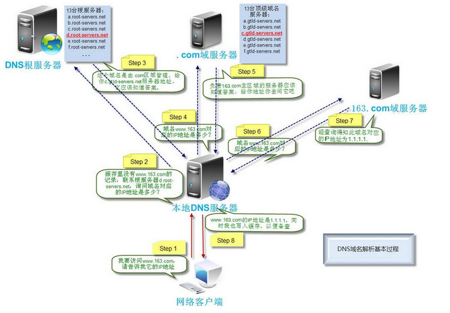
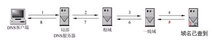
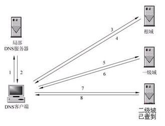
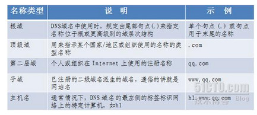
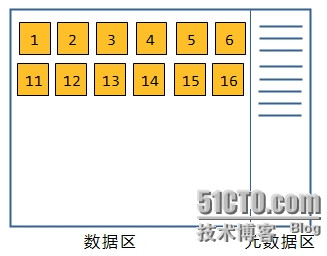
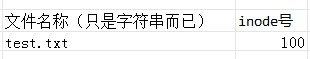
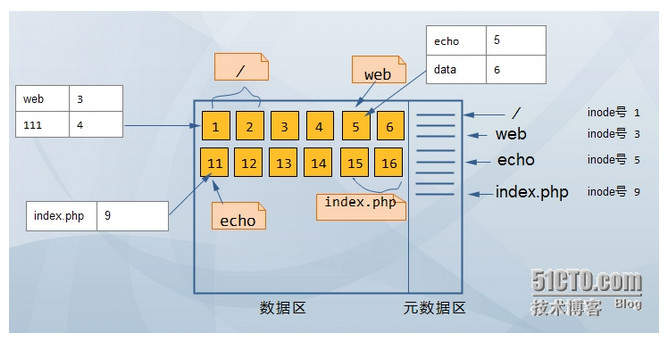

# HTTP简介

参考：https://www.cnblogs.com/phpstudy2015-6/p/6810130.html#_label3

## HTTP协议是什么？

即超文本传输协议（HTTP，HyperText Transfer Protocol)是互联网上应用最为广泛的一种网络协议，所有的WWW文件都必须遵守这个标准。从网络参考模型来看，它是属于应用层。它规定了计算机通信网络中两台计算机之间进行通信所必须共同遵守的规定或规则，它允许将超文本标记语言(HTML)文档从Web服务器传送到客户端的浏览器。

简单的来说，它就是基于应用层一个规范一个标准！通讯双发都需要遵守这一准则，这就是http协议！

## HTTP简史

设计HTTP最初的目的是为了提供一种发布和接收HTML页面的方法。1960年美国人Ted Nelson构思了一种通过计算机处理文本信息的方法，并称之为超文本（hypertext），这成为了HTTP超文本传输协议标准架构的发展根基。Ted Nelson组织协调万维网协会（World Wide Web Consortium）和互联网工程工作小组（Internet Engineering Task Force ）共同合作研究，最终发布了一系列的RFC，其中著名的RFC 2616定义了HTTP 1.1，这也是我们现在最常用的版本，在此之前还存在HTTP 1.0版本以及HTTP 0.9版本


## HTTP特点

HTTP协议永远都是客户端发起请求，服务器回送响应。这样就限制了使用HTTP协议，无法实现在客户端没有发起请求的时候，服务器将消息推送给客户端。

主要特点：

　　1、支持客户/服务器模式。一旦建立了运输连接（这常常称为建立了会话），浏览器端就向万维网服务器端发送HTTP请求，服务器收到请求后给出HTTP响应。
　　2、简单快速：客户向服务器请求服务时，只需传送请求方法和路径。请求方法常用的有GET、HEAD、POST。每种方法规定了客户与服务器联系的类型不同。由于HTTP协议简单，使得HTTP服务器的程序规模小，因而通信速度很快。
　　3、灵活：HTTP允许传输任意类型的数据对象。正在传输的类型由Content-Type加以标记。
　　4、HTTP 0.9和1.0使用非持续连接：限制每次连接只处理一个请求，服务器处理完客户的请求，并收到客户的应答后，即断开连接。HTTP 1.1使用持续连接：不必为每个web对象创建一个新的连接，一个连接可以传送多个对象，采用这种方式可以节省传输时间。
　　5、无状态：HTTP协议是无状态协议。即每一个HTTP请求都是独立的。万维网服务器不保存过去的请求和过去的会话记录。这就是说，同一个用户再次访问同一个服务器时，只要服务器没有进行内容的更新，服务器的响应就给出和以前被访问时相同的响应。服务器不记录曾经访问过的用户，也不记录某个用户访问过多少次


# URI和URL

## URI

**URI：统一资源标示符，只是标识资源在哪里，这意味着存在多个URI可以指向该资源（例如：绝对与相对）【URI包含URL】**

URI一般由三部分组成：

- 访问资源的命名机制。 

- 存放资源的主机名。 

- 资源自身的名称，由路径表示。 

  

  语法：[scheme:] scheme-specific-part 

URI以scheme和冒号开头。Scheme用大写/小写字母开头，后面为空或者跟着更多的大写/小写字母、数字、加号、减号和点号。冒号把 scheme与scheme-specific-part分开了，并且scheme-specific-part的语法和语义（意思）由URI的名字空间决定。如下面的例子：

```
http://www.cnn.com，其中http是scheme，//www.cnn.com是 scheme-specific-part，并且它的scheme与scheme-specific-part被冒号分开了。
```

**绝对与相对：**

绝对的URI指以scheme（后面跟着冒号）开头的URI。(例如：mailto:jeff@javajeff.com、news:comp.lang.java.help和xyz: //whatever)；绝对的URI看作是以某种方式引用某种资源，而这种方式对标识符出现的环境没有依赖。

相对的URI不是以scheme（后面跟着冒号）开始的URI。(例如：articles/articles.html、img/aa.jpg)你可以把相对的URI看作是以某种方式引用某种资源，而这种方式依赖于标识符出现的环境。（即你在html中引用图片：./img/aa.jpg，那么它依赖的就是http）

## URL

**URL：统一资源定位符，是URI的子集；它除了标识资源的位置，还提供一种定位该资源的主要访问机制(如其网络“位置”)。【即提供具体方式找到该资源（位置+方式）】**

URL的格式由下列三部分组成：

- 第一部分，是协议或称为服务方式 （指定低层使用的协议，例如：http, https, ftp)；
- 第二部分，是存有该资源的主机IP地址（有时也包括端口号）； 
- 第三部分，是主机资源的具体地址。如目录和文件名等。

　　第一部分和第二部分之间用"：//"符号隔开，第二部分和第三部分用"/"符号隔开。第一部分和第二部分是不可缺少的，第三部分有时可以省略。 


# ==HTTP请求（Request）==

## Request消息结构

请求消息的结构由三部分组成，请求行、请求头、请求主体（即：请求行、消息报头、请求正文。）

> 【请  求 行】请求方法 **空格** 请求资源地址(URI、无域名) **空格** HTTP版本 **空格 <CR><LF>(回车换行符)**
>
> 【请  求 头】标识:内容 <CR><LF>(回车换行符)
>
> 【空  一 行】（表示请求头结束）
>
> 【请求主体】（即请求正文，用户的主要数据。POST方式时使用，GET无请求主体）

　　在HTTP/1.1 协议中，所有的请求头，除Host外，都是可选的。　　

```http
GET /phpstudy2015-6/ HTTP/1.1		←请求头
Host: www.cnblogs.com				←请求行
User-Agent: Mozilla/5.0 (Windows; U; Windows NT 6.0; en-US; rv:1.9.0.10) Gecko/2009042316 Firefox/3.0.10
Accept: text/html,application/xhtml+xml,application/xml;q=0.9,*/*;q=0.8
Accept-Language: en-us,en;q=0.5
Accept-Encoding: gzip,deflate
Accept-Charset: ISO-8859-1,utf-8;q=0.7,*;q=0.7
Keep-Alive: 300
Connection: keep-alive
If-Modified-Since: Sat, 06 May 2017 12:05:41 GMT
```


### ==服务器解析HTTP请求==

在解析HTTP请求时，我们判断HTTP头部结束的依据是遇到一个空行，该空行仅包含一对回车换行符`\r\n`（＜CR＞＜LF＞）。如果一次读操作没有读入HTTP请求的整个头部，即没有遇到空行，那么我们必须等待客户继续写数据并再次读入。因此，每完成一次读操作，就要分析新读入的数据中是否有空行。为了提高解析HTTP请求的效率，在寻找空行的过程中，可以同时完成对整个HTTP请求头部的分析（记住，空行前面还有请求行和头部域）


### 请求行

正如上面所讲的，请求行以一个方法符号开头，空格之后，一个请求URI，再空格，然后一个HTTP版本，最后一个回车换行。

它的作用是用来说明当前请求的最基本信息。


### 请求头

（注：在HTTP/1.1 协议中，所有的请求头，除Host外，都是可选的）

　　#请求头的书写形式为：Host:coblogs.com \r\n【标识符:内容 回车换行】

　　**常见的请求头：**

　　1、Host：（发送请求时，该头域是必需的）主要用于指定被请求资源的Internet主机和端口号，它通常从HTTP URL中提取出来的。HTTP/1.1请求必须包含主机头域，否则系统会以400状态码返回。
　　例如: 我们在浏览器中输入：http://www.guet.edu.cn/index.html，浏览器发送的请求消息中，就会包含Host请求头域：Host：http://www.guet.edu.cn，此处使用缺省端口号80，若指定了端口号，则变成：Host：指定端口号。

　　2、User-Agent：告诉HTTP服务器，客户端使用的操作系统和浏览器的名称和版本。
　　例如： User-Agent: Mozilla/5.0 (Windows NT 6.3; Win64; x64; rv:53.0) Gecko/20100101 Firefox/53.0

　　3、Content-Type：例如：Content-Type: application/x-www-form-urlencoded

　　4、Accept-Language：浏览器申明自己接收的语言。语言跟字符集的区别：中文是语言，中文有多种字符集，比如big5，gb2312，gbk等等；例如：Accept-Language: en-us。如果请求消息中没有设置这个报头域，服务器假定客户端对各种语言都可以接受。

　　5、Accept：text/html,application/xhtml+xml,application/xml;q=0.9,*/*;q=0.8

　　6、Accept-Encoding：浏览器申明自己可接收的编码方法，通常指定压缩方法，是否支持压缩，支持什么压缩方法（gzip，deflate）;Servlet能够向支持gzip的浏览器返回经gzip编码的HTML页面。许多情形下这可以减少5到10倍的下载时间。

　　例如： Accept-Encoding: gzip, deflate。如果请求消息中没有设置这个域，服务器假定客户端对各种内容编码都可以接受。

　　7、Cookie：最重要的请求头之一, 将cookie的值发送给HTTP服务器。

　　8、Connection：HTTP 1.1默认进行持久连接keep-alive。
　　例如：Connection: keep-alive 当一个网页打开完成后，客户端和服务器之间用于传输HTTP数据的TCP连接不会关闭，如果客户端再次访问这个服务器上的网页，会继续使用这一条已经建立的连接。

　　利用持久连接的优点，当页面包含多个元素时（例如Applet，图片），显著地减少下载所需要的时间。要实现这一点，Servlet需要在应答中发送一个Content-Length头，最简单的实现方法是：先把内容写入ByteArrayOutputStream，然后在正式写出内容之前计算它的大小。
　　Connection: close 代表一个Request完成后，客户端和服务器之间用于传输HTTP数据的TCP连接会关闭，当客户端再次发送Request，需要重新建立TCP连接。

　　9、Keep-Alive：30保持持久连接30s

　　10、If-Modified-Since：把浏览器端缓存页面的最后修改时间发送到服务器去，服务器会把这个时间与服务器上实际文件的最后修改时间进行对比。如果时间一致，那么返回304，客户端就直接使用本地缓存文件。如果时间不一致，就会返回200和新的文件内容。客户端接到之后，会丢弃旧文件，把新文件缓存起来，并显示在浏览器中。

　　例如：If-Modified-Since: Sat, 06 May 2017 12:05:41 GMT

　　11、If-None-Match：If-None-Match和ETag一起工作，工作原理是在HTTP Response中添加ETag信息。 当用户再次请求该资源时，将在HTTP Request 中加入If-None-Match信息(ETag的值)。如果服务器验证资源的ETag没有改变（该资源没有更新），将返回一个304状态告诉客户端使用本地缓存文件。否则将返回200状态和新的资源和Etag.  使用这样的机制将提高网站的性能。

　　例如: If-None-Match: "03f2b33c0bfcc1:0"。

　　12、Pragma：指定“no-cache”值表示服务器必须返回一个刷新后的文档，即使它是代理服务器而且已经有了页面的本地拷贝；在HTTP/1.1版本中，它和Cache-Control:no-cache作用一模一样。Pargma只有一个用法， 例如： Pragma: no-cache

　　13、Cache-Control：指定请求和响应遵循的缓存机制。缓存指令是单向的（响应中出现的缓存指令在请求中未必会出现），且是独立的（在请求消息或响应消息中设置Cache-Control并不会修改另一个消息处理过程中的缓存处理过程）。请求时的缓存指令包括no-cache、no-store、max-age、max-stale、min-fresh、only-if-cached，响应消息中的指令包括public、private、no-cache、no-store、no-transform、must-revalidate、proxy-revalidate、max-age、s-maxage。

　　注意: 在HTTP/1.0版本中，只实现了Pragema:no-cache, 没有实现Cache-Control

　　Cache-Control:Public 可以被任何缓存所缓存
　　Cache-Control:Private 内容只缓存到私有缓存中
　　Cache-Control:no-cache 所有内容都不会被缓存
　　Cache-Control:no-store 用于防止重要的信息被无意的发布。在请求消息中发送将使得请求和响应消息都不使用缓存。
　　Cache-Control:max-age 指示客户机可以接收生存期不大于指定时间（以秒为单位）的响应。
　　Cache-Control:min-fresh 指示客户机可以接收响应时间小于当前时间加上指定时间的响应。
　　Cache-Control:max-stale 指示客户机可以接收超出超时期间的响应消息。如果指定max-stale消息的值，那么客户机可以接收超出超时期指定值之内的响应消息。

　　14、Accept-Charset：浏览器可接受的字符集。如果在请求消息中没有设置这个域，缺省表示任何字符集都可以接受。

　　15、Referer：包含一个URL，用户从该URL代表的页面出发访问当前请求的页面。提供了Request的上下文信息的服务器，告诉服务器我是从哪个链接过来的，比如从我主页上链接到一个朋友那里，他的服务器就能够从HTTP Referer中统计出每天有多少用户点击我主页上的链接访问他的网站。

　　例如: Referer:http://translate.google.cn/?hl=zh-cn&tab=wT

　　16、Content-Length：表示请求消息正文的长度。例如：Content-Length: 38。

　　17、From：请求发送者的email地址，由一些特殊的Web客户程序使用，浏览器不会用到它。

　　18、Range：可以请求实体的一个或者多个子范围。

　　例如：
　　表示头500个字节：bytes=0-499
　　表示第二个500字节：bytes=500-999
　　表示最后500个字节：bytes=-500
　　表示500字节以后的范围：bytes=500-
　　第一个和最后一个字节：bytes=0-0,-1
　　同时指定几个范围：bytes=500-600,601-999
　　但是服务器可以忽略此请求头，如果无条件GET包含Range请求头，响应会以状态码206（PartialContent）返回而不是以200（OK）。 


### 请求主体

请求的主要用户数据，就是POST数据。

如果方式为POST，则需要请求主体部分；GET则没有请求主体

数据形式：类似name=XXX&pwd=XXXX的内容 


## 请求方法

HTTP/1.1协议中共定义了八种方法（有时也叫“动作”）来表明Request-URI指定的资源的不同操作方式，最基本的有4种，分别是**GET,POST,PUT,DELETE**。一个URL地址用于描述一个网络上的资源，而HTTP中的GET, POST, PUT, DELETE就对应着对这个资源的**查，改，增，删**4个操作。 我们最常见的就是GET和POST了。GET一般用于获取/查询资源信息，而POST一般用于更新资源信息。

　　【我们在浏览器地址栏直接输入地址的时候，采用的就是GET方法】

**各方法如下：**

　　1、GET：向特定的资源发出请求

　　2、POST：向指定资源提交数据进行处理请求（例如提交表单或者上传文件）。数据被包含在请求体中。POST请求可能会导致新的资源的建立和/或已有资源的修改。

　　3、PUT：向指定资源位置上传其最新内容。

　　4、DELETE：请求服务器删除Request-URI所标识的资源。

　　5、HEAD： 向服务器索要与GET请求相一致的响应，只不过响应体将不会被返回。这一方法可以在不必传输整个响应内容的情况下，就可以获取包含在响应消息头中的元信息。该方法常用于测试超链接的有效性，是否可以访问，以及最近是否更新。

　　6、TRACE：请求服务器会送收到的请求信息，主要用于测试或诊断。

　　7、OPTIONS：请求查询服务器的性能，或者查询与资源相关的选项和需求

　　8、CONNECT： HTTP/1.1协议中预留给能够将连接改为管道方式的代理服务器。（即留为将来使用）

　　【注意：请求方法区分大小写；所示请求方法应为大写】

**GET与POST的区别：**

　　1、GET提交的数据会放在URL之后，以?分割URL和传输数据，参数之间以&相连，如EditPosts.aspx?postid=6810130&update=1 ；POST方法是把提交的数据放在HTTP包的Body中。

　　2、GET提交的数据大小有限制（因为浏览器对URL的长度有限制），而POST方法提交的数据没有限制。

　　3、GET方式需要使用Request.QueryString来取得变量的值，而POST方式通过Request.Form来获取变量的值。

　　4、GET方式提交数据，会带来安全问题，比如一个登录页面，通过GET方式提交数据时，用户名和密码将出现在URL上，如果页面可以被缓存或者其他人可以访问这台机器，就可以从历史记录获得该用户的账号和密码。


## http的无状态以及建立连接方式

**无状态：**

　　http协议为了保证服务器的内存，不会维持客户端发过来的请求，即同一个客户端的这次请求和上次请求是没有对应关系，对http服务器来说，它并不知道这两个请求来自同一个客户端。例如：一个浏览器在短短几秒之内两次访问同一对象时，服务器进程不会因为已经给它发过应答报文而不接受第二期服务请求。

　　为了解决这个问题， Web程序引入了==Cookie机制==来维护状态。

　　**建立连接方式：**

　　HTTP中支持两种连接方式：非持久连接和持久连接(HTTP1.1默认的连接方式为持久连接)。

　　**1、非持久连接方式（采用访问例子来说明）**

　　让我们查看一下非持久连接情况下从服务器到客户传送一个Web页面的步骤。假设该贝面由1个基本HTML文件和10个JPEG图像构成，而且所有这些对象都存放在同一台服务器主机中。再假设该基本HTML文件的URL为：cnblogs.com/phpstudy2015-6/index.html。

　　下面是具体步骡：

　　1. HTTP客户初始化一个与服务器主机cnblogs.com中的HTTP服务器的TCP连接。HTTP服务器使用默认端口号80监听来自HTTP客户的连接建立请求。

　　2. HTTP客户经由与TCP连接相关联的本地套接字发出—个HTTP请求消息。这个消息中包含路径名/somepath/index.html。

　　3. HTTP服务器经由与TCP连接相关联的本地套接字接收这个请求消息，再从服务器主机的内存或硬盘中取出对象/somepath/index.html，经由同一个套接字发出包含该对象的响应消息。

　　4. HTTP服务器告知TCP关闭这个TCP连接(不过TCP要到客户收到刚才这个响应消息之后才会真正终止这个连接)。

　　5. HTTP客户经由同一个套接字接收这个响应消息。TCP连接随后终止。该消息标明所封装的对象是一个HTML文件。客户从中取出这个文件，加以分析后发现其中有10个JPEG对象的引用。

　　6.给每一个引用到的JPEG对象重复步骡1-4。

　　上述步骤之所以称为使用**非持久连接**，原因是每次服务器发出一个对象后，相应的TCP连接就被关闭，也就是说每个连接都没有持续到可用于传送其他对象。每个TCP连接只用于传输一个请求消息和一个响应消息。就上述例子而言，用户每请求一次那个web页面，就产生11个TCP连接。

　　**2、持久连接**

　　非持久连接有一个很大的缺点就是，每一个http请求都需要建立一个TCP连接，就上面的例子而言，get一个html页面就要建立十一次TCP连接，这是严重浪费资源行为！

　　首先，客户得为每个待请求的对象建立并维护一个新的连接。对于每个这样的连接，TCP得在客户端和服务器端分配TCP缓冲区，并维持TCP变量。对于有可能同时为来自数百个不同客户的请求提供服务的web服务器来说，这会严重增加其负担。其次，如前所述，每个对象都有2个RTT的响应延长——**一个RTT用于建立TCP连接**，**另—个RTT用于请求和接收对象**。最后，每个对象都遭受TCP缓启动，因为每个TCP连接都起始于缓启动阶段。不过并行TCP连接的使用能够部分减轻RTT延迟和缓启动延迟的影响。

【RTT(Round-Trip Time): 往返时延。在计算机网络中它是一个重要的性能指标，表示从发送端发送数据开始，到发送端收到来自接收端的确认（接收端收到数据后便立即发送确认），总共经历的时延。】

　　持久连接就能够很好解决这一缺点，在持久连接情况下，服务器在发出响应后让TCP连接继续打开着。同一对客户/服务器之间的后续请求和响应可以通过这个连接发送。整个Web页面(上例中为包含一个基本HTMLL文件和10个图像的页面)自不用说可以通过单个持久TCP连接发送:甚至存放在同一个服务器中的多个web页面也可以通过单个持久TCP连接发送。

　　通常，HTTP服务器在某个连接闲置一段特定时间后关闭它，而这段时间通常是可以配置的。

　　持久连接分为不带流水线(without pipelining)和带流水线(with pipelining)两个版本。

　　**不带流水线的版本：**

　　客户只在收到前一个请求的响应后才发出新的请求。这种情况下，web页面所引用的每个对象(上例中的10个图像)都经历1个RTT的延迟，用于请求和接收该对象。与非持久连接2个RTT的延迟相比，不带流水线的持久连接已有所改善，不过带流水线的持久连接还能进一步降低响应延迟。不带流水线版本的另一个缺点是，服务器送出一个对象后开始等待下一个请求，而这个新请求却不能马上到达。这段时间服务器资源便闲置了。

　　**带流水线的持久连接：**

　　HTTP/1.1的默认模式使用带流水线的持久连接。这种情况下，HTTP客户每碰到一个引用就立即发出一个请求，因而HTTP客户可以一个接一个紧挨着发出各个引用对象的请求。服务器收到这些请求后，也可以一个接一个紧挨着发出各个对象。如果所有的请求和响应都是紧挨着发送的，那么所有**引用到的对象一共只经历1个RTT的延迟**(而不是像不带流水线的版本那样，每个引用到的对象都各有1个RTT的延迟)。另外，带流水线的持久连接中服务器空等请求的时间比较少。与非持久连接相比，持久连接(不论是否带流水线)除降低了1个RTT的响应延迟外，缓启动延迟也比较小。其原因在于既然各个对象使用同一个TCP连接，服务器发出第一个对象后就不必再以一开始的缓慢速率发送后续对象。相反，服务器可以按照第一个对象发送完毕时的速率开始发送下一个对象。


# ==HTTP响应（Response）==

## Response 消息的结构

　　响应消息的结构由三部分组成，响应行、相应头、相应主体（即：状态行、消息报头、响应正文。）

> 【响  应 行】HTTP版本 **空格** 状态码 **空格** 状态码的文本描述 **空格 CRLF(换行符)**
>
> 【响  应 头】:内容 CRLF(换行符)
>
> 【空  一 行】（表示响应头结束）
>
> 【响应主体】所谓响应主体，就是服务器返回的资源的内容。即整个HTML文件。


### 响应行

响应数据的第一行，响应结果的概述。

　　**状态码：**

　　状态代码有3位数字组成，状态描述给出了状态代码简短的描述。状态码第一个数字定义了响应的类别，有五种可能取值：
　　1xx　　：　　指示信息--表示请求已接收，继续处理
　　2xx　　：　　成功--表示请求已被成功接收、理解、接受
　　3xx　　：　　重定向--要完成请求必须进行更进一步的操作
　　4xx　　：　　客户端错误--请求有语法错误或请求无法实现
　　5xx　　：　　服务器端错误--服务器未能实现合法的请求

常见状态码：

- 200——正常返回，OK
- 403——请求不允许
- 404——没有发现文件、查询或URl
- 500——服务器产生内部错误

### 响应头

与请求头同理

同理，请求头！

　　**HTTP常见的响应头：**

　　1、Date：表示消息发送的时间，时间的描述格式由rfc822定义。例如，Date:Sat, 06 May 2017 12:16:56 GMT。Date描述的时间表示世界标准时，换算成本地时间，需要知道用户所在的时区。你可以用setDateHeader来设置这个头以避免转换时间格式的麻烦　　

　　2、Content-Type：WEB服务器告诉浏览器自己响应的对象的类型和字符集。Servlet默认为text/plain，但通常需要显式地指定为text/html。由于经常要设置Content-Type，因此HttpServletResponse提供了一个专用的方法setContentType。可在web.xml文件中配置扩展名和MIME类型的对应关系。

　　例如:

　　Content-Type: text/html;charset=utf-8
　　Content-Type:text/html;charset=GB2312
　　Content-Type: image/jpeg

　　媒体类型的格式为：大类/小类，比如text/html。
　　IANA(The Internet Assigned Numbers Authority，互联网数字分配机构)定义了8个大类的媒体类型，分别是:
　　application— (比如: application/vnd.ms-excel.)
　　audio (比如: audio/mpeg.)
　　image (比如: image/png.)
　　message (比如,:message/http.)
　　model(比如:model/vrml.)
　　multipart (比如:multipart/form-data.)
　　text(比如:text/html.)
　　video(比如:video/quicktime.)

　　3、Expires：指明应该在什么时候认为文档已经过期，从而不再缓存它，重新从服务器获取，会更新缓存。过期之前使用本地缓存。HTTP1.1的客户端和缓存会将非法的日期格式（包括0）看作已经过期。

　　eg：为了让浏览器不要缓存页面，我们也可以将Expires实体报头域，设置为0。
　　例如: Expires: Tue, 08 Feb 2022 11:35:14 GMT

　　4、P3P：用于跨域设置Cookie, 这样可以解决iframe跨域访问cookie的问题
　　例如: P3P: CP=CURa ADMa DEVa PSAo PSDo OUR BUS UNI PUR INT DEM STA PRE COM NAV OTC NOI DSP COR

　　5、Set-Cookie：非常重要的header, 用于把cookie发送到客户端浏览器，每一个写入cookie都会生成一个Set-Cookie。
　　例如: Set-Cookie: sc=4c31523a; path=/; domain=.acookie.taobao.com

　　6、ETag：和If-None-Match 配合使用。

　　7、Last-Modified：用于指示资源的最后修改日期和时间。Last-Modified也可用setDateHeader方法来设置。

　　8、Content-Range：用于指定整个实体中的一部分的插入位置，他也指示了整个实体的长度。在服务器向客户返回一个部分响应，它必须描述响应覆盖的范围和整个实体长度。一般格式：Content-Range:bytes-unitSPfirst-byte-pos-last-byte-pos/entity-length。
　　例如，传送头500个字节次字段的形式：Content-Range:bytes0-499/1234如果一个http消息包含此节（例如，对范围请求的响 应或对一系列范围的重叠请求），Content-Range表示传送的范围。

　　9、Content-Length：指明实体正文的长度，以字节方式存储的十进制数字来表示。在数据下行的过程中，Content-Length的方式要预先在服务器中缓存所有数据，然后所有数据再一股脑儿地发给客户端。只有当浏览器使用持久HTTP连接时才需要这个数据。如果你想要利用持久连接的优势，可以把输出文档写入ByteArrayOutputStram，完成后查看其大小，然后把该值放入Content-Length头，最后通过byteArrayStream.writeTo(response.getOutputStream()发送内容。

　　例如: Content-Length: 19847

　　10、Content-Encoding：WEB服务器表明自己使用了什么压缩方法（gzip，deflate）压缩响应中的对象。只有在解码之后才可以得到Content-Type头指定的内容类型。利用gzip压缩文档能够显著地减少HTML文档的下载时间。Java的GZIPOutputStream可以很方便地进行gzip压缩，但只有Unix上的Netscape和Windows上的IE 4、IE 5才支持它。因此，Servlet应该通过查看Accept-Encoding头（即request.getHeader("Accept-Encoding")）检查浏览器是否支持gzip，为支持gzip的浏览器返回经gzip压缩的HTML页面，为其他浏览器返回普通页面。
　　例如：Content-Encoding：gzip

　　11、Content-Language：WEB服务器告诉浏览器自己响应的对象所用的自然语言。

　　例如： Content-Language:da。没有设置该域则认为实体内容将提供给所有的语言阅读。

　　12、Server：指明HTTP服务器用来处理请求的软件信息。例如：Server: Microsoft-IIS/7.5、Server：Apache-Coyote/1.1。此域能包含多个产品标识和注释，产品标识一般按照重要性排序

　　13、X-AspNet-Version：如果网站是用ASP.NET开发的，这个header用来表示ASP.NET的版本。
　　例如: X-AspNet-Version: 4.0.30319

　　14、X-Powered-By：表示网站是用什么技术开发的。
　　例如： X-Powered-By: ASP.NET

　　15、Connection：keep-alive /close
　　16、Location：用于重定向一个新的位置，包含新的URL地址。表示客户应当到哪里去提取文档。Location通常不是直接设置的，而是通过HttpServletResponse的sendRedirect方法，该方法同时设置状态代码为302。Location响应报头域常用在更换域名的时候。

　　17、Refresh：表示浏览器应该在多少时间之后刷新文档，以秒计。除了刷新当前文档之外，你还可以通过setHeader("Refresh", "5; URL=http://host/path")让浏览器读取指定的页面。注意这种功能通常是通过设置HTML页面HEAD区的`<META HTTP-EQUIV="Refresh" CONTENT="5;URL=http://host/path">`实现，这是因为，自动刷新或重定向对于那些不能使用CGI或Servlet的HTML编写者十分重要。但是，对于Servlet来说，直接设置Refresh头更加方便。注意Refresh的意义是“N秒之后刷新本页面或访问指定页面”，而不是“每隔N秒刷新本页面或访问指定页面”。因此，连续刷新要求每次都发送一个Refresh头，而发送204状态代码则可以阻止浏览器继续刷新，不管是使用Refresh头还是<META HTTP-EQUIV="Refresh" ...>。注意Refresh头不属于HTTP 1.1正式规范的一部分，而是一个扩展，但Netscape和IE都支持它。

### 响应主体

 就是服务器返回的资源的内容。即整个HTML文件


# ==HTTP整体流程==

## 1 输入地址

当我们开始在浏览器中输入网址的时候，浏览器其实就已经在智能的匹配可能得 url 了，他会从历史记录，书签等地方，找到已经输入的字符串可能对应的 url，然后给出智能提示，让你可以补全url地址。对于 google的chrome 的浏览器，他甚至会直接从缓存中把网页展示出来，就是说，你还没有按下 enter，页面就出来了。


## 2 浏览器查找域名的IP

1、请求一旦发起，浏览器首先要做的事情就是解析这个域名，一般来说，浏览器会首先查看本地硬盘的 hosts 文件，看看其中有没有和这个域名对应的规则，如果有的话就直接使用 hosts 文件里面的 ip 地址。

2、如果在本地的 hosts 文件没有能够找到对应的 ip 地址，浏览器会发出一个 DNS请求到本地DNS服务器 。本地DNS服务器一般都是你的网络接入服务器商提供，比如中国电信，中国移动。

3、查询你输入的网址的DNS请求到达本地DNS服务器之后，本地DNS服务器会首先查询它的缓存记录，如果缓存中有此条记录，就可以直接返回结果，此过程是递归的方式进行查询。如果没有，本地DNS服务器还要向DNS根服务器进行查询。

4、根DNS服务器没有记录具体的域名和IP地址的对应关系，而是告诉本地DNS服务器，你可以到域服务器上去继续查询，并给出域服务器的地址。这种过程是迭代的过程。

5、本地DNS服务器继续向域服务器发出请求，在这个例子中，请求的对象是.com域服务器。.com域服务器收到请求之后，也不会直接返回域名和IP地址的对应关系，而是告诉本地DNS服务器，你的域名的解析服务器的地址。

6、最后，本地DNS服务器向域名的解析服务器发出请求，这时就能收到一个域名和IP地址对应关系，本地DNS服务器不仅要把IP地址返回给用户电脑，还要把这个对应关系保存在缓存中，以备下次别的用户查询时，可以直接返回结果，加快网络访问。



### ==2.1 DNS扩展知识==

**1)什么是DNS？**

　　DNS（Domain Name System，域名系统），因特网上作为域名和IP地址相互映射的一个分布式数据库，能够使用户更方便的访问互联网，而不用去记住能够被机器直接读取的IP数串。通过主机名，最终得到该主机名对应的IP地址的过程叫做域名解析（或主机名解析）。

　　通俗的讲，我们更习惯于记住一个网站的名字，比如www.baidu.com,而不是记住它的ip地址，比如：167.23.10.2。而计算机更擅长记住网站的ip地址，而不是像www.baidu.com等链接。因为，DNS就相当于一个电话本，比如你要找www.baidu.com这个域名，那我翻一翻我的电话本，我就知道，哦，它的电话（ip）是167.23.10.2。

**2)DNS查询的两种方式：递归查询和迭代查询**

**1、递归解析**

  当局部DNS服务器自己不能回答客户机的DNS查询时，它就需要向其他DNS服务器进行查询。此时有两种方式，如图所示的是递归方式。局部DNS服务器自己负责向其他DNS服务器进行查询，一般是先向该域名的根域服务器查询，再由根域名服务器一级级向下查询。最后得到的查询结果返回给局部DNS服务器，再由局部DNS服务器返回给客户端。

　　**简单来讲，就是参与此次寻找IP的所有服务器，最后都能够得到该域名对应的IP信息（将信息进行往返传送！）**



**2、迭代解析**

　　当局部DNS服务器自己不能回答客户机的DNS查询时，也可以通过迭代查询的方式进行解析，如图所示。局部DNS服务器不是自己向其他DNS服务器进行查询，而是把能解析该域名的其他DNS服务器的IP地址返回给客户端DNS程序，客户端DNS程序再继续向这些DNS服务器进行查询，直到得到查询结果为止。也就是说，迭代解析只是帮你找到相关的服务器而已，而不会帮你去查。比如说：baidu.com的服务器ip地址在192.168.4.5这里，你自己去查吧，本人比较忙，只能帮你到这里了。

　　**简单的来讲，就是只有最后一台服务器与最初的服务器进行该域名/IP信息的传送！**



**3)DNS域名称空间的组织方式**

 　我们在前面有说到根DNS服务器，域DNS服务器，这些都是DNS域名称空间的组织方式。按其功能命名空间中用来描述 DNS 域名称的五个类别的介绍详见下表中，以及与每个名称类型的示例



**4)DNS负载均衡**

　　当一个网站有足够多的用户的时候，假如每次请求的资源都位于同一台机器上面，那么这台机器随时可能会蹦掉。处理办法就是用DNS负载均衡技术，它的原理是在DNS服务器中为同一个主机名配置多个IP地址,在应答DNS查询时,DNS服务器对每个查询将以DNS文件中主机记录的IP地址按顺序返回不同的解析结果,将客户端的访问引导到不同的机器上去,使得不同的客户端访问不同的服务器,从而达到负载均衡的目的｡例如可以根据每台机器的负载量，该机器离用户地理位置的距离等等。


## 3 浏览器携带IP地址向Web服务器发起HTTP请求

　　拿到域名对应的IP地址之后，浏览器会以一个随机端口（1024<端口<65535）向服务器的WEB程序（常用的有httpd,nginx等）80端口发起TCP的连接请求`。`这个连接请求到达服务器端后（这中间通过各种路由设备，局域网内除外），进入到网卡，然后是进入到内核的TCP/IP协议栈（用于识别该连接请求，解封包，一层一层的剥开），还有可能要经过Netfilter防火墙（属于内核的模块）的过滤，最终到达WEB程序，最终建立了TCP/IP的连接。

　　建立了TCP连接之后，发起一个http请求。一个典型的 http request header 一般需要包括请求的方法，例如 GET 或者 POST 等，不常用的还有 PUT 和 DELETE 、HEAD、OPTION以及 TRACE 方法，一般的浏览器只能发起 GET 或者 POST 请求。

## 4 服务器的永久重定向响应　

　　服务器给浏览器响应一个301永久重定向响应，这样浏览器就会访问“http://www.google.com/” 而非“http://google.com/”。

　　为什么服务器一定要重定向而不是直接发送用户想看的网页内容呢？其中一个原因跟搜索引擎排名有关。如果一个页面有两个地址，就像http://www.yy.com/和http://yy.com/，搜索引擎会认为它们是两个网站，结果造成每个搜索链接都减少从而降低排名。而搜索引擎知道301永久重定向是什么意思，这样就会把访问带www的和不带www的地址归到同一个网站排名下。还有就是用不同的地址会造成缓存友好性变差，当一个页面有好几个名字时，它可能会在缓存里出现好几次。

### ==4.1 重定向扩展知识==

**1）301和302的区别。**

　　301和302状态码都表示重定向，就是说浏览器在拿到服务器返回的这个状态码后会自动跳转到一个新的URL地址，这个地址可以从响应的Location首部中获取（用户看到的效果就是他输入的地址A瞬间变成了另一个地址B）——这是它们的共同点。

　　他们的不同在于。301表示旧地址A的资源已经被永久地移除了（这个资源不可访问了），**搜索引擎在抓取新内容的同时也将旧的网址交换为重定向之后的网址**；

　　302表示旧地址A的资源还在（仍然可以访问），这个重定向只是临时地从旧地址A跳转到地址B，**搜索引擎会抓取新的内容而保存旧的网址。 SEO302好于301**

**2）重定向原因：**

（1）网站调整（如改变网页目录结构）；

（2）网页被移到一个新地址；

（3）网页扩展名改变(如应用需要把.php改成.Html或.shtml)。

​    这种情况下，如果不做重定向，则用户收藏夹或搜索引擎数据库中旧地址只能让访问客户得到一个404页面错误信息，访问流量白白丧失；再者某些注册了多个域名的网站，也需要通过重定向让访问这些域名的用户自动跳转到主站点等。

**3）什么时候进行301或者302跳转呢？**

​    当一个网站或者网页24—48小时内临时移动到一个新的位置，这时候就要进行302跳转，而使用301跳转的场景就是之前的网站因为某种原因需要移除掉，然后要到新的地址访问，是永久性的。

清晰明确而言：使用301跳转的大概场景如下：

1、域名到期不想续费（或者发现了更适合网站的域名），想换个域名。

2、在搜索引擎的搜索结果中出现了不带www的域名，而带www的域名却没有收录，这个时候可以用301重定向来告诉搜索引擎我们目标的域名是哪一个。

3、空间服务器不稳定，换空间的时候。


## 5 发出新的请求（重定向）

现在浏览器知道了 "http://www.google.com/"才是要访问的正确地址，所以它会发送另一个http请求。重复上面的http请求步骤


## 6 ==服务器主机处理==

经过前面的重重步骤，我们终于将我们的http请求发送到了服务器这里，其实前面的重定向已经是到达服务器了，那么，服务器是如何处理我们的请求的呢？

后端从在固定的端口接收到TCP报文开始，它会对TCP连接进行处理，对HTTP协议进行解析，并按照报文格式进一步封装成HTTP Request对象，供上层使用。

【一些大一点的网站会将你的请求到反向代理服务器中，因为当网站访问量非常大，网站越来越慢，一台服务器已经不够用了。于是将同一个应用部署在多台服务器上，将大量用户的请求分配给多台机器处理。此时，客户端不是直接通过HTTP协议访问某网站应用服务器，而是先请求到Nginx，Nginx再请求应用服务器，然后将结果返回给客户端，这里Nginx的作用是反向代理服务器。同时也带来了一个好处，其中一台服务器万一挂了，只要还有其他服务器正常运行，就不会影响用户使用。】


## 7 Web应用服务器处理http请求

【假设服务器端使用nginx+php(fastcgi)架构提供服务】

假设我此时输入的URL为http://www.mecnblogs.com/


### 7.1 nginx读取配置文件，并寻找文件

当服务器主机将浏览器发送过来的所有数据通过各个网络层的相应协议的规定进行了解密以及封装，最后将数据包送达应用层使用。（可参考TCP/IP网络模型）

　　当Nginx在收到浏览器 GET / 请求时，会读取http请求里面的头部信息，根据Host来匹配 自己的所有的虚拟主机的配置文件的server_name,看看有没有匹配的，有匹配那么就读取该虚拟主机的配置，发现如下配置： 

```
root /web/echo
```

 　通过这个就知道所有网页文件的就在这个目录下 这个目录就是/ 当我们http://www.mecnblogs.com/时就是访问这个目录下面的文件，例如访问http://www.mecnblogs.com/index.html,那么代表/web/echo下面有个文件叫index.html

```
index index.html index.htm index.php
```

　　通过这个就能得知网站的首页文件是那个文件，也就是我们在入http://www.mecnblogs.com/ ，nginx就会自动帮我们把index.html（假设首页是index.php 当然是会尝试的去找到该文件，如果没有找到该文件就依次往下找，如果这3个文件都没有找到，那么就抛出一个404错误）加到后面，那么添加之后的URL是/index.php，然后根据后面的配置进行处理

```shell
location ~ .*\.php(\/.*)*$ {
   root /web/echo;
   fastcgi_pass   127.0.0.1:9000;
   fastcgi_index  index.php;
   astcgi_param  SCRIPT_FILENAME  $document_root$fastcgi_script_name;
   include        fastcgi_params;
}
```

这一段配置指明凡是请求的URL中匹配（这里是启用了正则表达式进行匹配） *.php后缀的（后面跟的参数）都交给后端的fastcgi进程进行处理。


### 7.2 把php文件交给fastcgi进程去处理

于是nginx把/index.php这个URL交给了后端的fastcgi进程处理，等待fastcgi处理完成后（结合数据库查询出数据，填充模板生成html文件）返回给nginx一个index.html文档，Nginx再把这个index.html返回给浏览器（通过HTTP协议返回，即HTTP响应【响应消息结构可以参考上面】），于是乎浏览器就拿到了首页的html代码，同时nginx写一条访问日志到日志文件中去。


### ==7.3 nginx扩展知识==

**nginx是怎么找index.php文件的？**

　　当nginx发现需要/web/echo/index.php文件时，就会向内核发起IO系统调用(因为要跟硬件打交道，这里的硬件是指硬盘，通常需要靠内核来操作，而内核提供的这些功能是通过系统调用来实现的)，告诉内核，我需要这个文件,内核从/开始找到web目录，再在web目录下找到echo目录，最后在echo目录下找到index.php文件，于是把这个index.php从硬盘上读取到内核自身的内存空间，然后再把这个文件复制到nginx进程所在的内存空间，于是乎nginx就得到了自己想要的文件了。

**寻找文件在文件系统层面是怎么操作的？**

　　比如nginx需要得到/web/echo/index.php这个文件

　　每个分区（像ext3 ext3等文件系统，block块是文件存储的最小单元 默认是4096字节）都是包含元数据区和数据区，每一个文件在元数据区都有元数据条目（一般是128字节大小），每一个条目都有一个编号，我们称之为inode（index node 索引节点），这个inode里面包含 文件类型、权限、连接次数、属主和数组的ID、时间戳、这个文件占据了那些磁盘块也就是块的编号（block，每个文件可以占用多个block,并且block不一定是连续的，每个block是有编号的），如下图所示：



　　还有一个要点：目录其实也普通是文件，也需要占用磁盘块，目录不是一个容器。你看默认创建的目录就是4096字节，也就说只需要占用一个磁盘块，但这是不确定的。所以要找到目录也是需要到元数据区里面找到对应的条目，只有找到对应的inode就可找到目录所占用的磁盘块。

**那到底目录里面存放着什么，难道不是文件或者其他目录吗？**

　　其实目录存着这么一张表（姑且这么理解），里面放着 目录或者文件的名称和对应的inode号（暂时称之为映射表）,如下图：



假设

/      在数据区占据 1、2号block ，/其实也是一个目录 里面有3个目录  web 111

web     占据 5号block  是目录 里面有2个目录 echo data

echo     占据 11号 block  是目录  里面有1个文件 index.php

index.php  占据 15 16号 block  是文件

其在文件系统中分布如下图所示：



**那么内核究竟是怎么找到index.php这个文件的呢？**

　　内核拿到nginx的IO系统调用要获取/web/echo/index.php这个文件请求之后

　　① 内核读取元数据区 / 的inode，从inode里面读取/所对应的数据块的编号，然后在数据区找到其对应的块（1 2号块），读取1号块上的映射表找到web这个名称在元数据区对应的inode号

　　② 内核读取web对应的inode（3号），从中得知web在数据区对应的块是5号块，于是到数据区找到5号块，从中读取映射表，知道echo对应的inode是5号，于是到元数据区找到5号inode

　　③ 内核读取5号inode，得到echo在数据区对应的是11号块，于是到数据区读取11号块得到映射表，得到index.php对应的inode是9号

　　④ 内核到元数据区读取9号inode，得到index.php对应的是15和16号数据块，于是就到数据区域找到15 16号块，读取其中的内容，得到index.php的完整内容


## 8 浏览器处理并显示html文件

在浏览器没有完整接受全部HTML文档时，它就已经开始显示这个页面了，浏览器是如何把页面呈现在屏幕上的呢？不同浏览器可能解析的过程不太一样，这里我们只介绍webkit的渲染过程，下图对应的就是WebKit渲染的过程，这个过程包括：

解析html以构建dom树 -> 构建render树 -> 布局render树 -> 绘制render树

在浏览器显示的时候，当遇到要获取外图片，CSS，JS文件等等时，浏览器将会发起不断发起异步的http请求来获取这些资源。


