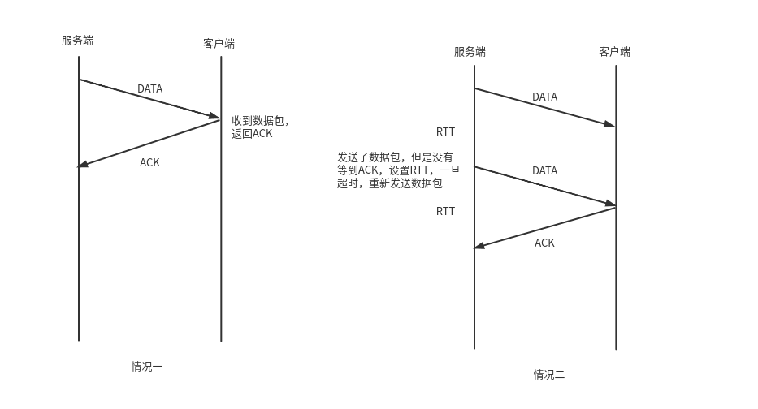
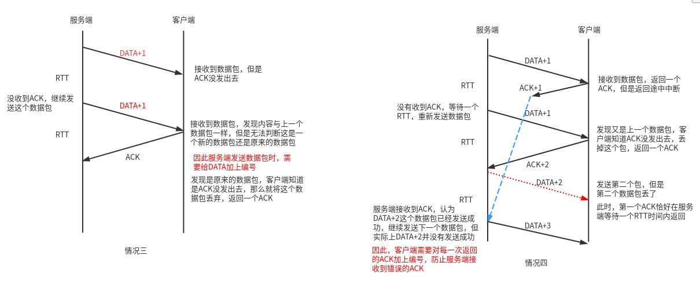
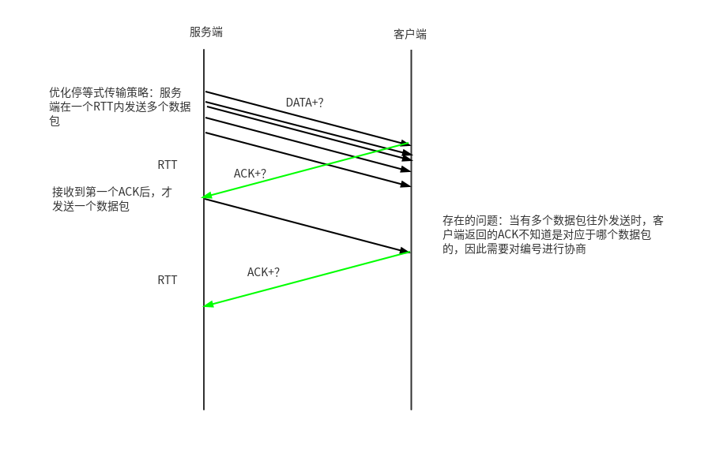
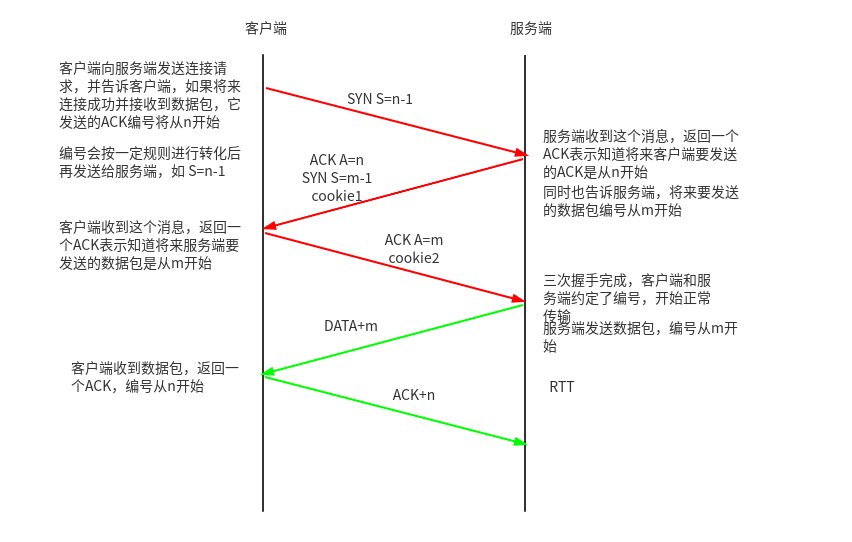

# 网络字节序

小端法存储：低位存放在低地址，高位存放在高地址

大端法存储：低位存放在高地址，高位存放在低地址


计算机数据采用的是小端字节序

网络数据流采用的是大端字节序


**进行数据传输时，需要对字节序进行相应的转化**

```c
#include <arpa/inet.h>

// 端口号转换为网络字节序
uint16_t htons(uint16_t hostshort);
// 网络字节序转换为端口号
uint16_t ntohs(uint16_t netshort);

// IP地址转换为网络字节序
int inet_pton(int af, const char *src, void *dst);
// 网络字节序转换为IP地址
const char *inet_ntop(int af, const void *src, char *dst, socklen_t size);
```

- af：ipv4/ipv6
- src：源IP
- dst：目的IP


# Socket 套接字

IP地址：在网络环境中唯一标识一台主机

端口号：在主机中唯一标识一个进程

IP+Port：在网络环境中唯一标识的一个进程（Socket）


IP地址+端口号对应一个socket。欲建立连接的两个进程各自有一个socket来标识，这两个socket组成的socket pair就唯一标识一个连接。

网络socket用于**不同主机之间的进程间通信**

- socket必须要有发送端和接收端（成对出现）
- ==在Linux中，Socket是一种文件类型==（伪文件，不占用磁盘空间）
- socket的文件描述符指向两个缓冲区（读、写）
- socket是全双工


# sockaddr_in 数据结构

```c
struct sockaddr_in {
    sa_family_t    sin_family; /* 网络协议族: AF_INET(ipv4) */ 
    in_port_t      sin_port;   /* 端口号 */
    struct in_addr sin_addr;   /* IP地址 */
};

/* Internet address. */
struct in_addr {
    uint32_t       s_addr;     /* address in network byte order */
};
```


# 创建 socket

```c
#include <sys/types.h>          /* See NOTES */
#include <sys/socket.h>

int socket(int domain, int type, int protocol);
```

- domain：网络协议族（AF_INET, AF_INET6, AF_UNIX）
- type：套接字类型
  - SOCK_STREAM：流式套接字
  - SOCK_DGRAM：报式套接字
- protocol：协议

成功返回一个文件描述符，否则返回-1和errno


# 服务端 bind

将address指向的sockaddr结构体中描述的一些属性（IP地址、端口号、地址簇）与socket套接字绑定，也叫给套接字命名

```c
int bind(int sockfd, const struct sockaddr *addr, socklen_t addrlen);
```

- sockfd：socket的文件描述符
- addr：sockaddr结构体指针，结构体中的IP地址一般为“0.0.0.0”
- addrlen：结构体长度


调用bind()后，就为socket套接字关联了一个相应的地址与端口号，即发送到地址值该端口的数据可通过socket读取和使用。当然也可通过该socket发送数据到指定目的。

对于Server，bind()是必须要做的事情，==服务器启动时需要绑定指定的端口来提供服务==（以便于客户向指定的端口发送请求），对于服务器socket绑定地址，一般而言将IP地址赋值为INADDR_ANY（该宏值为0），**即无论发送到系统中的哪个IP地址（当服务器有多张网卡时会有多个IP地址）的请求都采用该socket来处理，而无需指定固定IP**

对于Client，一般而言无需主动调用bind()，一切由操作系统来完成。在发送数据前，操作系统会为套接字随机分配一个可用的端口，同时将该套接字和本地地址信息绑定。


# 报式套接字 UDP

被动端（服务端）：接收包的一端，需要先运行（接受请求，并返回数据）

1、取得socket

2、给socket取得地址

3、收/发消息

4、关闭socket


主动端（客户端）：发包的一端（首先发起请求）

1、取得socket

2、给socket取得地址（可省略）

3、发/收消息

4、关闭socket


命令行：`netstat -anu`查看UDP的连接情况


**报式套接字接收/发送数据用到的函数**

```c
ssize_t recvfrom(int sockfd, void *buf, size_t len, int flags, 
                 struct sockaddr *src_addr, socklen_t *addrlen);

ssize_t sendto(int sockfd, const void *buf, size_t len, int flags,
               const struct sockaddr *dest_addr, socklen_t addrlen);

```


> 【示例】rcver.c, snder.c, proto.h


## 多点通讯

- 广播：全网广播、子网广播
- 多播（组播）


### socket选项

```c
int getsockopt(int sockfd, int level, int optname, void *optval, socklen_t *optlen);

int setsockopt(int sockfd, int level, int optname, 
               const void *optval, socklen_t optlen);
```


> 【示例】广播：brodcast_snder.c


## UDP

UDP：不可靠传输，会丢报（包）

TTL：经过路由的个数（路由跳数），Linux环境下默认为64，这个数量是完全足够通信的


丢报的原因：阻塞（由于数据包过多，队列等待）

解决办法：

停等式流控（客户端收到服务端的DATA后返回一个ACK）

RTT：服务器等待接收ACK的时间

DATA需要加编号，ACK也要加编号，以确保尽量不丢包


==数据传输过程中常会出现以下情况：==





从上面四种情况可以看出，停等式传输策略的缺点是客户端必须要获得一个数据包后才能发送一个ACK响应，同样的，服务端必须要等待一个ACK响应后才继续发送下一个数据包，效率很低

**优化停等式传输策略：**




# 流式套接字 TCP

客户端（主动端）

1、取得socket

2、给socket取得地址（可省略）

3、**发送连接请求**

4、收/发消息

5、关闭socket


服务端（被动端）：

1、取得socket

2、给socket绑定IP和端口号

3、**将socket置为监听模式，等待客户端的连接请求**

4、**接受连接**，==发送连接接受连接的过程就是TCP的三次握手==

5、收/发消息

6、关闭socket


命令行：`netstat -ant`查看TCP的连接情况


**流式套接字接收/发送数据用到的函数**

```c
ssize_t send(int sockfd, const void *buf, size_t len, int flags);

ssize_t recv(int sockfd, void *buf, size_t len, int flags);
```


> 【示例】server.c, client.c, proto.h
>
> 【示例】服务器并发版，当接收到一个连接请求后，让子进程去发送数据：server_fork.c
>
> 【示例】静态进程池（进程池大小固定）：server_pool.c
>
> 【示例】动态进程池（进程池大小有一定范围）：server_dpool.c


## 监听 socket

```c
int listen(int sockfd, int backlog);
```

- sockfd：socket文件描述符
- backlog：能够接收的连接数L上限


## 发送/接受连接

```c
int connect(int sockfd, const struct sockaddr *addr, socklen_t addrlen);
- addr：请求服务端的socket

int accept(int sockfd, struct sockaddr *addr, socklen_t *addrlen);
- addr：接受客户端的socket，以保证点对点连接
如果连接成功，返回socket文件描述符，这个socket连接到调用connect的客户端
```


## TCP 三次握手

TCP三次握手是为了建立连接，连接成功后才开始数据传输

这实现了点对点的传输，同时也解决了优化停等式传输策略的问题



完成一二次握手的状态称为**半连接状态**

在服务端存在一个**半连接池**，里面存放着已经完成一二次握手的网络节点，当客户端第三次握手时，就从半连接池中找到对应的节点进行连接

这会引发**半连接池洪水攻击**


==解决办法：==

cookie=hash(对端IP+对端Port+我端IP+我端Port+传输协议|salt)，salt由内核产生（1s生成一次）

在第二次握手时，服务端携带一个cookie1发送给客户端

第三次握手时，客户端返回一个cookie2给服务端，服务端对cookie2进行验证，如果cookie1==cookie2，那么就建立连接


## TCP 四次挥手

关闭连接是==两端都向对方请求关闭连接==

- 客户端发送一个FIN标志给服务端，请求关闭连接
- 服务端响应，返回一个确认关闭的ACK，客户端关闭连接，服务端还没关闭连接，此时处于半关闭状态
- 一段时间后，服务端发送一个FIN标志给客户端，请求关闭连接
- 客户端响应，返回一个确认关闭的ACK，两端均关闭连接

半关闭：允许一端关闭连接，另一端不关闭连接（可以继续传输数据）


## 半关闭函数 shutdown

shutdown是close的高阶版本，shutdown是从内核来关闭文件描述符的 

close只是关闭一个文件描述符引用

```c
int shutdown(int sockfd, int how);
- how：关闭的方式
```


# 小结

- 在Linux中，网络套接字是一个文件描述符，意味着可以使用IO操作来对文件描述符进行操作
- socket是全双工的
- 网络套接字必须存在于两端
- 网络套接字包含了两端通信的协议、IP、端口号
- 两端通信时，**协议一致**，**数据的格式（数据类型、字节序）**也要一致
- 服务端的套接字一定要使用`bind()`来绑定一个提供服务的端口，方便客户端请求
- 使用wireshark抓包工具来分析连接情况


# 实例：多进程版并发服务器

父进程负责接受连接，创建多个子进程来处理每个连接

子进程处理数据

> ./parrlel/server.c


# ==并发服务器：IO多路转接==

【01.IO操作/高级IO】

IO多路转接：实现文件描述符的监视，当文件描述符状态发生改变时，再执行相应的操作

并发服务器是接受多个客户端的请求，对每个客户端的socket进行操作

**socket的本质是文件描述符，所以可以使用多路转接来监视多个客户端的socket变化**

（服务器委托内核调用相关函数，来监听多个socket）

==实现步骤：==

- 1、布置监视任务
- 2、选择监视函数对socket进行监视（select、poll、epoll）
- 3、根据监视的结果来执行相应的操作


