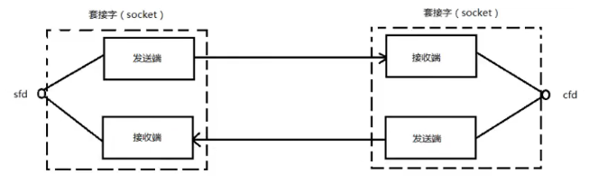

# 网络字节序

小端法存储：低位存放在低地址，高位存放在高地址

大端法存储：低位存放在高地址，高位存放在低地址


计算机数据采用的是小端字节序

网络数据流采用的是大端字节序


**进行数据传输时，需要对字节序进行相应的转化**

```c
#include <arpa/inet.h>

// 端口号转换为网络字节序
uint16_t htons(uint16_t hostshort);
// 网络字节序转换为端口号
uint16_t ntohs(uint16_t netshort);

// IP地址转换为网络字节序
int inet_pton(int af, const char *src, void *dst);
// 网络字节序转换为IP地址
const char *inet_ntop(int af, const void *src, char *dst, socklen_t size);
```

- af：ipv4/ipv6
- src：源IP
- dst：目的IP


# Socket 套接字

IP地址：在网络环境中唯一标识一台主机

端口号：在主机中唯一标识一个进程

IP+Port：在网络环境中唯一标识的一个进程（Socket）


IP地址+端口号对应一个socket。欲建立连接的两个进程各自有一个socket来标识，这两个socket组成的socket pair就唯一标识一个连接。

网络socket用于**不同主机之间的进程间通信**

- socket必须要有发送端和接收端（成对出现）

- ==在Linux中，Socket是一种文件类型==（伪文件，不占用磁盘空间）

- socket的文件描述符指向两个缓冲区（读、写）

- socket是全双工




# sockaddr_in 数据结构

```c
struct sockaddr_in {
    sa_family_t    sin_family; /* 网络协议族: AF_INET(ipv4) */ 
    in_port_t      sin_port;   /* 端口号 */
    struct in_addr sin_addr;   /* IP地址 */
};

/* Internet address. */
struct in_addr {
    uint32_t       s_addr;     /* address in network byte order */
};
```


# 创建 socket

```c
#include <sys/types.h>          /* See NOTES */
#include <sys/socket.h>

int socket(int domain, int type, int protocol);
```

- domain：网络协议族（AF_INET, AF_INET6, AF_UNIX）
- type：套接字类型
  - SOCK_STREAM：流式套接字
  - SOCK_DGRAM：报式套接字
- protocol：协议

成功返回一个文件描述符，否则返回-1和errno


# 服务端 bind

将address指向的sockaddr结构体中描述的一些属性（IP地址、端口号、地址簇）与socket套接字绑定，也叫给套接字命名

```c
int bind(int sockfd, const struct sockaddr *addr, socklen_t addrlen);
```

- sockfd：socket的文件描述符
- addr：sockaddr结构体指针，结构体中的IP地址一般为“0.0.0.0”
- addrlen：结构体长度


调用bind()后，就为socket套接字关联了一个相应的地址与端口号，即发送到地址值该端口的数据可通过socket读取和使用。当然也可通过该socket发送数据到指定目的。

对于Server，bind()是必须要做的事情，==服务器启动时需要绑定指定的端口来提供服务==（以便于客户向指定的端口发送请求），对于服务器socket绑定地址，一般而言将IP地址赋值为INADDR_ANY（该宏值为0），**即无论发送到系统中的哪个IP地址（当服务器有多张网卡时会有多个IP地址）的请求都采用该socket来处理，而无需指定固定IP**

对于Client，一般而言无需主动调用bind()，一切由操作系统来完成。在发送数据前，操作系统会为套接字随机分配一个可用的端口，同时将该套接字和本地地址信息绑定。


# 报式套接字

被动端：接收包的一端，需要先运行

1、取得socket

2、给socket取得地址

3、收/发消息

4、关闭socket


主动端：发包的一端

1、取得socket

2、给socket取得地址（可省略）

3、发/收消息

4、关闭socket


**接收/发送数据用到的函数**

```c
ssize_t recvfrom(int sockfd, void *buf, size_t len, int flags, 
                 struct sockaddr *src_addr, socklen_t *addrlen);

ssize_t sendto(int sockfd, const void *buf, size_t len, int flags,
               const struct sockaddr *dest_addr, socklen_t addrlen);

```


# 流式套接字

