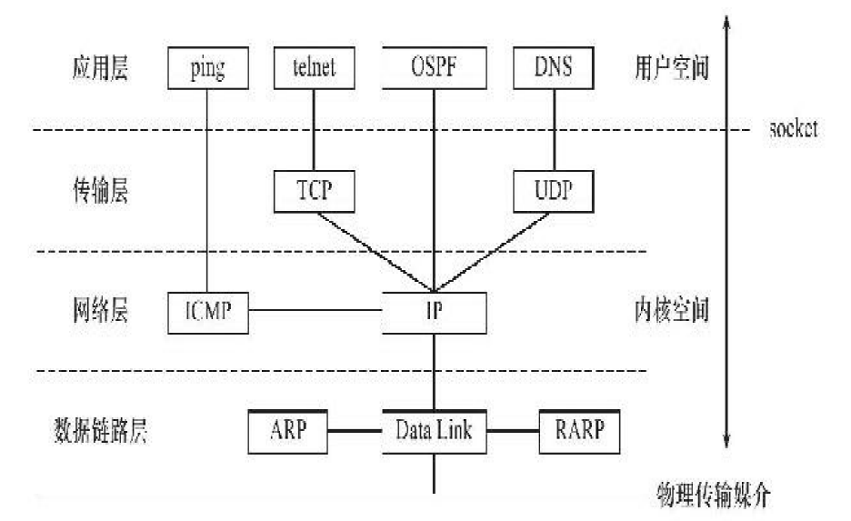
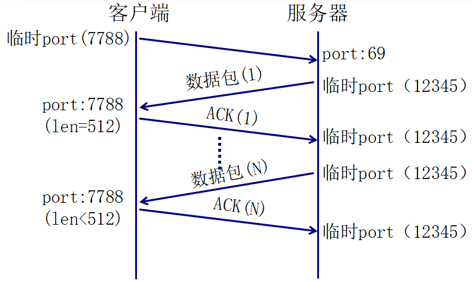
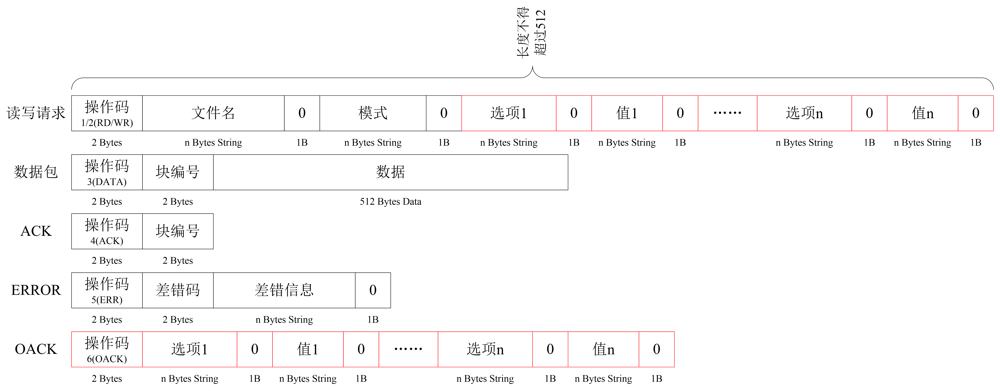
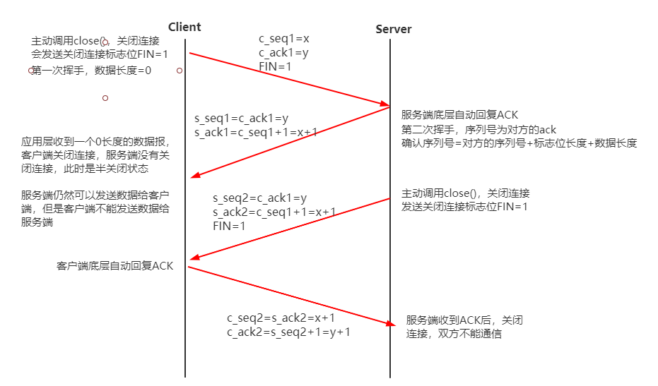
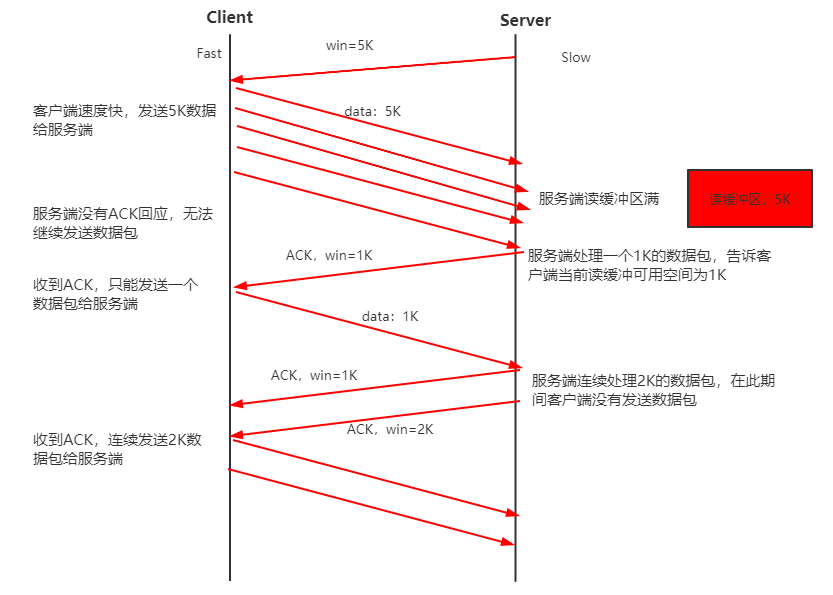

# Socket与TCP/IP的关系



TCP/IP协议族是一个四层协议系统，自底而上分别是**数据链路层**、**网络层**、**传输层**和**应用层**。每一层完成不同的功能，且通过若干协议来实现，上层协议使用下层协议提供的服务 

==数据链路层、网络层和传输层负责处理网络通信细节，这部分必须既稳定又高效，因此它们都在内核空间中实现==

应用层则在用户空间实现，因为它负责处理众多逻辑，比如文件传输、名称查询和网络管理等

数据链路层、网络层、传输层协议是在内核中实现的。==当一个客户端请求服务端服务时，需要经过内核，再获得应用层实现的服务。==因此操作系统需要实现一组系统调用，使得应用程序能够访问这些协议提供的服务，实现这组系统调用的API（Application ProgrammingInterface，应用程序编程接口）主要是Socket API


==**由socket定义的这一组API提供如下两点功能：**==

- 将应用程序数据从用户缓冲区中复制到TCP/UDP内核发送缓冲区，以交付内核来发送数据（比如`send`函数），或者是从内核TCP/UDP接收缓冲区中复制数据到用户缓冲区，以读取数据
- 应用程序可以通过它们来修改内核中各层协议的某些头部信息或其他数据结构，从而精细地控制底层通信的行为。比如可以通过`setsockopt`函数来设置IP数据报在网络上的存活时间等


# 网络字节序

小端法存储：低位存放在低地址，高位存放在高地址

大端法存储：低位存放在高地址，高位存放在低地址


计算机数据采用的是小端字节序

网络数据流采用的是**大端字节序**


**进行数据传输时，需要对字节序进行相应的转化**

```c
#include <arpa/inet.h>

// 端口号转换为网络字节序
uint16_t htons(uint16_t hostshort);
// 网络字节序转换为端口号，2个字节
uint16_t ntohs(uint16_t netshort);

// ip，4个字节，主机字节序转为网络字节序
uint32_t htonl(uint32_t hostlong);
// 网络字节序转为主机字节序
uint32_t ntohl(uint32_t netlong);

// IP地址（src）转换为网络字节序（dst）
int inet_pton(int af, const char *src, void *dst);
// 网络字节序转换为IP地址
const char *inet_ntop(int af, const void *src, char *dst, socklen_t size);
```

- af：ipv4/ipv6
- src：主机IP地址
- dst：转换后的网络字节序存储到struct sockadd_in的sin_addr中


# Socket 套接字

IP地址：在网络环境中唯一标识一台主机

端口号：在主机中唯一标识一个进程

IP+Port：在网络环境中唯一标识的一个进程（Socket）


IP地址+端口号对应一个socket。欲建立连接的两个进程各自有一个socket来标识，这两个socket组成的socket pair就唯一标识一个连接。

网络socket用于**不同主机之间的进程间通信**

- socket必须要有发送端和接收端（成对出现）
- ==在Linux中，Socket是一种文件类型==（伪文件，不占用磁盘空间）
- socket的文件描述符指向两个缓冲区（读、写）
- socket是全双工


# sockaddr_in 数据结构

```c
// ipv4
struct sockaddr_in {
    sa_family_t    sin_family; /* 网络协议族: AF_INET(ipv4) */ 
    in_port_t      sin_port;   /* 端口号 */
    struct in_addr sin_addr;   /* IP地址，需要注意将IP字符串转换为网络字节序*/
};

/* Internet address. */
struct in_addr {
    uint32_t       s_addr;     /* address in network byte order */
};
```


# 创建 socket

```c
#include <sys/types.h>          /* See NOTES */
#include <sys/socket.h>

int socket(int domain, int type, int protocol);
```

- domain：网络协议族（AF_INET（ipv4）, AF_INET6（ipv6）, AF_UNIX）
- type：套接字类型
  - SOCK_STREAM：流式套接字（TCP）
  - SOCK_DGRAM：报式套接字（UDP）
  - SOCK_RAW：原始套接字
- protocol：协议，一般为0

成功返回一个文件描述符，否则返回-1和errno


# 获取socket信息

```c++
int getsockname(int sockfd, struct sockaddr *address, socklen_t *address_len);
int getpeername(int sockfd, struct sockaddr *address, socklen_t *address_len);
```

getsockname获取sockfd对应的本端socket地址，并将其存储于address参数指定的内存中，该socket地址的长度则存储于address_len参数指向的变量中。如果实际socket地址的长度大于address所指内存区的大小，那么该socket地址将被截断。getsockname成功时返回0，失败返回-1并设置errno。

getpeername获取sockfd对应的远端socket地址，其参数及返回值的含义与getsockname的参数及返回值相同。


# 设置socket选项

```c++
#include＜sys/socket.h＞
int getsockopt(int sockfd, int level, int option_name, void *option_value, socklen_t *restrict option_len);

int setsockopt(int sockfd, int level, int option_name, const void *option_value, socklen_t option_len);
```

- level：协议选项，如IPv4、IPv6、TCP等
- **option_name**：socket选项
- option_value和option_len参数分别是被操作选项的值和长度

成功时返回0，失败时返回-1并设置errno

|         level          |   option_name    | 数据类型 |                        说明                         |
| :--------------------: | :--------------: | :------: | :-------------------------------------------------: |
| SOL_SOCKET（通用选项） |     SO_TYPE      |   int    |                   获取socket类型                    |
|                        |    SO_RCVBUF     |   int    |         TCP接收缓冲区大小（默认256 bytes）          |
|                        |    SO_SNDBUF     |   int    |        TCP发送缓冲区大小（默认为2048 bytes）        |
|                        |   SO_OOBINLINE   |   int    |           将接收到的带外数据看成普通数据            |
|                        |   SO_KEEPALIVE   |   int    |     发送周期性保活报文以维持连接（**心跳包**）      |
|                        |   SO_BROADCAST   |   int    |                        广播                         |
|                        | ==SO_REUSEADDR== |   int    | 重用本地地址，强制使用TIME_WAIT状态占用的socket地址 |


# 服务端 bind

将address指向的sockaddr结构体中描述的一些属性（IP地址、端口号、地址簇）与socket套接字绑定，也叫给套接字命名

```c
int bind(int sockfd, const struct sockaddr *addr, socklen_t addrlen);
```

- sockfd：socket的文件描述符
- addr：sockaddr结构体指针，结构体中的IP地址一般为“0.0.0.0”
- addrlen：结构体长度


调用bind()后，就为socket套接字关联了一个相应的地址与端口号，即发送到地址值该端口的数据可通过socket读取和使用。当然也可通过该socket发送数据到指定目的。

对于Server，bind()是必须要做的事情，==服务器启动时需要绑定指定的端口来提供服务==（以便于客户向指定的端口发送请求），对于服务器socket绑定地址，一般而言将IP地址赋值为INADDR_ANY（该宏值为0），**即无论发送到系统中的哪个IP地址（当服务器有多张网卡时会有多个IP地址）的请求都采用该socket来处理，而无需指定固定IP**

对于Client，一般而言无需主动调用bind()，一切由操作系统来完成。在发送数据前，操作系统会为套接字随机分配一个可用的端口，同时将该套接字和本地地址信息绑定。


# 通用读写数据函数

```c++
ssize_t recvmsg(int sockfd, struct msghdr*msg, int flags);
ssize_t sendmsg(int sockfd, struct msghdr*msg, int flags);
```

- sockfd：是通信的socket
- msg：是msghdr结构体类型的指针

```c++
struct msghdr
{
    void *msg_name;/*socket地址*/
    socklen_t msg_namelen;/*socket地址的长度*/
    struct iovec *msg_iov;/*分散的内存块，见后文*/
    int msg_iovlen;/*分散内存块的数量*/
    void *msg_control;/*指向辅助数据的起始位置*/
    socklen_t msg_controllen;/*辅助数据的大小*/
    int msg_flags;/*复制函数中的flags参数，并在调用过程中更新*/
};
```


# 报式套接字 UDP

**UDP不需要建立连接，没有使用listen、accept、connect函数**

被动端（服务端）：接收包的一端，需要先运行（接受请求，并返回数据）

1、取得socket

2、给socket绑定IP+端口，bind（）

3、收/发消息

4、关闭socket


主动端（客户端）：发包的一端（首先发起请求）

1、取得socket

2、发/收消息

3、关闭socket


命令行：`netstat -anu`查看UDP的连接情况

## 接收/发送数据用到的函数

```c
ssize_t recvfrom(int sockfd, void *buf, size_t len, int flags, 
                 struct sockaddr *src_addr, socklen_t *addrlen);

ssize_t sendto(int sockfd, const void *buf, size_t len, int flags,
               const struct sockaddr *dest_addr, socklen_t addrlen);

```

因为UDP通信没有连接的概念，所以我们==每次读取数据都需要获取发送端的socket地址==，即参数src_addr所指的内容，addrlen参数则指定该地址的长度

recvfrom/sendto系统调用也可以用于面向连接（STREAM）的socket的数据读写，只需
要把最后两个参数都设置为`NULL`以忽略发送端/接收端的socket地址（因为我们已经和对方建立了连接，所以已经知道其socket地址了）

> 【示例】`src/`rcver.c, snder.c, proto.h


## 多点通讯

- 广播：全网广播、子网广播
- 多播（组播）：给一个多播组发消息
  - 有一个多播地址，组员主动加入多播组
  - 多播地址：D类地址，224.0.0.1-239.255.255.254

> 【示例】广播：`src/`brodcast_snder.c


## UDP传输过程

UDP：不可靠传输，会丢报（包）

TTL：经过路由的个数（路由跳数），Linux环境下默认为64，这个数量是完全足够通信的


丢报的原因：阻塞（由于数据包过多，队列等待）

解决办法：

停等式流控（客户端收到服务端的DATA后返回一个ACK）

RTT：服务器等待接收ACK的时间

DATA需要加编号，ACK也要加编号，以确保尽量不丢包


==数据传输过程中常会出现以下情况：==


从上面四种情况可以看出，停等式传输策略的缺点是客户端必须要获得一个数据包后才能发送一个ACK响应，同样的，服务端必须要等待一个ACK响应后才继续发送下一个数据包，效率很低

**优化停等式传输策略：**


## TFTP：简单文件传送协议

最初用于引导无盘系统，被设计用来传输小文件，应用场景：网吧

特点：

- 基于UDP协议实现
- 不进行用户有效性认证

数据传输模式：

- octet：二进制模式

- netascii：文本模式

  

  




# 流式套接字 TCP


## TCP服务端

- 1、`socket()`建立一个服务端的==监听套接字==socket ld

  - 绑定之前可以设置socket属性（==端口复用==：服务器关闭后立即关闭端口，`netstat -ant`查看tcp连接情况）

  ```c
  // 设置socket属性
  int val =1 ;
  if(setsockopt(sd, SOL_SOCKET, SO_REUSEADDR, &val, sizeof(val))<0)
  {
      perror("setsockopt()");
      exit(1);
  }
  ```

- 2、`bind()`**绑定一个端口用于服务端的socket服务**

- 3、`listen()`监听网络端口号

- 4、`accept()`接受客户端发起的（connect）连接请求，**该函数创建一个用于和客户端通信的==连接套接字==socket fd**，==发送连接接受连接的过程就是TCP的三次握手==

- 5、`send()`使用accept创建的socket fd与客户端进行数据传输

- 6、`close()`关闭socket


可使用 `telnet ip port`模拟客户端进行测试


## TCP客户端

- 1、`socket()`建立一个本地socket ld
- 2、`connect()`发起请求，连接服务器
- 3、`recv()`本地sockect ld接收服务端发送的数据
- 4、`close()`关闭socket ld


命令行：`netstat -ant`查看TCP的连接情况


可使用`nc ip port` 模拟服务端进行测试


## 接收/发送数据用到的函数

```c
ssize_t send(int sockfd, const void *buf, size_t len, int flags);
// send(connfd, send_msg, strlen(send_msg), 0);

ssize_t recv(int sockfd, void *buf, size_t len, int flags);
// n = recv(ld, recv_msg, sizeof(recv_msg), 0);


/****************************************************************/
ssize_t write(int fd, const void *buf, size_t count);
// write(connfd, send_msg, strlen(send_msg));

ssize_t read(int fd, void *buf, size_t count);
// n = read(ld, recv_msg, sizeof(recv_msg));
```

成功，返回实际发送\读取到的数据长度，可能会小于实际的长度，需要==多次调用读写函数==直到数据被完全读\取

recv=0说明对方已经关闭连接，出错时recv=-1


> 【示例】server.c, client.c, proto.h
>
> 【示例】服务器并发版，当接收到一个连接请求后，让子进程去发送数据：server_fork.c
>
> 【示例】静态进程池（进程池大小固定）：server_pool.c
>
> 【示例】动态进程池（进程池大小有一定范围）：server_dpool.c


## 监听 listen

```c
int listen(int sockfd, int backlog);
```

- sockfd：socket文件描述符，==将fd设置为监听套接字==
- backlog：监听队列最大长度。半连接socket队列和已建立连接socket队列之和的最大值，一般为128


服务端设置监听套接字后，该套接字由主动变为被动，同时在系统内部创建==两个任务队列缓冲区==：**未完成连接队列（SYN_RCVD）**和**已完成连接队列（ESTABLISHED）**

服务端accept阻塞等待客户端发起connect请求

connect请求，实则是在建立三次握手，将这个连接任务加入未完成连接队列

当三次握手成功，连接成功，加入已完成连接队列，服务端accept的作用就是从已完成连接队列中提取客户端socket地址，并自动**创建一个新的连接套接字socket用于客户端和服务端通信**

accept只是从监听队列中取出连接，而不论连接处于何种状态


## 请求connect/接受accept连接

```c
//客户端主动调用connect()，请求连接
int connect(int sockfd, const struct sockaddr *addr, socklen_t addrlen);
- sockfd：本地端socket
- addr：请求服务端的socket

int accept(int sockfd, struct sockaddr *addr, socklen_t *addrlen);
- sockfd：本地端监听的socket
- addr：从监听队列中获取客户端的socket地址，以保证点对点连接
如果连接成功，返回socket文件描述符，这个新的socket连接到调用connect的客户端，此后用这个新的socket与客户端进行通信
```


## TCP 三次握手

TCP三次握手是为了建立连接，连接成功后才开始数据传输

这实现了点对点的传输，同时也解决了优化停等式传输策略的问题


三次握手时，会携带序列号和确认序列号

- 序列号（seq）：初始为0，每次通信，序列号为对方发送的确认序列号，用于确认收到对方的报文

- 确认序列号（ack）：收到对方的序列号+标志位长度+对方发送的数据长度（三次握手过程中没有数据传输）

  - 期望下一次对方发送的序列号是我这次发送过去的确认序列号，用于确认收到对方的报文
  - 数据长度的作用是：当收到数据报后知道收到了多少个数据，从而确认数据报是否完整

  


完成一二次握手的状态称为**半连接状态**

在服务端存在一个**未完成连接队列（半连接池）**，里面存放着已经完成一二次握手的网络节点，当客户端第三次握手时，就从半连接池中找到对应的节点进行连接

这会引发**半连接池洪水攻击**：客户端只进行一二次握手，不进行第三次握手，导致半连接池中的网络节点爆满，服务端无法处理连接请求


==解决办法：==

cookie=hash(对端IP+对端Port+我端IP+我端Port+传输协议|salt)，salt由内核产生（1s生成一次）

在第二次握手时，服务端携带一个cookie1发送给客户端

第三次握手时，客户端返回一个cookie2给服务端，服务端对cookie2进行验证，如果cookie1==cookie2，那么就建立连接


## TCP 四次挥手

关闭连接是==两端都向对方请求关闭连接==

- 客户端发送一个FIN标志给服务端，请求关闭连接
- 服务端响应，返回一个确认关闭的ACK，客户端关闭连接，服务端还没关闭连接，此时处于半关闭状态
- 一段时间后，服务端发送一个FIN标志给客户端，请求关闭连接
- 客户端响应，返回一个确认关闭的ACK，两端均关闭连接

半关闭：允许一端关闭连接，另一端不关闭连接（一端可以继续传输数据但另一端不会响应）



## 半关闭函数 shutdown

半关闭状态FIN_WAIT_2：两次挥手，主动方只能接收数据，不能发数据

shutdown是close的高阶版本，shutdown是从内核来关闭文件描述符的 

close只是关闭一个文件描述符引用

```c
int shutdown(int sockfd, int how);
- how：允许为shutdown操作选择以下几种方式:
SHUT_RD(0)： 关闭sockfd上的读功能，此选项将不允许sockfd进行读操作；该套接字不再接收数据，任何当前在套接字接受缓冲区的数据将被无声的丢弃掉。
SHUT_WR(1):  关闭sockfd的写功能，此选项将不允许sockfd进行写操作。进程不能在对此套接字发出写操作
SHUT_RDWR(2):关闭sockfd的读写功能。相当于调用shutdown两次：首先是以SHUT_RD,然后以SHUT_WR
```


## 心跳包

设置socket属性

```c
keepAlive = 1;
setsockopt(listenfd, SOL_SOCKET, SO_KEEPALIVE, (void*)&keepAlive, sizeof(keepAlive));

SO_KEEPALIVE 保持连接检测对方主机是否崩溃，避免（服务器）永远阻塞于TCP连接的输入。设置该选项后，如果2小时内在此套接口的任一方向都没有数据交换，TCP就自动给对方发一个保持存活探测分节(keepalive probe)。这是一个对方必须响应的TCP分节.它会导致以下三种情况：对方接收一切正常：以期望的ACK响应。2小时后，TCP将发出另一个探测分节。对方已崩溃且已重新启动：以RST响应。套接口的待处理错误被置为ECONNRESET，套接 口本身则被关闭。对方无任何响应：源自berkeley的TCP发送另外8个探测分节，相隔75秒一个，试图得到一个响应。在发出第一个探测分节11分钟 15秒后若仍无响应就放弃。套接口的待处理错误被置为ETIMEOUT，套接口本身则被关闭。如ICMP错误是“host unreachable(主机不可达)”，说明对方主机并没有崩溃，但是不可达，这种情况下待处理错误被置为EHOSTUNREACH。
```


## 滑动窗口

实质：窗口大小指的是自己**当前读缓冲区的可用空间**


客户端与服务端通信使用的是套接字：

发送方发送数据，将数据存入自己的写缓冲区；

==通过传输层，将写缓冲区的数据传输到接收方的读缓冲区中==；

接收方接收数据，从自己的读缓冲区中读取数据；


客户端和服务端之间存在带宽差异，有可能存在数据交互的速度差异，在传输时可能会出现下面的情况：

当发送端不断的快速发送数据，接收缓冲区很快填满，此时发送端无法发送数据，造成网络阻塞现象

只有当接收端将缓冲区的数据提取出来，腾出一个缓冲区空间，并向发送端回应一个ACK和滑动窗口大小时，发送端才能继续发送数据




# 小结

- 在Linux中，网络套接字是一个文件描述符，意味着可以使用IO操作来对文件描述符进行操作
- socket是全双工的
- 网络套接字必须存在于两端
- 网络套接字包含了两端通信的协议、IP、端口号
- 两端通信时，**协议一致**，**数据的格式（数据类型、字节序）**也要一致
- 服务端的套接字一定要使用`bind()`来绑定一个提供服务的端口，方便客户端请求
- 使用wireshark抓包工具来分析连接情况


# 实例：多进程版并发服务器

父进程负责接受连接，创建多个子进程来处理每个连接

子进程处理数据

> ./parrlel/server.c


# ==并发服务器：IO多路转接==

**详见【01.IO操作/高级IO】**

IO多路转接：实现文件描述符的监视，当文件描述符状态发生改变时，再执行相应的操作

并发服务器是接受多个客户端的请求，对每个客户端的socket进行操作

**socket的本质是文件描述符，所以可以使用多路转接来监视多个客户端的socket变化**

（服务器委托内核调用相关函数，来监听多个socket）

==实现步骤：==

- 1、布置监视任务
- 2、选择监视函数对socket进行监视（select、poll、==epoll==）
- 3、根据监视的结果来执行相应的操作


# ==线程池：生产者消费者模型==

常用在服务端处理数据

当服务端接收到多个客户端发送来的数据时，需要对每个客户端的数据进行单独处理，会用到线程池

--------------------------------------------------------------------------------------------------------------------------------------------

线程池：一堆已经启动了的线程

- 静态线程池：能创建的线程有固定数量
- 动态线程池：有下限和上限，会因为客户端的数量在这个区间内动态扩张/缩减（定义步长）
  - 什么时候扩张/缩减？单独用一个线程来管理
  - 定义两个变量：当前存活的线程数、当前运行的线程数；根据比例来进行扩张/缩减


服务端维护着一个**任务队列**，当有客户端发送数据给服务端时，服务端相当于接到了一个任务，将这个客户端fd放入到任务队列中，然后让线程池中的所有线程来抢这个任务进行处理


任务队列是临界资源，需要互斥锁

任务队列的情况：

- 任务队列为空：线程池等待阻塞（直到任务队列有任务才开始取任务）
- 任务队列满：服务端等待阻塞（直到任务队列不满才开始接收客户端的新任务）


> 【示例】：./thread_pool/pool.c


# 开源库

常见的开源库：libevent、libev（libevent的升级版，增加了线程）


## 开源库的一般使用方式

查看README

- 执行`./configure`：检查当前主机环境是否适合安装，自动生成makefile
- 执行`make`：编译
- 执行`sudo make install`
- simple目录是例子


# 抓包工具 

## Wireshark

过滤器的使用：可以过滤一个或多个条件，条件用and连接

如：ip.src == 10.20.155.12 and udp and udp.port == 2425

常用过滤条件：

- ip.addr、ip.src、ip.dst
- udp
- tcp
- port


## Linux下使用tcpdump命令

