# 0 什么是协议？

规定了通信双方**数据传输的格式和方法**，双方交换数据（通信）的规则


# 1 TCP/IP协议分层

OSI参考模型（自底向上）：**物数网传会表应**

物理层、数据链路层；网络层；传输层；会话层、表示层、应用层

 

TCP/IP模型（自底向上）：**链网传应**

- 链路层：ARP映射，以太网帧
- ==网络层==：提供==点到点==的服务；IP协议，ICMP协议，IGMP协议
- ==传输层==：提供==端到端==的服务； TCP协议、UDP协议
- 应用层：应用程序的端口号


# 2 封装与分用

## 2.1 封装

操作系统做的事：

发送端：将数据按照分层模型自顶向下的协议进行封装（打包）

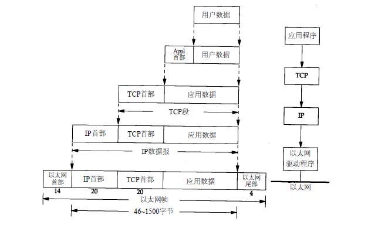

**发送端自顶向下进行封装**：

应用程序【发送的数据】→TCP【应用程序】→IP【TCP【应用程序】】→以太网数据帧【IP【TCP【应用程序】】】

**打包**：网络接口层（链路层）协议（网络层协议（传输层协议==（应用层协议（数据==

对于操作系统而言，对数据进行打包时也有用户的参与（其中应用层协议的封装是在User态完成的），外面三层协议的封装是在Kernel态完成的

应用层协议：如HTTP协议

—————————————————————————————————————————

应用层的数据在发送到物理网络之前，将沿着协议栈从上往下依次传递，每层协议都将在上层数据的基础上进行封装
自己的头部信息（有时还包括尾部信息），以实现该层的功能，这个过程就称为封装

> TCP报文封装：
>
> 当发送端应用程序使用send（或者write）函数向一个TCP连接写入数据时，内核中的TCP模块首先把这些数据复制到与该连接对应的TCP内核发送缓冲区中，然后TCP模块调用IP模块提供的服务进行网络传输。
>
> 传递的参数包括TCP头部信息和TCP发送缓冲区中的数据，即TCP报文段。

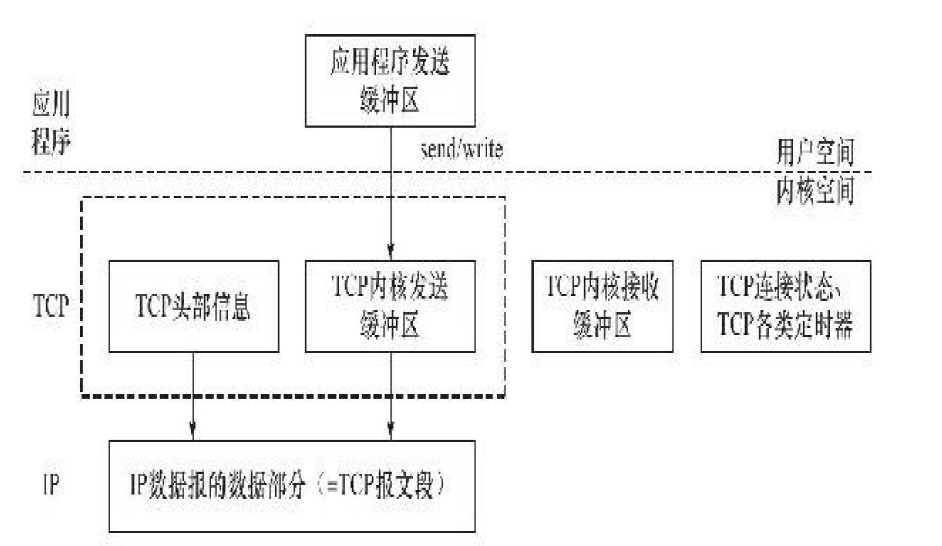

> UDP报文封装：
>
> UDP对应用程序数据的封装与TCP类似。不同的是，UDP无须为应用层数据保存副本，因为它提供的服务是不可靠的。
>
> 当一个UDP数据报被成功发送之后，UDP内核缓冲区中的该数据报就被丢弃了。如果应用程序检测到该数据报未能被接收端正确接收，并打算重发这个数据报，则应用程序需要重新从用户空间将该数据报拷贝到UDP内核发送缓冲区中。


## 2.2 分用

接收端：将数据按照分层模型自底向上的协议进行分用（解包）

因为数据是要打包之后才能在网络中传输的，且数据受到多个层协议的影响，不可能将数据一次性打包，因此需要对数据进行拆包传输

如：

数据60000kb，经过多层封装后，最外层的网络接口层的协议（以太网帧）允许传输最大字节数为1500

因此需要将数据进行拆分，拆成60000/1500=40个包进行封装再传输


链路层：以太网帧MTU=1500字节；Internet的MTU=576字节

IP协议中数据报长度最大为65535个字节，但由于MTU的限制，长度超过MTU的数据报都将被分片传输，所以实际传输的IP数据报（或分片）的长度都远远没有达到最大值，==IP数据报数据部分最多为1480字节==（IP头部占用20字节，1480=1500-20）

UDP协议封装在IP数据报中，UDP首部为8字节，因此UDP数据报最多为1480-8=1472字节

TCP首部为20字节，TCP数据报最多为1480-20=1460字节


# ==3 链路层==

**数据链路层实现了网卡接口的网络驱动程序，以处理数据在物理媒介（比如以太网、令牌环等）上的传输。**

以太网帧和IEEE 802.3链路层封装的协议，相同点：

- 两种帧格式都采用48bit（6字节）的目的地址和源地址

## 3.1 以太网帧

==以太网帧是最终在物理网络上传送的字节序列==

在链路层，数据包是依据MAC地址（MAC地址唯一）来进行传输的

MTU（Max  Transmit  Unit）：帧的最大传输单元，即帧最多能携带多少上层协议数据（比如IP数据报），通常受到网络类型的限制。

**数据报最小46个字节，低于46需要填充；最大1500字节，高于1500需要分片（分包）**

1500是取传输路径上的**最小MTU**

```shell
目的MAC地址（6）|源MAC地址（6）|帧类型（2）|数据（46-1500）|CRC（4）

不同类型的以太网帧发送的数据类型如下：
类型0800（2）|IP数据报（46-1500）
类型0806（2）|ARP请求/应答（28）+PAD填充字段（18）
类型0835（2）|RPAP请求/应答（28）+PAD填充字段（18）
```

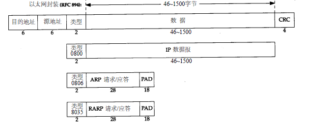

目的地址：下一跳的MAC（网卡）地址，一开始不知道，需要发送ARP广播来获得

源地址：当前的MAC地址

==帧类型==：0800（发送普通数据）、0806（发送ARP请求，获取下一个节点的MAC地址）


## 3.2 地址解析协议（ARP）协议：找到下一跳地址

广播（发送端请求下一跳地址）：向所有路由发送ARP广播，寻找下一跳路由的MAC地址

单播（接收端应答下一跳地址）：向发送ARP广播的主机回应自己的MAC地址

**ARP 数据报**

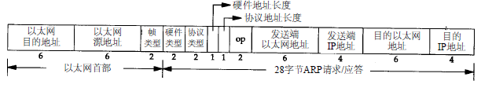

```
目的MAC（6）|源MAC（6）|帧类型（2）硬件类型（2）协议类型（2）|...|发送端MAC|发送端IP（4）|目的MAC|目的IP
```

作用：获取下一跳的MAC地址


数据包在网络传输的过程中会经过一个一个的路由节点，是如何找到到达目的地所需要经过的路由节点？

实际上，数据包不是只打包一次解包一次的

数据包想要达到下一个路由节点（下一跳）时，一开始是不知道这个路由器的MAC地址的

因此需要对**链路层和网络层进行解包**

网络层解包：获得了==源IP地址==和最终要到达的==目的地IP地址==

链路层解包：获得了==当前MAC地址==，目的MAC全为FF（不知道目的MAC是多少）

于是再将==源IP地址==、==当前MAC地址==和==目的地IP==打包起来，**作为ARP的数据报**，并向路由表中的所有路由器发送一个ARP广播请求

匹配的下一跳路由器接收到ARP请求，将自己的MAC地址进行补充，然后又按照自身的路由表发送一个ARP单播请求

此时发送端接收到这个ARP请求，获得了下一个路由节点的MAC地址后，就可以将这个MAC地址填充到以太网帧中，进行正常的网络传输

**简单来说，发送端到接收端中途会经过许多路由器，每要到达下一个路由器，都需要对数据包的链路层和网络层进行一次解包，发送ARP广播进行匹配，从而获得下一个路由器的MAC地址，再发送ARP单播，回应数据报给这个路由器，以此类推，最终到达接收端**


==注意！！！==

- ==以太网帧和ARP数据报中的源MAC和目的MAC是指当前的MAC和下一跳的MAC，它们负责找到传输路径==
- ==真正的目的地IP是封装在网络层的IP协议中的==
- **通俗理解：**
  - 对帧当中的IP地址的理解：发货人、收货人（始终不变）
  - 对帧当中的MAC地址的理解：
    - 源MAC：货物中途所经过的上一个驿站
    - 目标MAC：货物中途所要到达的下一个驿站

在Linux中，可使用`tcpdump`命令来观察ARP通信过程

## 3.3 ARP高速缓存

ARP维护一个高速缓存，其中包含经常访问（比如网关地址）或最近访问的机器的IP地址到物
理地址的映射。这样就避免了重复的ARP请求，提高了发送数据包的速度

在Linux中，可使用`arp`命令来查看和修改ARP高速缓存


# ==4 网络层==

**网络层实现数据包的选路和转发。**通信的两台主机之间一般不是直接相连的，中间包含多个路由器节点，网络层的任务就是选择这些中间节点，以确定两台主机之间的通信路径。

## 4.1 IP协议

**核心协议：IP协议**，根据数据包的目的IP地址来决定如何投递它。

**IP提供不可靠、无连接、无状态无序的数据报传送服务**

无状态、无序的：

- 指IP==通信双方不同步==传输数据的状态信息，因此所有IP数据报的发送、传输和接收都是==相互独立、没有上下文关系==的
- 优点：简单、高效
- 缺点：无法处理乱序和重复的IP数据报，需要上层协议(TCP协议)进行进一步处理

不可靠的：

- 不能保证数据报能够成功到达目的地，中途可能会因为网络延时或阻塞造成数据报丢失
- 需要上层协议，如TCP协议实现数据确认、超时重传等机制达到可靠传输

无连接：

- 指IP通信双方都==不长久地维持==对方的任何信息。这样，上层协议每次发送数据的时候，都必须明确指定对方的IP地址

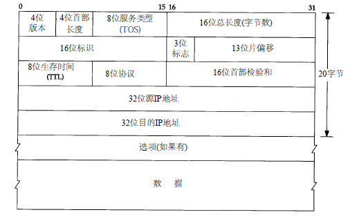

IP首部（20字节+选项40字节）

- 4位版本：==IP协议版本==，如4（IPV4）
- 4位首部长度：该IP头部有多少个32 bit（4字节）
- 8位服务类型：主要包含4位TOS字段（**最小延时、最大吞吐量、最高可靠性和最小费用**）
- 16位总长度：指**整个IP数据报的长度**，以字节为单位，因此IP数据报的最大长度为65535（$2^{16}-1$）字节。但由于MTU的限制，长度超过MTU的数据报都将被分片传输，所以实际传输的IP数据报（或分片）的长度都远远没有达到最大值。接下来的3个字段则描述了如何实现分片

- 前32位：==网络字节序（大端字节序）==，IP数据报传输时必须**统一网络字节序**
- 16位标识：标识主机发送的每一份数据报。其**初始值由系统随机生成**；每发送一个数据报，其值就加1。该值在数据报分片时被==复制==到每个分片中，因此==同一个数据报的所有分片都具有相同的标识值==。
- 3位标志：第一位保留；第二位（DF，禁止分片）；第三位（MF，更多分片）
- 13位片偏移：是分片相对原始IP数据报开始处（仅指数据部分）的偏移
- 8位生存时间：数据报可以经过的最多路由器数量，通常为64或128，经过一个路由器TTL值减1；当TTL=0时，数据报丢弃，并发送ICMP报文通知源主机；TTL值可以**防止数据报陷入路由循环**
- 8位协议：==传输层的协议号==，如TCP(6), UDP(17)，ICMP（1）
- 选项：记录传输过程中的路由记录
  - 记录路由：告诉数据报途经的所有路由器都将自己的IP地址填入IP头部的选项部分，就可以跟踪数据报的传递路径
  - 时间戳：告诉每个路由器都将数据报被转发的时间（或时间与IP地址对）填入IP头部的选项部分，这样就可以测量途经路由之间数据报传输的时间
  - 松散源路由选择：指定一个路由器IP地址列表，数据报发送过程中必须经过其中所有的路由器
  - 严格源路由选择：数据报只能经过被指定的路由器


> IP数据报分析

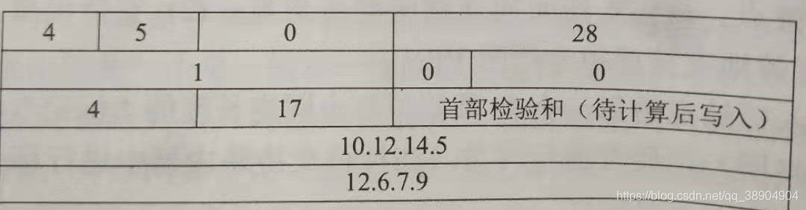

**十进制转换为16位二进制**

4 5 0 —>01000101 00000000
28 —>00000000 00011100
1 —>00000000 00000001
00 —>00000000 00000000
4 17 —>00000100 00010001
10.12.14.5 —>00001010 00001100 00001100 00000110
12.6.7.9 —> 00001110 00000101 0000111 00001001


**每16位二进制转换为4个十六进制**

4 5 0 —>4500（0100=4,	0101=5,	0000=0,	0000=0）
28 ---->001C（0000=0，	0000=0，	0001=1，	1100=12=C）
1 --------->0001
0 0 —>0000
4 17 ---->0411
10.12.14.5 —> 0A0C 0E05
12.6.7.9 -->0C06 0709


## 4.2 IP分片

- 分片时间：可能发生在发送端、中转路由器上，而且可能在传输途中进行多次分片

- 分片组装：在最后目标机器的内核IP模块进行重新组装

- 如何分片：IP头部三个字段（16位标识、3位标志、13位片偏移）提供了分片和组装信息，假设一个数据报被分片为N份子数据报：
  - 具有相同的16位标识
  - 除了最后一个分片外，其他分片的3位标志设置为MF
  - 具有不同的13位片偏移
  - IP头部的16位总长度设置为该分片的总长度
- 以太网帧和IP：以太网帧的MTU是1500字节，则封装的==IP数据报数据部分最多为1480字节==（IP头部占用20字节）


## 4.3 IP路由

**IP路由选择是逐跳进行的，只为IP数据报提供下一跳路由器的IP地址**

**IP数据报应该发送至哪个下一跳路由（或者目标机器），以及经过哪个网卡来发送，就是IP路由过程**


### 4.3.1 IP模块工作流程

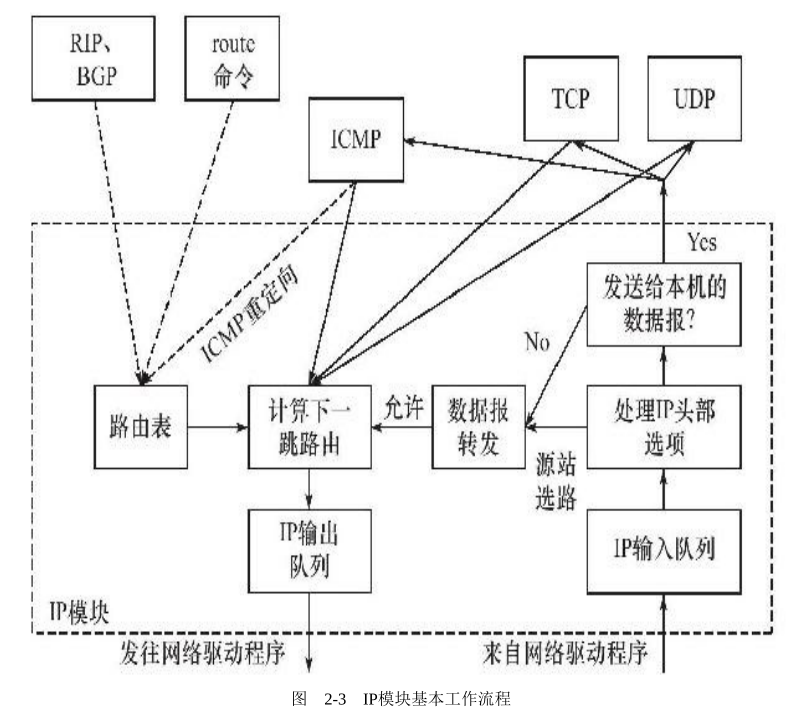

- 情况一：如果IP数据报的选项中==设置了路由选择==或==IP数据报不是发送给本机==：调用**转发子模块**来处理
- 情况二：如果IP数据报的==目标IP是本机的IP==或==广播地址==：将该IP数据报**派发给本机的上层应用（分用）**


### 4.3.2 路由表

IP层在内存中有一个路由表，路由表主要包含以下信息：

- 目的IP地址、网关地址、网络掩码
- 路由标志
- 路由距离
- 该路由项对应的输出网卡接口


### 4.3.3 路由选择步骤

- （1）搜索路由表，寻找能与数据报目的IP地址完全匹配的==主机IP==，如果找到，就使用该路由项，否则执行步骤（2）；
- （2）搜索路由表，寻找能与目的==网络号相匹配的IP地址==，如果找到，就使用该路由项，否则执行步骤（3）；
- （3）搜索路由表，寻找标为“默认（default）”的路由项（通常执行到这一步时下一跳路由是==网关==）

如果上述都不能成功，数据报就不能被发送，返回“主机不可达”、“网络不可达”的错误


### 4.3.4 IP转发

IP模块的数据报转发子模块中，对于情况一，执行如下操作：

- 1）检查数据报头部的TTL值。如果TTL值已经是0，则丢弃该数据报
- 2）查看数据报头部的严格源路由选择选项。如果该选项被设置，则检测数据报的目标IP地址是否是本机的某个IP地址。如果不是，则发送一个ICMP源站选路失败报文给发送端。
- 3）如果有必要，则给源端发送一个ICMP重定向报文，以告诉它一个更合理的下一跳路由
- 4）将TTL值减1
- 5）处理IP头部选项
- 6）如果有必要，则执行IP分片操作


## 4.4 ICMP协议

协议号：1

ICMP是IP的附属协议，是一种功能协议，是在IP数据报内部传输的，**封装在IP数据报内部**

主要功能：

- 确认IP包是否成功送达目标地址
- 通知在发送过程中IP包被废弃的具体原因
- 改善网络设置

**作用：**==测试网络，确认网络是否正常工作==，遇到异常时进行问题诊断

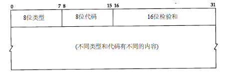

ICMP报文分为两大类：==差错报文==和==查询报文==，常见类型、代码如下：

- 8 0：请求回显（ping请求），查询报文
- 0 0：回显应答（ping应答），查询报文
- 3 x：不可达，差错报文
- 5 x：重定向，差错报文
- 11 x：超时，差错报文


# 5 网络层与传输层的关系

网络层与硬件联系紧密，网络传输会不稳定（IP协议不可靠）

传输层：对网络层进行弥补

- 完全不弥补UDP：无连接不可靠报文传输
- 完全弥补TCP：面向连接的可靠数据包传输


# 6 ==传输层==

**传输层为两台主机上的应用程序提供端到端的通信。**传输层只关心通信的==起始端==和==目的端==，而不在乎数据包的中转过程，负责数据的收发、链路的超时重连等

## 6.1 端口号

服务器提供的端口号是固定的知名端口号，给客户端提供服务，一般低于1024，如http（80），https（443），ftp（20，21）

客户端的端口号是短暂随机的临时端口号，一般为1024-5000


## 6.2 用户数据报（UDP）协议

**UDP为应用层提供不可靠、无连接和基于数据报的服务**

**不可靠的：**

- UDP协议无法保证数据从发送端正确地传送到目的端
- 如果数据在中途丢失，或者目的端通过数据校验发现数据错误而将其丢弃，则UDP协议只是简单地通知应用程序发送失败
- 使用UDP协议的应用程序通常要自己处理数据确认、超时重传等逻辑

**无连接的：**

- 通信双方不保持一个长久的联系，因此应用程序每次发送数据都要明确指定接收端的地址（IP地址等信息）

**基于数据报的：**

- 相对基于字节流的服务而言，==每个UDP数据报都有一个长度==，接收端必须以该长度为最小单位将其所有内容==一次性==读出，否则数据将被截断
- 通信双方必须执行==相同次数==的读、写
- 发送端应用程序每执行一次写操作，UDP模块就将其封装成一个UDP数据报并发送
- 接收端必须**及时**针对每一个UDP数据报执行读操作（`recvfrom`系统调用），否则就会丢包；如果没有**足够大的临时缓冲区**来读取UDP数据，则UDP数据报就会被截断

UDP封装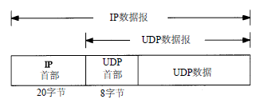

UDP首部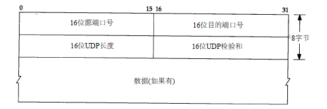

端口号：表示发送进程和接收进程


## ==6.2 传输控制（TCP）协议==

**TCP为应用层提供可靠的、面向连接的、基于字节流的服务**

**可靠的：**

- 应答机制：发送端发送的每个TCP报文段都必须得到接收方的应答才认为数据传输成功
- 超时重传机制：发送方发出一个TCP报文段后启动定时器，在定时器内未收到应答，重发
- 数据重组：TCP报文由IP协议封装，IP数据报在网络层进行传输，到达接收端时可能乱序、重复，接收端收到时，TCP协议会对数据报进行重排、整理再传给应用层

**面向连接的（全双工）：**

- 使用TCP协议==通信的双方必须先建立TCP连接==，并在内核中为该连接维持一些必要的数据结构，比如连接的状态、读写缓冲区，以及诸多定时器等
- 当通信结束时，双方必须关闭连接以释放这些内核数据

**基于字节流的：**

- 基于流的数据==没有边界（长度）限制==，它源源不断地从通信的一端流入另一端
- 发送端可以逐个字节地向数据流中写入数据，接收端也可以逐个字节地将它们读出
- 发送端应用程序执行多次**写操作**，TCP模块将这些数据放入TCP**发送缓冲区**，当TCP模块真正发送数据时，发送缓冲区就将这些待发送的数据封装成一个或多个TCP报文段发出。**程序的写操作数和发送的TCP报文段数量没有关系**
- 同理，接收端的读操作数和**接收缓冲区**的报文段数量也没有关系


TCP封装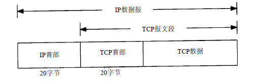

TCP首部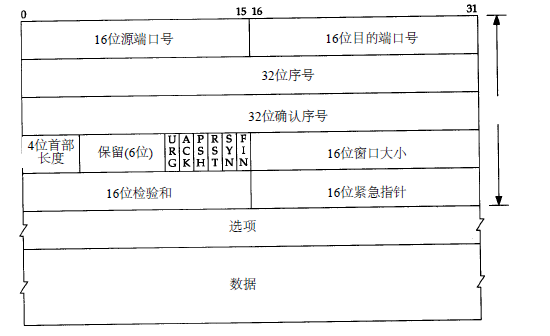

- 16位端口号：点对点通信，需要源端口号和目的端口号
- ==32位序列号（seq）：==
  - 每次通信，**序列号为对方发送的确认号**，==用于确认收到对方的报文==
  - TCP三次握手建立连接中：通信双方的序列号是一个随机值（ 为0）
- ==32位确认号（ack）：用于对另一方发送来的TCP报文的响应==,告诉对方我收到了你发送的数据
  - **对方发送的序列号+标志位长度+对方发送的数据长度**（三次握手过程中没有数据传输，标志位长度为1）
  - 数据长度的作用是：当收到数据报后知道收到了多少个数据，从而==确认数据报是否完整==
- 4位首部长度：标识TCP头部有多少个32位字（4字节）
- 6位标志位：URG（紧急指针是否有效），**ACK（确认报文段）**，PSH（接收端应立即读取TCP接收缓冲区数据），RST（对方重新建立连接，复位报文段），**SYN（同步报文段）**，**FIN（结束报文段）**
- ==16位窗口大小==：用于TCP流量控制。窗口是指接收通告窗口（RWND），告诉本端TCP==接收缓冲区==还能容纳多少字节，这样发送端就可以控制发送速度
- 16位校验：由发送端填充，可靠传输的保障
- 16位紧急指针：一个正的偏移量。紧急指针+序列号=最后一个紧急数据的下一字节的序列号。用于发送端发送紧急数据

==注：牢记序列号和确认号的关系==

### 6.2.1 TCP 三次握手

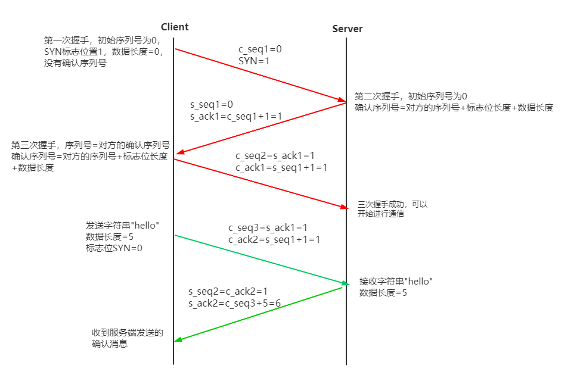

### 6.2.2 TCP 四次挥手

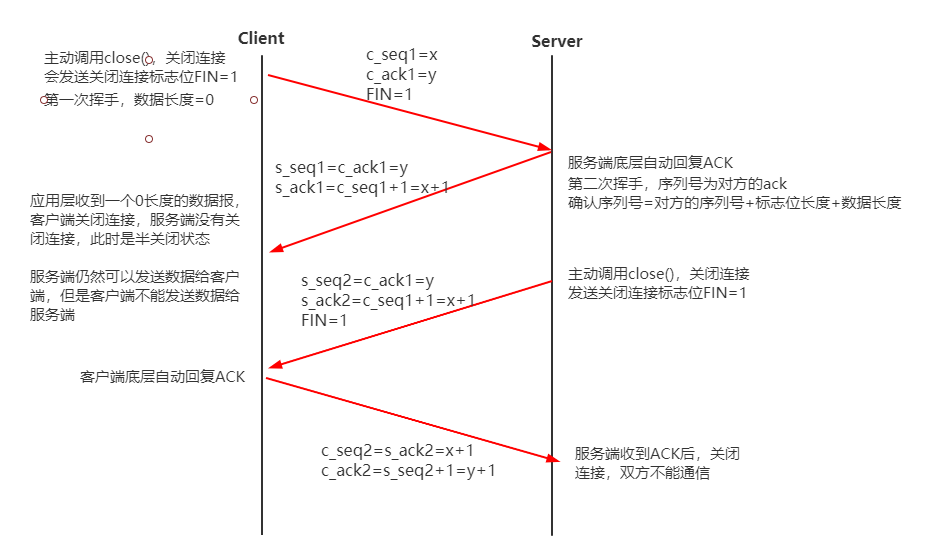

### 6.2.3 TCP状态转换图

查看TCP状态命令：`netstat -apn | gerp 端口号`

主动方状态：

- CLOSED->SYN_SENT：调用`connect()`主动建立连接，发送SYN
- SYN_SENT->ESTABLISHED：第二次握手，接收发送的ACK、SYN，连接建立成功
- ESTABLISHED->FIN_WAIT1：应用层调用close()请求关闭连接，发送FIN
- FIN_WAIT1->FIN_WAIT2：接收ACK，此时处于==半关闭状态==
- FIN_WAIT2->TIME_WAIT：接收FIN，发送ACK，并等待2MSL再全关闭（在等待时间内，==端口还没关闭==）
- FIN_WAIT1->CLOSING：第一次挥手等待被动方回应ACK，同时完成了三、四次挥手，处于正在关闭状态
- FIN_WAIT1->TIME_WAIT：接收FIN、ACK，发送ACK
- CLOSING->TIME_WAIT：接收ACK

==TIME_WAIT==：会等待2MSL时间（TCP报文最大生存时间是MSL）确保通信双方未被接收的、迟到的TCP报文已经消失。下一次建立安全连接时，可能会等待2MSL等待端口完全关闭才可使用，因此可以通过socket选项`SO_REUSERADDR`来强制取消延时等待。

TIME_WAIT：https://www.cnblogs.com/dadonggg/p/8778318.html

```
TIME_WAIT状态存在的理由：
1）可靠地实现TCP全双工连接的终止
在进行关闭连接四次挥手协议时，最后的ACK是由主动关闭端发出的，如果这个最终的ACK丢失，服务器将重发最终的FIN，因此客户端必须维护状态信息允许它重发最终的ACK。如果不维持这个状态信息，那么客户端将响应RST分节，服务器将此分节解释成一个错误（在java中会抛出connection reset的SocketException)。
因而，要实现TCP全双工连接的正常终止，必须处理终止序列四个分节中任何一个分节的丢失情况，主动关闭的客户端必须维持状态信息进入TIME_WAIT状态。

2）允许老的重复分节在网络中消逝 
TCP分节可能由于路由器异常而“迷途”，在迷途期间，TCP发送端可能因确认超时而重发这个分节，迷途的分节在路由器修复后也会被送到最终目的地，这个原来的迷途分节就称为lost duplicate。在关闭一个TCP连接后，马上又重新建立起一个相同的IP地址和端口之间的TCP连接，后一个连接被称为前一个连接的化身（incarnation)，那么有可能出现这种情况，前一个连接的迷途重复分组在前一个连接终止后出现，从而被误解成从属于新的化身。为了避免这个情况，TCP不允许处于TIME_WAIT状态的连接启动一个新的化身，因为TIME_WAIT状态持续2MSL，就可以保证当成功建立一个TCP连接的时候，来自连接先前化身的重复分组已经在网络中消逝。

```

被动方状态：

- CLOSED->LISTEN：应用层调用`listen()`，被动监听客户请求
- LISTEN->SYN_RCVD：接收主动方的SYN，并回应ACK
- SYN_RCVD->ESTABLISHED：连接建立成功
- ESTABLISHED->CLOSE_WAIT：前两次挥手，接收FIN，并回应ACK
- CLOSE_WAIT->LAST_ACK：第三次挥手，主动close，发送FIN给主动方，等待ACK
- LAST_ACK->CLOSED：关闭连接


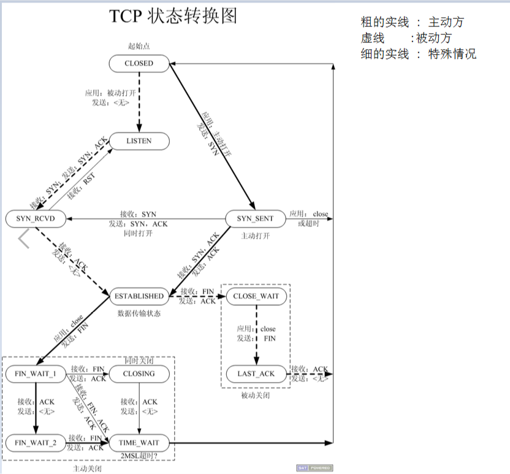


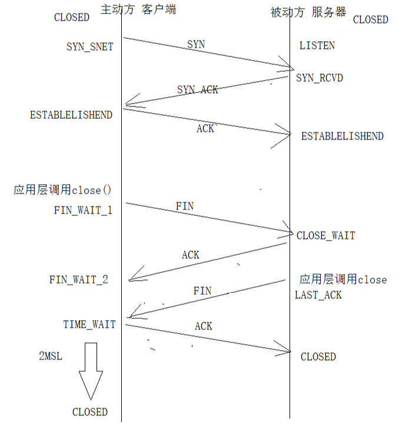

### 6.2.4 keepalive、心跳包

在实际开发中，TCP连接会出现以下两种情况：

- 情况1：一个客户端连接服务器以后，如果**长期没有和服务器有数据来往，可能会被防火墙程序关闭连接，有时候我们并不想要被关闭连接**。例如，对于一个即时通讯软件，如果服务器没有消息时，我们确实不会和服务器有任何数据交换，但是如果连接被关闭了，有新消息来时，我们再也没法收到了，这就违背了“即时通讯”的设计要求。
- 情况2：通常情况下，服务器与某个客户端一般不是位于同一个网络，其之间可能经过数个路由器和交换机，如果其中**某个必经路由器或者交换器出现了故障，并且一段时间内没有恢复**，导致这之间的链路不再畅通，而此时服务器与客户端之间也没有数据进行交换，由于 TCP 连接是状态机，对于这种情况，**无论是客户端或者服务器都无法感知与对方的连接是否正常**，这类连接我们一般称之为“死链”。

情况1中的应用场景要求==必须保持客户端与服务器之间的连接正常==，就是我们通常所说的==“保活“==。当服务器与客户端一定时间内没有有效业务数据来往时，我们只需要给对端发送==心跳包==即可实现保活。

情况2中的死链，只要我们此时任意一端给对端发送一个数据包即可==检测链路是否正常==，这类数据包我们也称之为”心跳包”，这种操作我们称之为==“心跳检测”==。顾名思义，如果一个人没有心跳了，可能已经死亡了；一个连接长时间没有正常数据来往，也没有心跳包来往，就可以认为这个连接已经不存在，==为了节约服务器连接资源，我们可以通过关闭 socket，回收连接资源==。

根据上面的分析，让我再强调一下，心跳检测一般有两个作用：

- 1、保活，保持客户端与服务器的连接
- 2、心跳检测，检测连接是否正常，关闭已经断开的连接，回收资源

实现方法：

- 1、调用API设置TCP keepalive选项
- 2、应用层自定义心跳包


> 传输层 TCP keepalive 选项

**作用：**用于检查TCP连接是否正常，并不能保证应用层的连接健全 

操作系统的 TCP/IP 协议栈其实提供了这个的功能，即 keepalive 选项。在 Linux 操作系统中，我们可以通过代码启用一个 socket 的心跳检测（即每隔一定时间间隔发送一个心跳检测包给对端），代码如下：

```c++
 //on 是 1 表示打开 keepalive 选项，为 0 表示关闭，0 是默认值
 int on = 1;
 setsockopt(fd, SOL_SOCKET, SO_KEEPALIVE, &on, sizeof(on));
```

**优点：**TCP协议自带的保活功能, 使用起来简单, 减少了应用层代码的复杂度. 推测也会更节省流量, 因为一般来说应用层的数据传输到协议层时都会被加上额外的包头包尾. 由TCP协议提供的检活, 其发的探测包, 理论上实现的会更精妙(用更少的字节完成更多的目标), 耗费更少的流量

**缺点：**相对于应用层的心跳包，不够灵活


> 应用层 自己实现的心跳包

**作用：**用于检测客户端和服务器之间是否能正常响应

心跳包：为心跳消息额外定义一个消息类型. 就是应用正常的消息包, 只是这个包特殊点, 专门用来检活而已, 通常比较小, 可能只有消息头就可以了, 除非需要额外的信息

服务器和客户端之间有一个心跳包，以**固定的频率**来发送标志位，类似网络层的协议

乒乓包：类似于心跳包，但是可以携带简单数据

**优点：** 一是比较**灵活**, 因为协议层的心跳只能提供最纯粹的检活功能, 但是应用层自己可以随意控制, 包括协议可能提供的是秒级的, 但是你想做成毫秒级的都任意(虽然实际几乎不会有这种时间级别的心跳), 包里还甚至可以携带额外的信息, 这些都是灵活之处；二是**通用**, 应用层的心跳不依赖协议. 如果有一天不用TCP要改为UDP了, 协议层不提供心跳机制了, 但是你应用层的心跳依旧是通用的, 可能只需要做少许改动就可以继续使用.

**缺点：**增加开发工作量, 由于应用特定的网络框架, 还可能很增加代码结构的复杂度. 再就是根据上面的推测, 应用层心跳的流量消耗还是更大的, 毕竟这本质上还是个普通的数据包


### 6.2.5 TCP携带的数据

TCP报文段携带的应用数据按长度分为两种：交互数据和成块数据

- 交互数据包含很少的字节，使用交互数据的应用程序或协议对实时性要求较高，如telnet、ssh

- 成块数据的长度则通常为TCP报文段允许的最大数据长度。使用成块数据的应用程序（或协议）对传输效率要求高，比如ftp


### 6.2.6 带外数据

传输层协议具有带外（Out Of Band，OOB）数据的概念，用于迅速通告对方，本端发生的**重要事件**，相比普通数据有更高的优先级，总是==立即被发送==，不论发送缓冲区是否有排队等待发送的普通数据。

传输方式：

- 方式一：TCP默认接收方式。TCP报文中设置URG（紧急指针）标志

- 方式二：TCP连接设置`SO_OOBINLINE`，将带外数据和普通数据一起存放在TCP接收缓冲区，再使用系统调用识别带外数据


### 6.2.7 短连接、长连接

长连接和短连接的产生在于client和server采取的关闭策略

> **短连接**：建立连接——数据传输——关闭连接...建立连接——数据传输——关闭连接

client**主动发起close操作**，client/server只进行**一次读写操作**

**应用：**WEB网站的http服务一般都用**短连接**，因为长连接对于服务端来说会耗费一定的资源，而像WEB网站这么频繁的成千上万甚至上亿客户端的连接用短连接会更省一些资源，如果用长连接，而且同时有成千上万的用户，如果每个用户都占用一个连接的话，那可想而知吧。所以并发量大，但每个用户无需频繁操作情况下需用短连接。

**优点：**管理起来比较简单，存在的连接都是有用的连接，不需要额外的控制手段

**缺点：**如果客户**请求频繁**，将在**TCP的建立和关闭操作上浪费时间和带宽**。


> **长连接**：建立连接——数据传输...（保持连接）...数据传输——关闭连接

client与server之间的连接并**不会主动关闭**，后续的读写操作会继续使用这个连接

不主动关闭连接，但会出现【6.2.4】连接突然中断的2种情况，因此涉及到==保活机制==

**应用：**多用于操作频繁，点对点的通讯，而且连接数不能太多的场景，如：微信开放平台网站应用的扫码登陆，聊天室等。

**优点：**省去较多的TCP建立和关闭的操作，减少浪费，节约时间。对于频繁请求资源的客户来说，较适用长连接

**缺点：**Client与server之间的连接如果一直不关闭的话，会存在一个问题，随着客户端连接越来越多，server早晚有扛不住的时候，这时候server端需要采取一些策略，如关闭一些长时间没有读写事件发生的连接（**关闭非活动连接**），这样可 以避免一些恶意连接导致server端服务受损；如果条件再允许就可以以客户端机器为颗粒度，限制每个客户端的最大长连接数，这样可以完全避免某个蛋疼的客户端连累后端服务。


### 6.2.8 滑动窗口

实质：窗口大小指的是自己**当前接收缓冲区的可用空间**

作用：**控制TCP传输流量**


客户端与服务端通信使用的是套接字：

发送方发送数据，将数据存入自己的写缓冲区；

==通过传输层，将写缓冲区的数据传输到接收方的读缓冲区中==；

接收方接收数据，从自己的读缓冲区中读取数据；


客户端和服务端之间存在带宽差异，有可能存在数据交互的速度差异，在传输时可能会出现下面的情况：

当发送端不断的快速发送数据，接收缓冲区很快填满，此时发送端无法发送数据，造成网络阻塞现象

只有当接收端将缓冲区的数据提取出来，腾出一个缓冲区空间，并向发送端回应一个ACK和==滑动窗口大小==时，发送端才能继续发送数据


# 7 应用层

**应用层负责处理应用程序的逻辑**

常见的应用层协议如下：

- ping：实质上是应用程序，利用ICMP报文检测网络连接，用于调试网络环境
- telnet：远程登录协议
- OSPF（Open Shortest Path First）：开放最短路径优先协议，是一种动态路由更新协议，用于路由器之间的通信，以告知对方各自的路由信息
- DNS（Domain Name Service）：域名服务协议，提供机器域名到IP地址的转换 