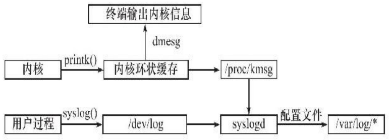

# Linux服务器程序规范

- （1）==守护进程==：服务器在后台以进程形式一直运行
- （2）==日志系统==：记录服务器日志，通常保存在/var/log目录下
- （3）服务器程序一般以某个专门的==非root身份==运行
- （4）配置文件管理Linux服务器程序：配置文件一般存放在/etc目录下
- （5）服务器进程通常会在启动是生成一个PID文件并存入/var/run目录中，以记录该后台进程的PID
- （6）需要考虑==系统资源限制==，以预测自身能承受多大负荷，比如进程可用文件描述符总数和内存总量等


# 系统日志

Linux提供一个守护进程`rsyslogd`来处理系统日志

`rsyslogd`守护进程既能==①接收用户进程输出的日志==，又能==②接收内核日志==





**系统日志体系：**

用户——调用`syslog`函数——生成系统日志——输出到UNIX本地域socket（AF_UNIX）类型的文件/dev/log中

守护进程`rsyslogd`——监听/dev/log——==①获取用户进程的输出==

内核日志——由守护进程`rklogd`来管理——`printk`等函数打印内核日志到内核的环状缓存（ring buffer）中——环状缓存映射到/proc/kmsg文件中——守护进程`rsyslogd`读取该文件==②获得内核日志==

守护进程`rsyslogd`把用户进程日志和内核日志——输出到特定的日志文件（调试信息保存到/var/log/debug，普通信息保存到/var/log/message，内核消息保存到/var/log/kern.log）

守护进程`rsyslogd`的主配置文件是/etc/rsyslogd.conf，可配置以下内容：

- 内核日志输入路径
- 是否接收UDP日志及其监听端口
- 是否接收TCP日志及其监听端口
- 日志文件的权限
- 包含哪些子配置文件（子配置文件指定各类日志的目标存储文件）


## syslog

用于生成系统日志

```c++
#include＜syslog.h＞
void syslog(int priority, const char *message,...);

void openlog(const char *ident, int option, int facility);

void closelog(void);
```


# 用户信息

uid在系统中保存了三份，分别是：real uid（当前用户），effective uid（有效用户）， save uid（可以没有）

gid与uid同理


## u +s / g +s 权限

文件权限一般情况下是rwx

某些特殊文件，如passwd命令行的二进制文件，==x权限的位置变为了s==

这个文件就具有s权限

s权限：如果一个文件有s权限，那么当某个用户调用这个文件时，这个用户会==切换==到这个文件所有者的身份来执行

g+s权限同理

==大部分服务器必须以root身份启动，但不能以root身份运行，这与真实UID和有效UID相关==

例如：

命令行passwd的二进制文件的所有者是root，uid为0 0 0，具有u+s权限

当前用户（假设uid为2 2 2）执行命令passwd后，因为passwd具有u+s权限，所以用户会切换到这个文件的所有者，也就是root(uid=0)用户的身份来执行，那么当前用户此时的uid变成了**2 0 0**

2是真实用户的real uid；0是root用户的uid（也就是当前的effctive uid）

相当于当前用户执行password命令时，拥有了root的执行权限

==也就是说，一个用户是否可以执行某个文件，关键是看这个用户的effective uid是否可执行==


> 将文件所属用户，所属组改为root，并设置为s权限

```shell
sudo chown root:root file	#修改所属用户所属组为root
sudo chmod +s file			#将权限改为s权限，普通用户可以执行此文件
```


## 常用函数

`uid_t getuid()`：返回real uid

`uid_t geteuid()`：返回effetcitve uid

`int setuid()`：设置effective uid

`int seteuid()`：设置effective uid

`int setreuid(uid_t ruid, uid_t euid)`：交换ruid和euid


`gid_t getgid()`：返回real gid

`gid_t getegid()`：返回effective gid

`int setgid`：设置effective gid

`int setegid()`：设置effective gid

`int setregid(uid_t rgid, uid_t egid)`：交换real gid和effective gid


# 改变工作目录和根目录

有些服务器程序需要改变工作目录和根目录

获取进程当前工作目录

```c++
#include＜unistd.h＞
char *getcwd(char *buf, size_t size);
```

- buf：指向的内存用于存储进程当前工作目录的==绝对路径名==，其大小由size参数指定
- 如果buf为NULL，size非0，则内部使用malloc动态分配内存，并将进程的当前工作目录存储在其中，此时需要自己释放这块内存

成功返回一个指向目标存储区的指针，失败返回NULL并设置errno


改变进程工作目录：

```c++
int chdir(const char *path);
```

- path:指定要切换到的目标目录

成功时返回0，失败时返回-1并设置errno


改变进程根目录的函数是chroot：

```c++
int chroot(const char *path);
```

- path：指定要切换到的目标根目录

成功时返回0，失败时返回-1并设置errno


# 系统资源限制

Linux系统资源限制可以通过如下一对函数来读取和设置：

```c++
#include＜sys/resource.h＞
int getrlimit(int resource, struct rlimit *rlim);
int setrlimit(int resource, const struct rlimit *rlim);
```

成功返回0，否则返回-1并设置errno


rlim参数是rlimit结构体类型的指针，rlimit结构体的定义如下：

```c++
struct rlimit
{
    // rlim_t是一个整数类型，它描述资源级别
    rlim_t rlim_cur;	//指定资源的软限制，软限制是建议性的、最好不要超过的，系统可能发送信号终止运行
    rlim_t rlim_max;	//指定资源的硬限制，硬限制是软限制的上限
};
```


# 守护进程

```c++
#include＜unistd.h＞
int daemon(int nochdir, int noclose);
```

- nochdir：用于指定是否改变工作目录，如果给它传递0，则工作目录将被设置为“/”（根目录），否则继续使用当前工作目录
- noclose：为0时，标准输入、标准输出和标准错误输出都被重定向到/dev/null文件，否则依然使用原来的设备

函数成功时返回0，失败则返回-1并设置errno


> 将服务器程序以守护进程的方式运行

```c++
bool daemonize()
{
/*创建子进程，关闭父进程，这样可以使程序在后台运行*/
    pid_t pid=fork();
    if(pid＜0)
    {
    	return false;
    }
    else if(pid＞0)
    {
    	exit(0);
    }
    /*设置文件权限掩码。当进程创建新文件（使用open(const char*pathname,int flags,mode_t mode)系统调用）时，文件的权限将是mode＆0777*/
    umask(0);
    /*创建新的会话，设置本进程为进程组的首领*/
    pid_t sid=setsid();
    if(sid＜0)
    {
    	return false;
    }
    /*切换工作目录*/
    if((chdir("/"))＜0)
    {
    	return false;
    }
    /*关闭标准输入设备、标准输出设备和标准错误输出设备*/
    close(STDIN_FILENO);
    close(STDOUT_FILENO);
    close(STDERR_FILENO);
    /*关闭其他已经打开的文件描述符，代码省略*/
    /*将标准输入、标准输出和标准错误输出都定向到/dev/null文件*/
    open("/dev/null",O_RDONLY);
    open("/dev/null",O_RDWR);
    open("/dev/null",O_RDWR);
    return true;
}
```


# 日志系统

