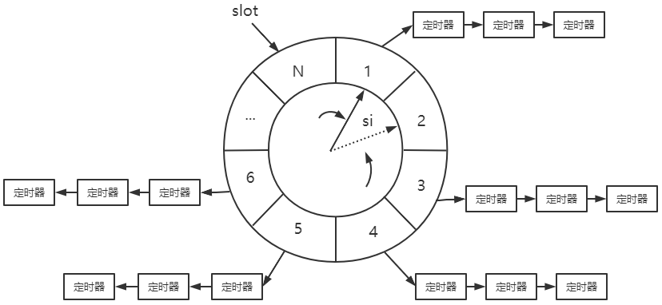

# 1 定时器介绍

定时是指在一段时间之后触发某段代码的机制，我们可以在这段代码中依次处理所有到期的定时器。换言之，定时机制是定时器得以被处理的原动力。

**Linux提供了三种定时方法：**

- socket选项SO_RCVTIMEO和SO_SNDTIMEO
- SIGALRM信号
- I/O复用系统调用的超时参数


定时事件：比如定期检测一个客户连接的活动状态

服务器程序通常管理着众多定时事件，因此有效地组织这些定时事件，使之能在预期的时间点被触发且不影响服务器的主要逻辑，对于服务器的性能有着至关重要的影响

将定时事件使用某种容器类数据结构进行封装后，称为定时器

将所有定时器串联起来，以实现对定时事件的统一管理，**管理这些定时事件的容器称为定时器容器**

**常用的高效定时器管理容器：**

- 升序链表
- 时间轮
- 时间堆


# 2 Linux 定时方法

## 2.1 设置socket选项

socket选项中：SO_RCVTIMEO（接收数据超时时间）、SO_SNDTIMEO（发送数据超时时间）

**仅对与数据接收和发送相关的系统调用（send、sendmsg、recv、recvmsg、accept、connect）有效**，其中accept对应SO_RCVTIMEO选项，connect对应SO_SNDTIMEO选项

根据上述系统调用的返回值以及errno来判断超时时间是否已到，进而决定是否开始处理定时任务

```c++
struct timeval timeout;
timeout.tv_sec = time;
timeout.tv_usec = 0;
socklen_t len = sizeof(timeout);
//设置socket选项
ret = setsockopt(cfd, SOL_SOCKET, SO_SNDTIMEO, &timeout, len);

//发送connect请求
ret = connect(cfd, (struct sockaddr *)&raddr, sizeof(raddr));
if(ret == -1)
{
    /*超时对应的错误号是EINPROGRESS。下面这个条件如果成立，我们就可以处理定时任务了*/
    if (errno == EINPROGRESS)
    {
        //处理定时器任务
        printf("connecting timeout,process timeout logic\n");
        return-1;
    }
    printf("error occur when connecting to server\n");
    return-1;
}
```


## 2.2 SIGALRAM信号

alarm或setitimer函数设置的实时闹钟一旦超时，就会触发SIGALRM信号，之后我们可以利用该信号的信号处理函数来处理定时任务。

但是，如果要处理多个定时任务，我们就需要不断地触发SIGALRM信号，并在其信号处理函数中执行到期的任务。

一般而言，SIGALRM信号按照固定的频率生成，即由alarm或setitimer函数设置的定时周期T保持不变。

如果某个定时任务的超时时间不是T的整数倍，那么它实际被执行的时间和预期的时间将略有偏差。因此定时周期T反映了定时的精度。


## 2.3 IO复用设置超时参数

select、poll、epoll都能设置**超时参数(函数等待时间)**，设置了之后不仅能统一处理信号和I/O事件，也能统一处理定时事件

**I/O复用系统调用可能在超时时间到期之前就返回（有I/O事件发生），所以如果我们要利用它们来定时，就需要不断更新定时参数以反映剩余的时间**

```c++
#define TIMEOUT 5000

int timeout=TIMEOUT;		//总等待时间
time_t start=time(NULL);
time_t end=time(NULL);

while(1)
{
    printf("the timeout is now %d mil-seconds\n",timeout);
    start=time(NULL);	//开始时间
    int number = epoll_wait(epollfd, events, MAX_EVENT_NUMBER, timeout);
    if((number＜0)&&(errno!=EINTR))
    {
        printf("epoll failure\n");
        break;
    }
    /*如果epoll_wait成功返回0，则说明超时时间到，此时便可处理定时任务，并重置定时时间*/
    if(number==0)
    {
        timeout=TIMEOUT;
        continue;
    }
    end=time(NULL);		//结束时间
    
    /*如果epoll_wait的返回值大于0，则本次epoll_wait调用持续的时间是(end-start)*1000  ms，我们需要将定时时间timeout减去这段时间，以获得下次epoll_wait调用的超时参数*/
    timeout-=(end-start)*1000;	//没有监听到事件，则更新等待时间
    
    /*重新计算之后的timeout值有可能等于0，说明本次epoll_wait调用返回时，不仅有文件描述符就绪，而且其超时时间也刚好到达，此时我们也要处理定时任务，并重置定时时间*/
    if(timeout<=0)
    {
    	timeout=TIMEOUT;
    }
    
    //handle connections
}
```


# 3 定时器容器

定时器通常至少要包含两个成员：一个超时时间（相对时间或者绝对时间）和一个任务回调函数。

有的时候还可能包含回调函数被执行时需要传入的参数，以及是否重启定时器等信息。

## 3.1 升序链表

如果使用链表作为容器来串联所有的定时器，则每个定时器还要包含指向下一个定时器的指针成员。

进一步，如果链表是双向的，则每个定时器还需要包含指向前一个定时器的指针成员。

升序定时器链表：将其中的定时器按照超时时间做升序排序

 * 添加定时器的时间复杂度是O(n)
 * 删除定时器的时间复杂度是O(1)
 * 执行定时任务的时间复杂度是O(1)

> listClock.h

```c++
/**
 * @author: fenghaze
 * @date: 2021/05/22 14:42
 * @desc: 升序链表定时器容器
 * 添加定时器的时间复杂度是O(n)
 * 删除定时器的时间复杂度是O(1)
 * 执行定时任务的时间复杂度是O(1)
 */

#ifndef LISTCLOCK_H
#define LISTCLOCK_H

#include <time.h>
#define BUFFERSIZE 64

class UtilTimer;

//用户数据类型
class ClientData
{
    struct sockaddr_in addr;
    int cfd;
    char buf[BUFFERSIZE];
    UtilTimer timer;
};

//定时器类型（升序链表中的每一个元素）
class UtilTimer
{
public:
    UtilTimer() : prev(nullptr), next(nullptr) {}

public:
    time_t expire;                  //任务的超时时间，使用绝对时间
    void (*callback)(ClientData *); //回调函数处理的客户数据，由定时器的执行者传递给回调函数
    ClientData *client_data;
    UtilTimer *prev; //指向前一个定时器
    UtilTimer *next; //指向后一个定时器
};

//升序的双向链表定时器容器：初始化链表、销毁链表、插入节点、修改节点、删除节点
class ListClock
{
public:
    //初始化双向链表
    ListClock() : head(nullptr), tail(nullptr) {}

    //销毁链表：删除所有节点
    ~ListClock()
    {
        auto tmp = head;
        while (tmp)
        {
            head = tmp->next;
            delete tmp;
            tmp = head;
        }
    }

    //插入节点：头插法，向链表中添加一个定时器
    void addClock(UtilTimer *timer)
    {
        if (!timer)
        {
            return;
        }

        //头节点为空
        if (!head)
        {
            head = timer;
            return;
        }
        //头插法：升序链表
        if (timer->expire < head->expire)
        {
            timer->next = head;
            head->prev = time;
            head = timer;
            return;
        }
        //其他情况
        addClock(timer, head);
    }

    //修改指定节点：根据定时器的expire值，调整节点位置
    void adjustClock(UtilTimer *timer)
    {
        if (!timer)
        {
            return;
        }
        auto tmp = timer->next;
        //timer在末尾 或 timer < tmp，不用调整
        if (!tmp || timer->expire < tmp->expire)
        {
            return;
        }

        //timer是头节点，则重新插入
        if(timer == head)
        {
            head = head->next;
            head->prev = nullptr;
            timer->next = nullptr;
            addClock(timer, head);
        }
        //不是头节点，则删除该节点，并重新插入
        else
        {
            timer->prev->next = tmp;
            tmp->prev = timer->prev;
            addClock(timer, tmp);
        }
    }

    //删除指定节点
    void delClock(UtilTimer *timer)
    {
        if(!timer) 
        {
            return;
        }
        //链表中只有一个定时器(链表长度为1)
        if((timer==head) && (timer==tail))
        {
            delete timer;
            head = nullptr;
            tail = nullptr;
            return;
        }

        //链表中至少有两个定时器，且timer==head
        if (timer == head)
        {
            head = head->next;
            head->prev = nullptr;
            delete timer;
            return;
        }

        //链表中至少有两个定时器，且timer==tail
        if(timer == tail)
        {
            tail = tail->prev;
            tail->next = nullptr;
            delete timer;
            return;
        }

        //timer不是head、tail
        timer->next->prev = timer->perv;
        timer->prev->next = timer->next;
        delete timer;
    }

    //处理定时事件：每隔一段事件调用一次来处理定时事件
    void tick()
    {
        if (!head)
        {
            return;
        }
        printf("timer tick\n");
        time_t cur = time(nullptr); //当前时间
        UtilTimer *tmp = head;
        while (tmp)
        {
            if(cur < tmp->expire)   //还没有达到处理时间，break，等待下一次调用tick()
            {
                break;
            }
            
            //执行回调函数，处理客户数据
            tmp->callback(tmp->client_data);
            
            //处理完一个定时器就删掉
            head = tmp->next;
            if (head)
            {
                head->prev = nullptr;
            }
            delete tmp;
            tmp = head;
        }
    }

private:
    //表示将目标定时器timer添加到节点lst_head之后的部分链表中  
    void addClock(UtilTimer *timer, UtilTimer *lst_head)
    {
        auto tmp = lst_head->next;
        auto pre = lst_head;
        while (tmp)
        {
            if(timer->expire < tmp->expire)
            {
                pre->next = timer;
                timer->next = tmp;
                timer->prev = pre;
                tmp->prev = timer;
                break;
            }
            pre = tmp;
            tmp = tmp->next;
        }
        //如果tmp < timer，则插入到末尾
        if(!tmp)
        {
            pre->next = timer;
            timer->prev = pre;
            timer->next = nullptr;
            tail = timer;
        }
    }

private:
    UtilTimer *head;	//头结点
    UtilTimer *tail;	//尾结点
};

#endif // LISTCLOCK_H
```


## 3.2 时间轮



时间轮使用==哈希表==的思想，将定时器散列到不同的链表上。这样每条链表上的定时器数目都将明显少于原来的排序链表上的定时器数目，插入操作的效率基本不受定时器数目的影响

时间轮中有N个**槽（slot）**，以恒定的速度顺时针转动，每转动一步就指向下一个槽，每次转动称为一个**滴答（tick）**，一个滴答的时间称为时间轮的**槽间隔si（slot interval）**，这就是心博时间

时间轮转动一周所需时间为$N*si$

每个槽指向一条定时器链表，每条链表具有相同特征：定时时间相差 $N*si$ 的整数倍

时间轮正是利用这个关系**将定时器散列到不同的链表中**。假如现在指针指向槽cs，我们要添加一个定时时间为ti的定时器，则该定时器将被插入槽ts（timer slot）对应的链表中：$ts = (cs + (ti/si)) \bmod N$

对时间轮而言，要提高定时精度，就要使si值足够小；要提高执行(插入定时器)效率，则要求N值足够大

复杂的时间轮可能有多个轮子，不同的轮子拥有不同的粒度。相邻的两个轮子，精度高的转一圈，精度低的仅往前移动一槽，就像水表一样。

- 添加一个定时器的时间复杂度是O（1）

- 删除一个定时器的时间复杂度也是O（1）

- 执行一个定时器的时间复杂度是O（n）

  但实际上执行一个定时器任务的效率要比O（n）好得多，因为时间轮将所有的定时器散列到了不同的链表上。时间轮的槽越多，等价于散列表的入口（entry）越多，从而每条链表上的定时器数量越少。此外，我们的代码仅使用了一个时间轮。

  当使用多个轮子来实现时间轮时，执行一个定时器任务的时间复杂度将接近O（1）

> timeWheel.h

```c++
/**
 * @author: fenghaze
 * @date: 2021/05/24 19:11
 * @desc: 实现时间轮
 */

#ifndef TIMEWHEEL_H
#define TIMEWHEEL_H

#include <time.h>
#include <stdio.h>
#include <netinet/in.h>
#include <vector>
#define BUFFERSIZE 10

using namespace std;

class TimeWheelTimer;

//用户数据类型
class ClientData
{
public:
    struct sockaddr_in addr;
    int cfd;
    char buf[BUFFERSIZE];
    TimeWheelTimer *timer;
};

//时间轮的槽所指向的链表
class TimeWheelTimer
{
public:
    TimeWheelTimer(int rot, int ts) : rotation(rot), time_slot(ts), next(nullptr), prev(nullptr) {}

public:
    int rotation;  //定时器在时间轮中转多少圈后生效，相当于expire
    int time_slot; //定时器对应的槽
    void (*callback)(ClientData *);
    ClientData *client_data;
    TimeWheelTimer *next; //指向链表中的前一个定时器
    TimeWheelTimer *prev; //指向链表中的后一个定时器
};

//时间轮定时器容器：初始化、销毁、插入节点、删除节点、执行定时任务
class TimeWheel
{
public:
    //初始化
    TimeWheel() : cur_slot(0)
    {
        //初始化时间轮的所有槽的链表
        for (auto slot : slots)
        {
            slot = nullptr;
        }
    }

    //销毁
    ~TimeWheel()
    {
        slots.clear();
    }

    //根据timeout创建一个定时器，并插入到合适的槽中
    TimeWheelTimer *addClock(int timeout)
    {
        if (timeout < 0)
        {
            return nullptr;
        }
        int ticks = 0;
        //小于一个槽间隔，则向上取1
        if (timeout < SI)
        {
            ticks = 1;
        }
        //否则，计算需要多少个槽间隔
        else
        {
            ticks = timeout / SI;
        }
        //计算需要转多少圈
        int rot = ticks / N;
        //计算最后的槽编号
        int ts = (cur_slot + (ticks % N)) % N;

        //创建定时器，转动rot圈后，第ts个槽上
        auto timer = new TimeWheelTimer(rot, ts);
        //如果第ts个槽为空，则这个定时器作为头节点
        if (!slots[ts])
        {
            printf("add timer, rotation=%d, ts=%d, cur_slot=%d\n", rot, ts, cur_slot);
            slots[ts] = timer;
        }
        //否则，使用头插法插入
        else
        {
            timer->next = slots[ts];
            slots[ts]->prev = timer;
            slots[ts] = timer;
        }
        return timer;
    }

    //根据timeout删除定时器
    void delClock(TimeWheelTimer *timer)
    {
        if (!timer)
        {
            return;
        }
        int ts = timer->time_slot;
        //如果删除的定时器是头节点
        if (timer == slots[ts])
        {
            slots[ts] = slots[ts]->next;
            if (slots[ts])
            {
                slots[ts]->prev = nullptr;
            }
            delete timer;
        }
        else
        {
            timer->prev->next = timer->next;
            if (timer->next)
            {
                timer->next->prev = timer->prev;
            }
            delete timer;
        }
    }

    //执行当前槽的所有定时事件
    void tick()
    {
        //取得当前槽的头节点
        TimeWheelTimer *tmp = slots[cur_slot];
        printf("current slot is %d\n", cur_slot);

        //遍历链表中的所有定时器
        while (tmp)
        {
            printf("tick the timer once\n");
            /*如果定时器的rotation值大于0，则它在这一轮不起作用*/
            if (tmp->rotation > 0)
            {
                tmp->rotation--;
                tmp = tmp->next;
            }
            /*否则，说明定时器已经到期，于是执行定时任务，然后删除该定时器*/
            else
            {
                tmp->callback(tmp->client_data);
                //如果是头节点
                if (tmp == slots[cur_slot])
                {
                    printf("delete header in cur_slot\n");
                    slots[cur_slot] = tmp->next;
                    delete tmp;
                    if (slots[cur_slot])
                    {
                        slots[cur_slot]->prev = NULL;
                    }
                    tmp = slots[cur_slot];
                }
                else
                {
                    tmp->prev->next = tmp->next;
                    if (tmp->next)
                    {
                        tmp->next->prev = tmp->prev;
                    }
                    TimeWheelTimer *tmp2 = tmp->next;
                    delete tmp;
                    tmp = tmp2;
                }
            }
        }
        /*更新时间轮的当前槽，以反映时间轮的转动*/
        cur_slot = ++cur_slot % N;
    }

private:
    static const int N = 60;           //槽的总数
    static const int SI = 1;           //槽间隔为1s
    vector<TimeWheelTimer *> slots{N}; //时间轮，每个元素指向一个定时器链表，链表无序
    int cur_slot;                      //当前槽
};

#endif // TIMEWHEEL_H
```


## 3.3 时间堆

升序链表和时间轮都是以固定的频率调用心搏函数tick，并在其中依次检测到期的定时器，然后执行到期定时器上的回调函数

时间堆则是使用==最小堆排序==思想。将所有定时器中超时时间最小的一个定时器的超时值作为心搏间隔。这样，一旦心搏函数tick被调用，超时时间最小的定时器必然到期，我们就可以在tick函数中处理该定时器。

然后，再次从剩余的定时器中找出超时时间最小的一个，并将这段最小时间设置为下一次心搏间隔。如此反复，就实现了较为精确的定时。

- 添加一个定时器的时间复杂度是O（lgn）
- 删除一个定时器的时间复杂度是O（1）
- 执行一个定时器的时间复杂度是O（1）

> heapClock.h

```c++
/**
 * @author: fenghaze
 * @date: 2021/06/08 09:14
 * @desc: 小根堆定时容器
 */

#ifndef TIMEHEAP_H
#define TIMEHEAP_H

#include "../pool/http.h"
#include <deque>

class HeapNode
{
public:
    HeapNode(int timeout)
    {
        expire = time(nullptr) + timeout; //初始化到期时间
        printf("expire = %ld\n", expire);
    }

public:
    time_t expire;
    HTTPConn *client_data;
    void (*callback)(int, HTTPConn *);
};

//实现小根堆时间堆：取出小根堆堆顶
class TimeHeap
{
public:
    //初始化堆
    TimeHeap()
    {
        heap.clear();
    }

    TimeHeap(std::deque<HeapNode *> arr)
    {
        if (arr.size())
        {
            for (int i = 0; i < arr.size(); i++)
            {
                heap.push_back(arr[i]);
            }
            //从 (arr.size()-1)/2 开始向下调整小根堆
            for (int i = (arr.size() - 1) / 2; i >= 0; i--)
            {
                siftDown(i);
            }
        }
    }

    ~TimeHeap()
    {
        for (auto element : heap)
        {
            delete element;
        }
    }

    //每插入一个定时器，就向上调整为小根堆
    void push(HeapNode *node)
    {
        if (!node)
        {
            return;
        }
        //插入节点
        heap.push_back(node);
        printf("heap.size() == %d\n", heap.size());
        //向上调整当前根堆
        int hole = heap.size() - 1;
        int parent = 0;

        /*对从空穴到根节点的路径上的所有节点执行上虑操作*/
        for (; hole > 0; hole = parent)
        {
            parent = (hole - 1) / 2;
            printf("parent = %d\n", parent);
            if (parent < 0)
            {
                break;
            }
            if (heap[parent]->expire <= node->expire)
            {
                break;
            }
            heap[hole] = heap[parent];
        }
        heap[hole] = node;
    }
    //获得堆顶节点（expire最小），并删除这个顶点，重新调整为小根堆
    HeapNode *pop()
    {
        if (heap.size() == 0)
        {
            return nullptr;
        }
        auto node = heap[0];             //第一个顶点
        heap[0] = heap[heap.size() - 1]; //最后一个顶点放在第一个位置上
        heap.pop_back();                 //删除最后一个顶点
        //从顶点开始向下调整为小根堆
        siftDown(0);
        return node; //返回第一个顶点
    }

    void output()
    {
        for (auto el : heap)
        {
            printf("expire : %ld\t", el->expire);
        }
        printf("\n");
    }

    void tick(int epfd)
    {
        auto tmp = pop();   //获得堆顶节点
        time_t cur = time(nullptr);
        while (!heap.empty())
        {
            if (!tmp)
            {
                break;
            }
            if (tmp->expire > cur)
            {
                break;
            }
            if (tmp->callback)
            {
                tmp->callback(epfd, tmp->client_data);
            }
        }
    }

private:
    //向下调整堆
    void siftDown(int hole)
    {
        auto tmp = heap[hole];
        int child = 0;
        for (; (hole * 2 + 1) <= heap.size() - 1; hole = child)
        {
            child = hole * 2 + 1;
            if ((child < heap.size() - 1) && (heap[child + 1]->expire < heap[child]->expire))
            {
                child++;
            }
            if (heap[child]->expire < tmp->expire)
            {
                heap[hole] = heap[child];
            }
            else
            {
                break;
            }
        }
        heap[hole] = tmp;
    }

private:
    std::deque<HeapNode *> heap; //堆的存储结构：双端队列
};

#endif // TIMEHEAP_H
```


# 4 定时关闭非活动连接

使用升序链表实现KEEPALIVE机制

> 服务端

```c++
/**
 * @author: fenghaze
 * @date: 2021/05/22 16:00
 * @desc: 
 * Linux在内核中提供了对连接是否处于活动状态的定期检查机制，通过socket选项KEEPALIVE来激活它
 * 本程序实现类似于KEEPALIVE的机制：
 * 1、利用alarm函数周期性地触发SIGALRM信号
 * 2、SIGALRM信号处理函数：统一事件源，利用管道通知主循环执行定时器链表上的定时任务
 * 3、升序定时器链表的回调函数处理（重连、关闭）非活动连接
 */

#include <stdlib.h>
#include <stdio.h>
#include <unistd.h>
#include <sys/socket.h>
#include <netinet/in.h>
#include <arpa/inet.h>
#include <string.h>
#include <fcntl.h>
#include <assert.h>
#include <errno.h>
#include <sys/epoll.h>
#include <signal.h>
#include "listClock.h"

#define SERVERPORT "7788"
#define BUFFERSIZE 10
#define MAXEVENTNUM 1024
#define FD_LIMIT 65535
#define TIMESLOT 3

static int epfd;
static int pipefd[2];
static ListClock list_clock;

int setnonblocking(int fd)
{
    int old = fcntl(fd, F_GETFL);
    int opt = old | O_NONBLOCK;
    fcntl(fd, F_SETFL, opt);
    return old;
}

void addfd(int epfd, int fd)
{
    epoll_event ev;
    ev.data.fd = fd;
    ev.events = EPOLLIN | EPOLLET;
    epoll_ctl(epfd, EPOLL_CTL_ADD, fd, &ev);
    setnonblocking(fd);
}

//定时器的回调：关闭非活动连接
void clock_func(ClientData *user)
{
    //移除节点
    epoll_ctl(epfd, EPOLL_CTL_DEL, user->cfd, 0);
    assert(user);
    close(user->cfd);
    printf("close cfd %d\n", user->cfd);
}

//信号处理函数：使用管道pipefd[1]发送错误码给管道pipefd[0]
void sig_handler(int sig)
{
    printf("sigalrm = %d\n", sig);
    int save_errno = errno;
    int msg = sig;
    int len = send(pipefd[1], (char *)&msg, 1, 0);
    errno = save_errno;
}

//设置sig信号的信号处理函数
void addsig(int sig)
{
    struct sigaction sa;
    memset(&sa, '\0', sizeof(sa));
    sa.sa_handler = sig_handler;
    sa.sa_flags |= SA_RESTART;
    sigfillset(&sa.sa_mask);
    assert(sigaction(sig, &sa, NULL) != -1);
    // if(signal(sig, sig_handler)==SIG_ERR)
    // {
    //     perror("signal");
    //     return ;
    // }
}

void time_handler()
{
    //调用tick，处理定时器任务
    list_clock.tick();
    //一次alarm调用只会引起一次SIGALRM信号
    //所以我们要重新定时，以不断触发SIGALRM信号
    alarm(TIMESLOT);
}

int main(int argc, char const *argv[])
{

    int lfd;
    struct sockaddr_in laddr;

    lfd = socket(AF_INET, SOL_SOCKET, 0);
    laddr.sin_family = AF_INET;
    laddr.sin_port = htons(atoi(SERVERPORT));
    inet_pton(AF_INET, "127.0.0.1", &laddr.sin_addr);

    int val = 1;
    setsockopt(lfd, SOL_SOCKET, SO_REUSEADDR, &val, sizeof(val));

    bind(lfd, (struct sockaddr *)&laddr, sizeof(laddr));

    listen(lfd, 5);

    //epoll
    epfd = epoll_create(1);
    epoll_event events[MAXEVENTNUM];

    addfd(epfd, lfd);

    //创建双向管道
    socketpair(PF_UNIX, SOCK_STREAM, 0, pipefd);
    setnonblocking(pipefd[1]); //设置为非阻塞
    addfd(epfd, pipefd[0]);    //监听读事件

    //设置信号处理函数
    addsig(SIGALRM);
    addsig(SIGTERM);

    ClientData *users = new ClientData[FD_LIMIT];

    bool timeout = false;
    alarm(TIMESLOT); //TIMESLOT秒后触发一次SIGALRM信号,pipefd[0]可读
    bool stop_server = false;
    while (!stop_server)
    {
        int n = epoll_wait(epfd, events, MAXEVENTNUM, -1);
        if ((n < 0) && (errno != EINTR))
        {
            printf("epoll faliure\n");
            break;
        }
        for (int i = 0; i < n; i++)
        {
            int fd = events[i].data.fd;
            //有新客户连接：接受连接；添加一个定时器
            if (fd == lfd)
            {
                struct sockaddr_in client_address;
                char ip[INET_ADDRSTRLEN];
                socklen_t client_addrlength = sizeof(client_address);
                int cfd = accept(lfd, (struct sockaddr *)&client_address, &client_addrlength);
                inet_ntop(AF_INET, &client_address.sin_addr, ip, INET_ADDRSTRLEN);
                printf("client %s:%d\n", ip, ntohs(client_address.sin_port));
                
                addfd(epfd, cfd);

                //初始化用户信息结构体
                users[cfd].addr = client_address;
                users[cfd].cfd = cfd;

                //定义一个定时器
                UtilTimer *timer = new UtilTimer;
                timer->callback = clock_func;
                timer->client_data = &users[cfd];
                time_t cur = time(nullptr);
                timer->expire = cur + 3 * TIMESLOT; //定时器运行时间

                users[cfd].timer = timer;
                //添加到定时器容器中
                list_clock.addClock(timer);
            }
            //信号管道pipefd[0]可读，说明有信号响应（信号是从pipefd[1]发送给pipefd[0]的）
            else if ((fd == pipefd[0]) && (events[i].events & EPOLLIN))
            {
                int sig;
                char signals[1024];
                int ret = recv(fd, signals, sizeof(signals), 0);
                if (ret == -1)
                {
                    continue;
                }
                else if (ret == 0)
                {
                    continue;
                }
                else
                {
                    for (int i = 0; i < ret; i++)
                    {
                        switch (signals[i])
                        {
                        case SIGALRM: //定时信号触发
                        {
                            //用timeout变量标记有定时任务需要处理，但不立即处理定时任务
                            //这是因为定时任务的优先级不是很高，我们优先处理其他更重要的任务
                            timeout = true;
                            break;
                        }
                        case SIGTERM:
                        {
                            stop_server = true;
                        }
                        }
                    }
                }
            }

            //有客户数据
            else if (events[i].events & EPOLLIN)
            {
                printf("event trigger once\n");

                //读缓冲区满时，需要使用循环将所有数据读出
                while (1)
                {
                    memset(users[fd].buf, '\0', BUFFERSIZE);
                    int ret = read(fd, users[fd].buf, BUFFERSIZE - 1);
                    if (ret < 0)
                    {
                        /*对于非阻塞IO，下面的条件成立表示数据已经全部读取完毕。
                    此后，epoll就能再次触发sockfd上的EPOLLIN事件，以驱动下一次读操作*/
                        if ((errno == EAGAIN) || (errno == EWOULDBLOCK))
                        {
                            break;
                        }
                        else    //发生读错误：关闭连接，移除定时器
                        {
                            clock_func(&users[fd]);
                            if (users[fd].timer)
                            {
                                list_clock.delClock(users[fd].timer);
                            }
                            break;
                        }
                    }
                    else if (ret == 0) //客户端关闭连接：关闭连接，移除定时器
                    {
                        clock_func(&users[fd]);
                        if (users[fd].timer)
                        {
                            list_clock.delClock(users[fd].timer);
                        }
                    }
                    else    //有数据可读：调整定时器顺序，以延迟关闭该连接的时间
                    {
                        if (users[fd].timer)
                        {
                            time_t cur = time(nullptr);
                            users[fd].timer->expire = cur + 3 * TIMESLOT;
                            printf("adjust timer once\n");
                            list_clock.adjustClock(users[fd].timer);
                        }
                        printf("get %d bytes of content:%s\n", ret, users[fd].buf);
                    }
                }
            }
        }
        /*最后处理定时事件，因为I/O事件有更高的优先级。
        当然，这样做将导致定时任务不能精确地按照预期的时间执行*/
        if (timeout)
        {
            time_handler();
            timeout = false;
        }
    }
    close(lfd);
    close(pipefd[1]);
    close(pipefd[0]);
    delete[] users;
    return 0;
}
```


> 客户端

```c++
/**
  * @file    :client.cc
  * @author  :zhl
  * @date    :2021-03-11
  * @desc    :客户端发送TCP数据给服务端
  */
#include <stdlib.h>
#include <stdio.h>
#include <sys/types.h>
#include <sys/socket.h>
#include <netinet/in.h>
#include <arpa/inet.h>
#include <string.h>
#include <unistd.h>
#define SERVERPORT "7788"

int main(int argc, char const *argv[])
{
    int ld;
    struct sockaddr_in raddr;
    socklen_t raddr_len;
    char recv_msg[BUFSIZ];
    // 1、创建本地套接字
    ld = socket(AF_INET, SOCK_STREAM, 0);
    if (ld < 0)
    {
        perror("socket()");
        exit(1);
    }

    // 配置服务端socket
    raddr.sin_family = AF_INET;
    raddr.sin_port = htons(atoi(SERVERPORT));
    inet_pton(AF_INET, "0.0.0.0", &raddr.sin_addr);

    // 请求连接服务端
    if (connect(ld, (struct sockaddr *)&raddr, sizeof(raddr)) < 0)
    {
        perror("connect()");
        exit(1);
    }
    int n;
    char send_msg[10];
    while (1)
    {
        fgets(send_msg, sizeof(send_msg), stdin);
        n = write(ld, send_msg, strlen(send_msg));
        printf("sent %d bytes of content:%s\n", n, send_msg);
    }
    close(ld);
    exit(0);
}
```

