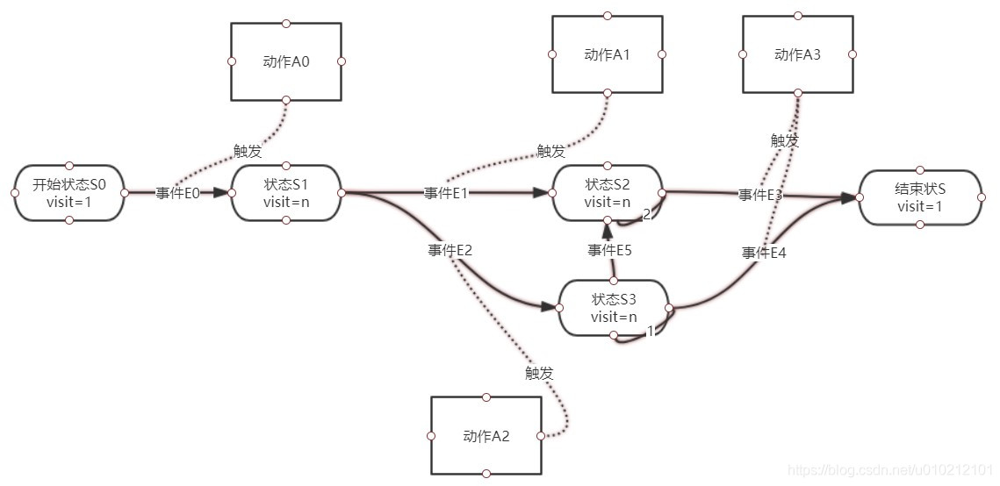
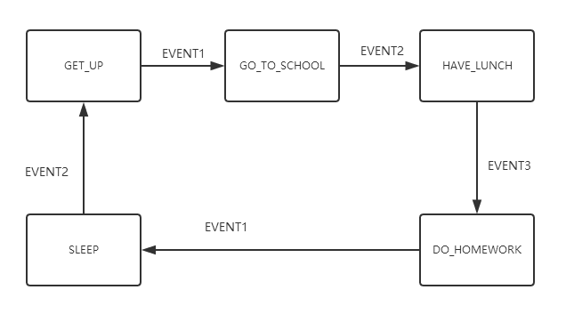
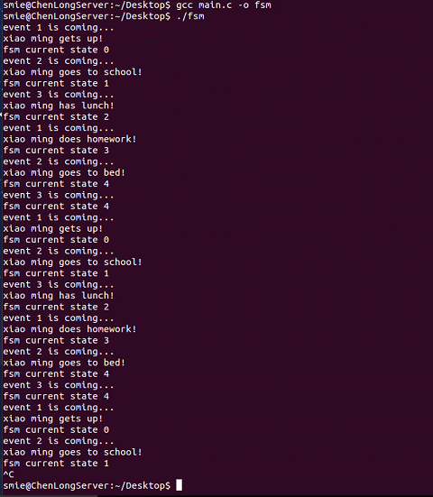
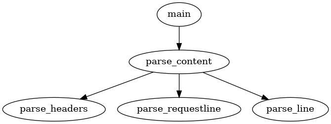
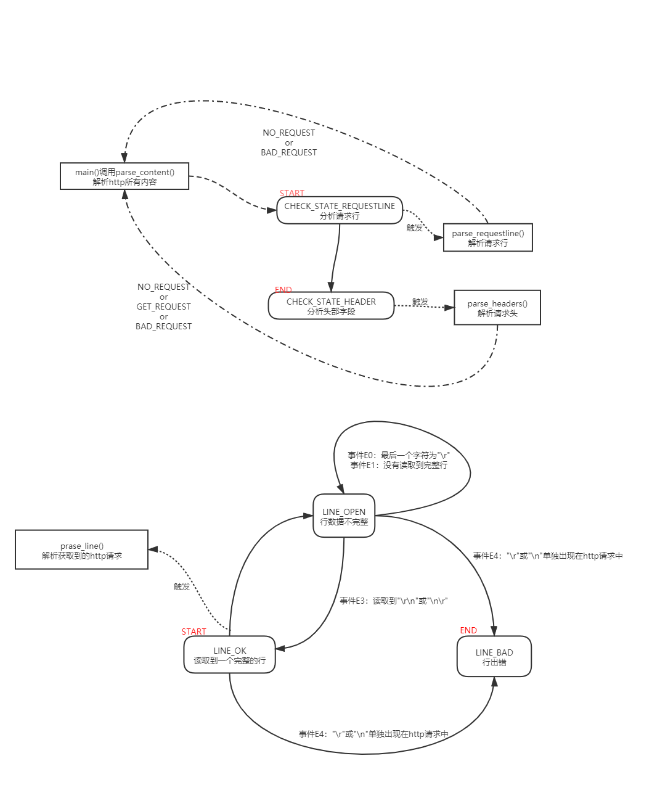

# 1 状态机要素

- 现态：当前所处状态
- 条件(事件)：当满足某个条件，将会触发一个动作，或执行一次状态转移
- 动作：满足某个条件时的处理逻辑。动作执行完毕后可以迁移到另一个状态，或保持新状态
- 次态：当条件满足后，即将转移到的下一个状态

状态转移图：



# 2 使用 if else 实现

使用if/else if语句是实现的FSM最简单最易懂的方法，我们只需要通过大量的if /else if语句来判断状态值来执行相应的逻辑处理。

看看下面的例子，我们使用了大量的if/else if语句实现了一个简单的状态机，做到了根据状态的不同执行相应的操作，并且实现了状态的跳转。

```c++
//比如我们定义了小明一天的状态如下
enum
{
	GET_UP,
	GO_TO_SCHOOL,
	HAVE_LUNCH,
	GO_HOME,
	DO_HOMEWORK,
	SLEEP,
};

int main()
{
	int state = GET_UP;
	//小明的一天
	while (1)
	{
		if (state == GET_UP)
		{
			GetUp(); //具体调用的函数
			state = GO_TO_SCHOOL;  //状态的转移
		}
		else if (state == GO_TO_SCHOOL)
		{
			Go2School();
			state = HAVE_LUNCH;
		}
		else if (state == HAVE_LUNCH)
		{
			HaveLunch();
		}
		...
		else if (state == SLEEP)
		{
			Go2Bed();
			state = GET_UP;
		}
	}

	return 0;
}
```

使用了大量的if判断语句，使得代码很低端，同时代码膨胀的比较厉害。这个状态机的状态仅有几个，代码膨胀并不明显，但是如果需要处理的状态有数十个的话，该状态机的代码就不好读了。


# 3 使用 switch 实现

使用switch语句实现的FSM的结构变得更为清晰了，其缺点也是明显的：这种设计方法虽然简单，通过一大堆判断来处理，适合小规模的状态切换流程，但如果规模扩大难以扩展和维护

```c++
int main()
{
	int state = GET_UP;
	//小明的一天
	while (1)
	{

		switch(state)
		{
		case GET_UP:
			GetUp(); //具体调用的函数
			state = GO_TO_SCHOOL;  //状态的转移
			break;
		case GO_TO_SCHOOL:
			Go2School();
			state = HAVE_LUNCH;
			break;
		case HAVE_LUNCH:
			HaveLunch();
			state = GO_HOME;
			break;
			...
		default:
			break;
	    }
	}

	return 0;
}
```


# 4 使用函数指针实现

使用函数指针实现FSM的思路：

- （1）建立相应的状态表和动作查询表
- （2）根据状态表、事件、动作表定位相应的动作处理函数
- （3）执行完成后再进行状态的切换

当然使用函数指针实现的FSM的过程还是比较费时费力，但是这一切都是值得的，因为当你的程序规模大时候，基于这种表结构的状态机，维护程序起来也是得心应手。

下面给出一个使用函数指针实现的FSM的框架：我们还是以“小明的一天”为例设计出该FSM。

先给出该FSM的状态转移图：



首先我们定义出小明一天的活动状态：

```c++
//比如我们定义了小明一天的状态如下
enum
{
	GET_UP,
	GO_TO_SCHOOL,
	HAVE_LUNCH,
	DO_HOMEWORK,
	SLEEP,
};
```

我们也定义出会发生的事件：

```c++
enum
{
	EVENT1 = 1,
	EVENT2,
	EVENT3,
};
```

定义状态表的数据结构：

```c++
typedef struct FsmTable_s
{
	int event;   //事件
	int CurState;  //当前状态
	void (*eventActFun)();  //函数指针
	int NextState;  //下一个状态
}FsmTable_t;
```

接下来定义出最重要==FSM的状态表==，我们整个FSM就是根据这个定义好的表来运转的

```c++
FsmTable_t XiaoMingTable[] =
{
	//{到来的事件，当前的状态，将要要执行的函数，下一个状态}
	{ EVENT2,  SLEEP,           GetUp,        GET_UP },
	{ EVENT1,  GET_UP,          Go2School,    GO_TO_SCHOOL },
	{ EVENT2,  GO_TO_SCHOOL,    HaveLunch,    HAVE_LUNCH },
	{ EVENT3,  HAVE_LUNCH,      DoHomework,   DO_HOMEWORK },
	{ EVENT1,  DO_HOMEWORK,     Go2Bed,       SLEEP },

	//add your codes here
};
```

状态机的注册、状态转移、事件处理的动作实现：

```c++
/*状态机注册*/
void FSM_Regist(FSM_t* pFsm, FsmTable_t* pTable)
{
	pFsm->FsmTable = pTable;
}

/*状态迁移*/
void FSM_StateTransfer(FSM_t* pFsm, int state)
{
	pFsm->curState = state;
}

/*事件处理*/
void FSM_EventHandle(FSM_t* pFsm, int event)
{
	FsmTable_t* pActTable = pFsm->FsmTable;
	void (*eventActFun)() = NULL;  //函数指针初始化为空
	int NextState;
	int CurState = pFsm->curState;
	int flag = 0; //标识是否满足条件
	int i;

	/*获取当前动作函数*/
	for (i = 0; i<g_max_num; i++)
	{
		//当且仅当当前状态下来个指定的事件，我才执行它
		if (event == pActTable[i].event && CurState == pActTable[i].CurState)
		{
			flag = 1;
			eventActFun = pActTable[i].eventActFun;
			NextState = pActTable[i].NextState;
			break;
		}
	}

	if (flag) //如果满足条件了
	{
		/*动作执行*/
		if (eventActFun)
		{
			eventActFun();
		}

		//跳转到下一个状态
		FSM_StateTransfer(pFsm, NextState);
	}
	else
	{
		// do nothing
	}
}
```

主函数我们这样写，然后观察状态机的运转情况：

```c++
int main()
{
	FSM_t fsm;
	InitFsm(&fsm);
	int event = EVENT1; 
	//小明的一天,周而复始的一天又一天，进行着相同的活动
	while (1)
	{
		printf("event %d is coming...\n", event);
		FSM_EventHandle(&fsm, event);
		printf("fsm current state %d\n", fsm.curState);
		test(&event); 
		sleep(1);  //休眠1秒，方便观察
	}
	return 0;
}
```

该状态机跑起来的状态转移情况：



上面的图可以看出，当且仅当在指定的状态下来了指定的事件才会发生函数的执行以及状态的转移，否则不会发生状态的跳转。这种机制使得这个状态机不停地自动运转，有条不絮地完成任务。

与前两种方法相比，使用函数指针实现FSM能很好用于大规模的切换流程，只要我们实现搭好了FSM框架，以后进行扩展就很简单了（只要在状态表里加一行来写入新的状态处理就可以了）


> 完整code

```c++
/*********************************************************************
Author:Li Junshi
File Decription: Finite State Machine general framework
File Created Time: 2017-06-23
Please send email to lijunshi2015@163.com if you have any question.
*********************************************************************/
#include <stdio.h>
#include <unistd.h>  //linux

//比如我们定义了小明一天的状态如下
enum
{
	GET_UP,
	GO_TO_SCHOOL,
	HAVE_LUNCH,
	DO_HOMEWORK,
	SLEEP,
};

//我们定义的事件有以下几个
enum
{
	EVENT1 = 1,
	EVENT2,
	EVENT3,
};

typedef struct FsmTable_s
{
	int event;   //事件
	int CurState;  //当前状态
	void (*eventActFun)();  //函数指针
	int NextState;  //下一个状态
}FsmTable_t;


typedef struct FSM_s
{
	FsmTable_t* FsmTable;   //指向的状态表
	int curState;  //FSM当前所处的状态

}FSM_t;

int g_max_num;  //状态表里含有的状态个数

void GetUp()
{
	// do something
	printf("xiao ming gets up!\n");
}

void Go2School()
{
	// do something
	printf("xiao ming goes to school!\n");
}

void HaveLunch()
{
	// do something
	printf("xiao ming has lunch!\n");
}

void DoHomework()
{
	// do something
	printf("xiao ming does homework!\n");
}

void Go2Bed()
{
	// do something
	printf("xiao ming goes to bed!\n");
}

/*状态机注册*/
void FSM_Regist(FSM_t* pFsm, FsmTable_t* pTable)
{
	pFsm->FsmTable = pTable;
}

/*状态迁移*/
void FSM_StateTransfer(FSM_t* pFsm, int state)
{
	pFsm->curState = state;
}

/*事件处理*/
void FSM_EventHandle(FSM_t* pFsm, int event)
{
	FsmTable_t* pActTable = pFsm->FsmTable;
	void (*eventActFun)() = NULL;  //函数指针初始化为空
	int NextState;
	int CurState = pFsm->curState;
	int flag = 0; //标识是否满足条件

	/*获取当前动作函数*/
	for (int i = 0; i<g_max_num; i++)
	{
		//当且仅当当前状态下来个指定的事件，我才执行它
		if (event == pActTable[i].event && CurState == pActTable[i].CurState)
		{
			flag = 1;
			eventActFun = pActTable[i].eventActFun;
			NextState = pActTable[i].NextState;
			break;
		}
	}


	if (flag) //如果满足条件了
	{
		/*动作执行*/
		if (eventActFun)
		{
			eventActFun();
		}

		//跳转到下一个状态
		FSM_StateTransfer(pFsm, NextState);
	}
	else
	{
		// do nothing
	}
}

FsmTable_t XiaoMingTable[] =
{
	//{到来的事件，当前的状态，将要要执行的函数，下一个状态}
	{ EVENT1,  SLEEP,           GetUp,        GET_UP },
	{ EVENT2,  GET_UP,          Go2School,    GO_TO_SCHOOL },
	{ EVENT3,  GO_TO_SCHOOL,    HaveLunch,    HAVE_LUNCH },
	{ EVENT1,  HAVE_LUNCH,      DoHomework,   DO_HOMEWORK },
	{ EVENT2,  DO_HOMEWORK,     Go2Bed,       SLEEP },

	//add your codes here
};

//初始化FSM
void InitFsm(FSM_t* pFsm)
{
	g_max_num = sizeof(XiaoMingTable) / sizeof(FsmTable_t);
	pFsm->curState = SLEEP;
	FSM_Regist(pFsm, XiaoMingTable);
}

//测试用的
void test(int *event)
{
	if (*event == 3)
	{
		*event = 1;
	}
	else
	{
		(*event)++;
	}
	
}

int main()
{
	FSM_t fsm;
	InitFsm(&fsm);
	int event = EVENT1; 
	//小明的一天,周而复始的一天又一天，进行着相同的活动
	while (1)
	{
		printf("event %d is coming...\n", event);
		FSM_EventHandle(&fsm, event);
		printf("fsm current state %d\n", fsm.curState);
		test(&event); 
		Sleep(1);  //休眠1秒，方便观察
	}
	return 0;
}
```


# 实例：HTTP协议解析




HTTP状态转移图如下图所示：



```c++
/**
  * @file    :8-3fsm_http.cc
  * @author  :zhl
  * @date    :2021-04-19
  * @desc    :使用主、从两个有限状态机（fsm）读取和解析HTTP请求
  * 测试：curl -v "127.0.0.1:12345"
  * 状态机的算法流程：
  * 1、定义整个流程中可能出现的状态
  * 2、为每个状态规定一系列动作，使用switch驱动每个状态
  */
#include <sys/socket.h>
#include <netinet/in.h>
#include <arpa/inet.h>
#include <stdio.h>
#include <unistd.h>
#include <stdlib.h>
#include <string.h>
#include <fcntl.h>
#include <assert.h>
#include <errno.h>

#define SERVERPORT "12345"
#define BUFFER_SIZE 1024

/*主状态机的两种可能状态，即分析哪个部分*/
enum CHECK_STATE
{
    CHECK_STATE_REQUESTLINE = 0, //当前正在分析请求行
    CHECK_STATE_HEADER           //当前正在分析头部字段
};
/*从状态机的三种可能状态，即行的读取状态*/
enum LINE_STATUS
{
    LINE_OK = 0, //读取到一个完整的行
    LINE_BAD,    //行出错
    LINE_OPEN    //行数据尚且不完整
};
/*服务器处理HTTP请求的结果*/
enum HTTP_CODE
{
    NO_REQUEST,        //请求不完整，需要继续读取客户数据
    GET_REQUEST,       //表示获得了一个完整的客户请求
    BAD_REQUEST,       //表示客户请求有语法错误
    FORBIDDEN_REQUEST, //表示客户对资源没有足够的访问权限
    INTERNAL_ERROR,    //表示服务器内部错误
    CLOSED_CONNECTION  //表示客户端已经关闭连接了
};
/*为了简化问题，我们没有给客户端发送一个完整的HTTP应答报文，而只是根据服务器的处理结果发送如下成功或失败信息*/
static const char *szret[] = {"I get a correct result\n", "Something wrong\n"};

//分析HTTP的行状态
LINE_STATUS parse_line(char *buffer, int &checked_index, int &read_index)
{
    char temp;
    //分析每个字节
    for (; checked_index < read_index; checked_index++)
    {
        //获得当前要分析的字节
        temp = buffer[checked_index];
        //当前为回车符，说明可能读取了一个完整行
        if (temp == '\r')
        {
            if (checked_index + 1 == read_index)
            {
                return LINE_OPEN;
            }
            //下一个字符为换行符，则说明读取到了一个完整行
            else if (buffer[checked_index + 1] == '\n')
            {
                buffer[checked_index++] = '\0';
                buffer[checked_index++] = '\0';
                return LINE_OK;
            }
        }
        //如果为换行符，则也有可能读取了一个完整行
        else if (temp == '\n')
        {
            if ((checked_index > 1) && (buffer[checked_index + 1] == '\r'))
            {
                buffer[checked_index++] = '\0';
                buffer[checked_index++] = '\0';
                return LINE_OK;
            }
            return LINE_BAD;
        }
    }
    return LINE_OPEN;
}

//解析HTTP请求的每行内容
HTTP_CODE parse_requestline(char *temp, CHECK_STATE &checkstate)
{
    char *url = strpbrk(temp, " ");
    /*如果请求行中没有空“\t”字符或“ ”字符，则HTTP请求必有问题*/
    if (!url)
    {
        return BAD_REQUEST;
    }
    *url++ = '\0';
    char *method = temp;
    if (strcasecmp(method, "GET") == 0) /*仅支持GET方法*/
    {
        printf("The request method is GET\n");
    }
    else
    {
        return BAD_REQUEST;
    }
    url += strspn(url, " ");
    char *version = strpbrk(url, " ");
    if (!version)
    {
        return BAD_REQUEST;
    }
    *version++ = '\0';
    version += strspn(version, " ");
    /*仅支持HTTP/1.1*/
    if (strcasecmp(version, "HTTP/1.1") != 0)
    {
        return BAD_REQUEST;
    }
    /*检查URL是否合法*/
    if (strncasecmp(url, "http://", 7) == 0)
    {
        url += 7;
        url = strchr(url, '/');
    }
    if (!url || url[0] != '/')
    {
        return BAD_REQUEST;
    }
    printf("The request URL is:%s\n", url);
    /*HTTP请求行处理完毕，状态转移到头部字段的分析*/
    checkstate = CHECK_STATE_HEADER;
    return NO_REQUEST;
}

HTTP_CODE parse_headers(char *temp)
{
    //遇到一个空行，说明得到一个正确的HTTP请求
    if (temp[0] == '\0')
    {
        return GET_REQUEST;
    }
    //处理 HOST 头部字段
    else if (strncasecmp(temp, "Host:", 5) == 0)
    {
        temp += 5;
        temp += strspn(temp, " ");
        printf("the request host is: %s\n", temp);
    }
    //其他头部字段不处理
    else
    {
        printf("i cannot handle the header\n");
    }
    return NO_REQUEST;
}

//解析HTTP请求的所有内容
HTTP_CODE parse_content(char *buffer, int &checked_index, CHECK_STATE &checkstate, int &read_index, int &start_line)
{
    //设置从状态机的初始状态
    LINE_STATUS linestatus = LINE_OK;
    HTTP_CODE rescode = NO_REQUEST;
    //状态机驱动
    while ((linestatus = parse_line(buffer, checked_index, read_index)) == LINE_OK)
    {
        //当前行的在buffer中的起始地址
        char *temp = buffer + start_line;
        //记录下一行的起始地址
        start_line = checked_index;
        //主状态机条件
        switch (checkstate)
        {
        //分析当前请求行
        case CHECK_STATE_REQUESTLINE:
        {
            rescode = parse_requestline(temp, checkstate);
            //错误请求
            if (rescode == BAD_REQUEST)
            {
                return BAD_REQUEST;
            }
            break;
        }
        //分析头部字段
        case CHECK_STATE_HEADER:
        {
            rescode = parse_headers(temp);
            if (rescode == BAD_REQUEST)
            {
                return BAD_REQUEST;
            }
            break;
        }
        default:
        {
            return INTERNAL_ERROR;
        }
        }
    }
    //如果没有读取到一个完整的行，则还需要继续读取客户数据才能进行分析
    if (linestatus == LINE_OPEN)
    {
        return NO_REQUEST;
    }
    else
    {
        return BAD_REQUEST;
    }
}

int main(int argc, char const *argv[])
{
    int lfd;
    struct sockaddr_in laddr, raddr;
    socklen_t raddr_len = sizeof(raddr);

    lfd = socket(AF_INET, SOCK_STREAM, 0);
    laddr.sin_family = AF_INET;
    laddr.sin_port = htons(atoi(SERVERPORT));
    inet_pton(AF_INET, "0.0.0.0", &laddr.sin_addr);

    int val = 1;
    setsockopt(lfd, SOL_SOCKET, SO_REUSEADDR, &val, sizeof(val));

    bind(lfd, (struct sockaddr *)&laddr, sizeof(laddr));

    listen(lfd, 5);

    int cfd = accept(lfd, (struct sockaddr *)&raddr, &raddr_len);
    if (cfd < 0)
    {
        perror("accept()");
        exit(1);
    }
    else
    {
        char buffer[BUFFER_SIZE];
        memset(buffer, '\0', BUFFER_SIZE);
        int data_read = 0;
        int read_index = 0;    //当前读取了多少字节客户数据
        int checked_index = 0; //当前分析了多少字节客户数据
        int start_line = 0;    //在buffer中的起始行号
        //设置主状态机的初始状态为分析请求行
        CHECK_STATE checkstate = CHECK_STATE_REQUESTLINE;
        while (1) //循环读取数据并进行分析
        {
            //缓冲区大小逐渐减小
            data_read = recv(cfd, buffer + read_index, BUFFER_SIZE - read_index, 0);
            if (data_read == -1)
            {
                printf("reading failed\n");
                break;
            }
            else if (data_read == 0)
            {
                printf("client has closed the connection\n");
                break;
            }
            //更新读取的字节数
            read_index += data_read;
            //分析读取到的字节
            HTTP_CODE res = parse_content(buffer, checked_index, checkstate, read_index, start_line);
            //还没有读取到一个完整的HTTP请求
            if (res == NO_REQUEST)
            {
                continue;
            }
            //分析并得到一个完整的、正确的HTTP的GET请求
            else if (res == GET_REQUEST)
            {
                //响应消息
                printf("%s\n", szret[0]);
                send(cfd, szret[0], strlen(szret[0]), 0);
                break;
            }
            else
            {
                printf("%s\n", szret[1]);
                send(cfd, szret[1], strlen(szret[1]), 0);
                break;
            }
        }
        close(cfd);
    }
    close(lfd);
    return 0;
}
```

