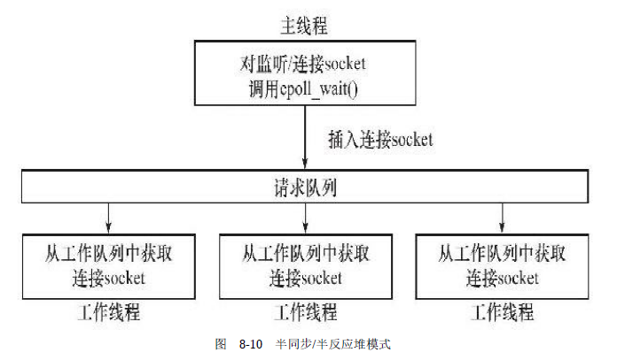
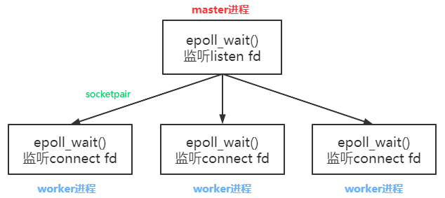

实现了两种并发模型

# 半同步半反应堆线程池

**特点：**

- 主线程创建一个`epoll`，**负责监听lfd和所有cfd**；
- 将I/O任务添加到**请求队列**中，让工作线程来抢夺任务（**生产者-消费者模型**），使用**信号量和互斥量实现**；
- **工作线程只负责处理I/O事件**。

**主线程：**负责监听所有事件；当有新的连接请求，主线程就接受连接，然后将新客户端连接添加到`epoll`；当客户端连接有读写事件时，主线程就将这个客户连接加入到请求队列中

**工作线程：**抢夺任务队列中的任务来处理IO事件

**缺陷：**

- 主线程和工作线程共享请求队列：相当于生产者-消费者模型，**需要对请求队列进行加锁保护，从而浪费CPU时间**
- 每个工作线程在同一时间只能处理一个客户请求：当客户数量多，工作线程少时，请求队列会堆积很多任务对象，客户端的响应变慢；如果增加工作线程，则工作线程的切换也会浪费CPU时间

# 半同步半异步进程池

**特点：**

- master进程创建一个`epoll`，**只负责监听服务端创建的lfd**；
- **没有请求队列，让master进程主动选择某个worker进程来执行任务**；
- **每个worker进程创建各自的`epoll`，负责接受连接并生成cfd**。

**master进程：**只监听lfd，当有新的连接请求，就通知给某个worker进程。

- master进程选择worker进程的方法：随机选择算法、Round Robin（时间片）算法等
- 进程间通信的方法：IPC，本项目中使用的是**管道通信**

**worker进程：**接受lfd的连接请求，生成cfd，并将cfd添加到自己的`epoll`模型上，此后这个socket上的任何I/O操作都是由这个进程来处理。

**优点：**

- 处理客户的worker进程相互独立，当一个worker挂掉后，不会影响其他worker

Nginx采用了类似的处理方式，Master进程主要负责信号处理，监控和管理Worker进程。 Master进程本身不处理具体业务。Worker进程处理具体业务，包括处理连接请求和网络读写事件的处理。多个worker进程可以独立地处理各自的客户连接。**Worker进程之间通过信号量和共享内存进行通信。**

