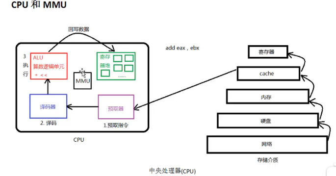
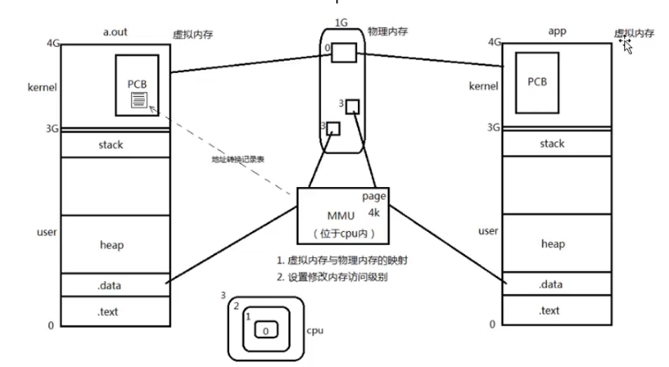

# 1 主要硬件

## CPU

CPU由**运算器**、**控制器**、**寄存器**组成，负责计算机最重要的运算与逻辑判断

CPU具有**微指令集**，通过参考微指令集，我们需要向CPU输入让机器读得懂的机器码才能让CPU正常运行

但是，**不同的CPU具有不同的微指令集**，如果在某个CPU平台上开发了一个程序，想要移植到另一个CPU平台上时，就需要针对当前CPU再重新编写一套新的代码

这显然是非常耗时的，因此，从而产生出了高级语言和编译器，高级语言相当于是人们编写程序的一套标准语言，不管在哪个平台上，只要使用相应的编译器，都能将这些高级语言编译成机器码，这样就可以在不同的平台使用同一套代码了

<small>内存管理单元(MMU)</small>

==MMU作用：==

- ==负责虚拟内存与物理内存的映射==

- ==负责User态和Kernel态的切换==（设置修改内存访问级别）

图片摘自：https://www.bilibili.com/video/BV1PE411e7rX?p=3

## 内存

CPU要处理的数据的来源：一是寄存器，二是内存

寄存器是在CPU内部的，CPU可以直接存取数据，速度最快，但是寄存器的个数和大小都有限制，因此当要处理大的数据时，就需要借助内存来存放这些数据了

内存中存放的是将要运行和正在运行的程序变量和各种参数

再说一下硬盘，硬盘就像一个存放数据的仓库

当从某个磁盘空间打开一个程序的时候，就把这个程序的数据放在内存中，CPU就会从内存中获取这个进程的数据来进行执行

当然，此时内存中存放了若干个进程的数据，CPU也不可能一次性处理掉全部进程，就算是8核处理器也最多在同一时间并行执行8个进程

因此，就涉及到了进程调度的相关方法（如先来先服务、时间片轮询等），CPU根据这些算法将内存中的进程一个个执行

又因为CPU的计算速度是非常快的，所以从我们用户角度来看，就像是多个进程同时在运行

当我们关闭掉这个程序的时候，内存中有关这个进程的数据也就消失了

总的来说，**内存就是一个临时存储器**，打开程序的时候，就把程序的代码和参数存放到内存中，然后CPU来处理，接着程序运行起来，当关机后，所有程序关闭，内存中的数据也就消失了

# 2 操作系统内核

操作系统是一个软件（一组程序），操作系统主要完成的功能是管理硬件软件资源

而在操作系统中，完成这些功能主要是由**内核**来完成的

具体功能如下：

- 程序管理功能（CPU调度）
- 内存管理功能
- 文件系统管理（IO操作）
- 硬件设备驱动功能
- **提供系统调用接口**

==内核的代码是存放在内存一块受保护的区域中的（内核空间），并且在开机后就一直常驻在内存中==

当我们开发一个软件时，如开发一个影音播放软件，就需要调用相关硬件设备（声卡），此时，由于内核提供了硬件设备驱动的系统调用接口，我们在开发时就可以调用这个函数来使用这个硬件设备，同时启动一个软件还涉及到进程同步，又得调用内核提供的调用接口来设计进程同步等功能

总的来说，操作系统出于安全性和稳定性的角度，对计算机的硬件资源和软件资源的管理功能进行了封装，封装在内核中，用户无法随意对其进行修改，只能通过系统调用接口来使用这些功能

## 内核空间和用户空间

以32位系统为例，一个进程的虚拟地址空间为4G

为了保证内核的安全，现在的操作系统一般都强制用户进程不能直接操作内核

具体的实现方式基本都是由操作系统将虚拟地址空间划分为两部分，一部分为**内核空间**，另一部分为**用户空间**。

针对 Linux 操作系统而言，最高的 1G 字节(从虚拟地址 0xC0000000 到 0xFFFFFFFF)由内核使用，称为内核空间

而较低的  3G 字节(从虚拟地址 0x00000000 到 0xBFFFFFFF)由各个进程使用，称为用户空间

对上面这段内容我们可以这样理解：**每个进程的 4G 地址空间中，最高 1G 都是一样的，即内核空间（存放内核代码）。只有剩余的 3G 才归进程自己使用（存放进程代码）**

==**换句话说就是，  1G 的内核空间映射到的物理内存的空间是被所有进程共享的！**==

## 内核态与用户态

在 CPU 的所有指令中，有些指令是非常危险的，如果错用，将导致系统崩溃，比如清内存、设置时钟等。如果允许所有的程序都可以使用这些指令，那么系统崩溃的概率将大大增加。

所以，CPU 将指令分为特权指令和非特权指令，对于那些危险的指令，只允许操作系统及其相关模块使用，普通应用程序只能使用那些不会造成灾难的指令。比如 Intel 的 CPU 将特权等级分为 4 个级别：Ring0~Ring3。

其实 Linux 系统只使用了 Ring0 和 Ring3 两个运行级别(Windows 系统也是一样的)。当进程运行在 Ring3 级别时被称为运行在**用户态**，而运行在 Ring0 级别时被称为运行在**内核态**。

对于 Linux 来说，通过区分内核空间和用户空间的设计，隔离了操作系统代码(操作系统的代码要比应用程序的代码健壮很多)与应用程序代码，**提高了操作系统的稳定性及可用性**

==**进程在内核空间时就处于内核态，而进程在用户空间时则处于用户态。**==

在内核态下，进程存放在内核地址空间中，此时 CPU 将其运行在Ring0级别，可以执行任何指令。运行的代码也不受任何的限制，可以自由地访问任何有效地址，也可以直接进行端口的访问。

在用户态下，进程存放在用户地址空间中，被执行的代码要受到 CPU 的诸多检查，它们只能访问映射其地址空间的页表项中规定的在用户态下可访问页面的虚拟地址，且只能对任务状态段(TSS)中 I/O  许可位图(I/O Permission Bitmap)中规定的可访问端口进行直接访问。 

## 从用户态切换到内核态

所有用户程序都是运行在用户态的, 但是有时候程序确实需要做一些内核态的事情

其实所有的系统资源管理都是在内核空间中完成的。比如读写磁盘文件，分配回收内存，从网络接口读写数据等等。我们的应用程序是无法直接进行这样的操作的。但是我们可以通过内核提供的接口来完成这样的任务。

比如应用程序要读取磁盘上的一个文件，它可以向内核发起一个 "系统调用"  告诉内核："我要读取磁盘上的某某文件"。其实就是**通过一个特殊的指令让进程从用户态进入到内核态(到了内核空间)**，在内核空间中，CPU  可以执行任何的指令，当然也包括从磁盘上读取数据。

**具体过程是先把数据读取到内核空间中，然后再把数据拷贝到用户空间并从内核态切换到用户态**。此时应用程序已经从系统调用中返回并且拿到了想要的数据，可以开开心心的往下执行了。

简单说就是应用程序把高科技的事情(从磁盘读取文件)外包给了系统内核，系统内核做这些事情既专业又高效。

对于一个进程来讲，从用户空间进入内核空间并最终返回到用户空间，这个过程是十分复杂的。

举个例子，比如我们经常接触的概念  "堆栈"，其实进程在内核态和用户态各有一个堆栈。

从用户态进入到内核态，涉及到状态切换，因此需要保留现场，用户态和内核态各自都维护了一套栈空间。所以说，Linux 中每个进程有两个栈，分别用于用户态和内核态。

有三种方式：**系统调用、软中断（异常）和硬件中断**

参考资料：

Linux内核空间和用户空间：https://www.cnblogs.com/sparkdev/p/8410350.html

用户态和内核态：https://www.cnblogs.com/maxigang/p/9041080.html